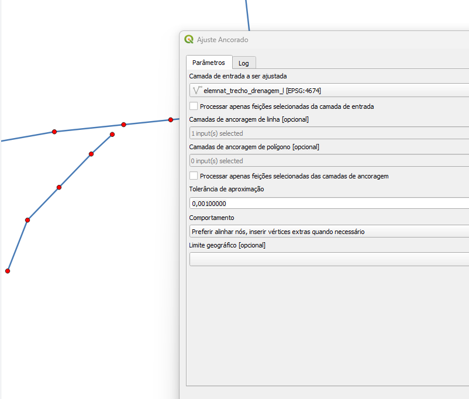
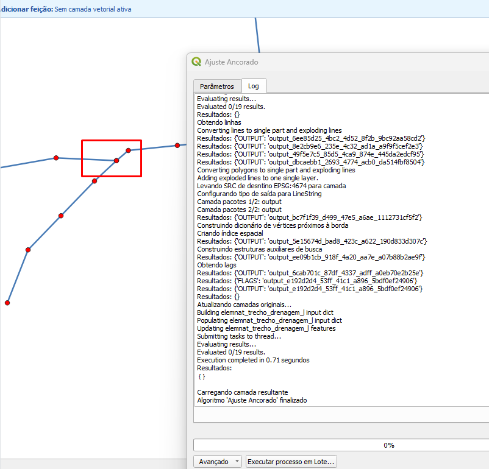

# Módulo 4: Provedor de Algoritmos - QA Tools: Snap Processes

## Algoritmo: Anchored Snapper (Ajuste Ancorado)

## 1. Introdução

O algoritmo `Anchored Snapper` tem como objetivo realizar o ajuste (snap) de feições vetoriais com base em camadas de ancoragem, que podem ser do tipo linha ou polígono. O processo permite alinhar feições de entrada a elementos de referência, respeitando uma tolerância definida e regras específicas de comportamento, como inserção de vértices ou preferência por nós existentes.

> 🔧 Ideal para situações em que há necessidade de corrigir geometrias com base em feições previamente ajustadas ou validadas, mantendo consistência topológica.

---

## 2. Parâmetros de Entrada

| Parâmetro                                | Descrição                                                                 |
|------------------------------------------|---------------------------------------------------------------------------|
| `Input layer to be snapped`              | Camada vetorial a ser ajustada                                            |
| `Process only selected features`         | Define se apenas feições selecionadas da camada de entrada serão processadas |
| `Line anchor layers`                     | Camadas vetoriais de linha usadas como referência                         |
| `Polygon anchor layers`                  | Camadas vetoriais de polígono usadas como referência                      |
| `Process only selected features from anchor layers` | Indica se apenas as feições selecionadas nas camadas âncora devem ser consideradas |
| `Snap tolerance`                         | Tolerância máxima de distância para realizar o snap (em unidades do CRS) |
| `Behavior`                               | Define o modo de snap entre sete opções disponíveis                       |
| `Geographic Boundary`                    | Camada poligonal delimitadora opcional para restringir a área de atuação |

### Interface de Parâmetros

A interface do DSGTools permite ao usuário configurar os modos de snap com precisão, ajustando tolerância, seleção de feições e uso de limites geográficos.

*Figura 4.3 – Interface do algoritmo "Anchored Snapper" com os parâmetros.*

---

## 3. Funcionamento

1. Cria-se uma camada auxiliar com as feições de entrada (total ou selecionadas).
2. As camadas âncora são preparadas, podendo considerar apenas as feições selecionadas.
3. Camadas poligonais âncora são convertidas em linhas para atuação do snap.
4. Todas as camadas de linha (inclusive derivadas de polígonos) são mescladas e tratadas para garantir geometrias simples.
5. É realizado o snap da camada de entrada às camadas âncora com base na tolerância e comportamento definidos.
6. Caso aplicável, vértices não compartilhados são adicionados em interseções ou arestas comuns.
7. A camada original é atualizada com as novas geometrias ajustadas.

---

## 4. Fluxo Operacional

1. Carregue as camadas de entrada e âncora no QGIS.
2. No menu de algoritmos do DSGTools, selecione `Anchored Snapper`.
3. Configure os parâmetros conforme a necessidade.
4. Execute o algoritmo e revise as modificações aplicadas.

---

## 5. Atributos da Camada de Saída

Este algoritmo modifica diretamente as feições da camada original. Não gera nova camada de saída com atributos adicionais.

---

## 6. Saída Esperada

- Camada original com geometrias ajustadas conforme as camadas âncora.
- Vértices alinhados e ajustados conforme a estratégia de snap definida.
- Consistência topológica aprimorada após a execução.

*Figura 4.1: Exemplo de grade criada com o Anchored Snapper*

---

## 7. Aplicações Práticas

- Ajuste de feições com base em limites validados (ex: hidrografia alinhada ao limite municipal).
- Correção topológica em bases colaborativas.
- Preparação de dados para integração com outras fontes oficiais.

---

## 8. Resumo

- Alinha feições com base em camadas âncora (linhas e/ou polígonos)
- Comportamento personalizável via modos de snap
- Pode considerar apenas feições selecionadas
- Ideal para garantir coerência geométrica e topológica

> ⚠️ **Atenção:** Utilize projeções métricas (como UTM) para garantir que a tolerância de snap funcione corretamente.
