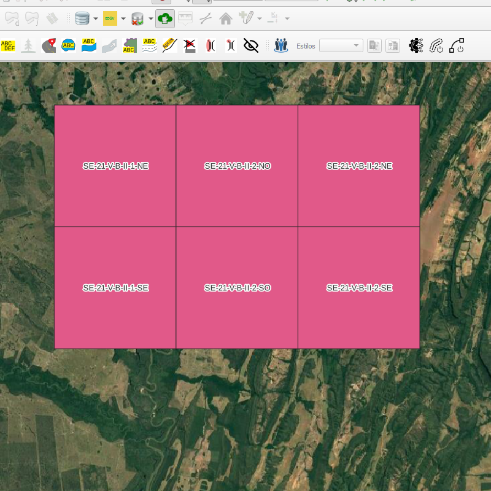

## Algoritmo: Create Frames With Constraint (Criar Molduras com Restrição)

## 1. Introdução

O algoritmo `Create Frames With Constraint` permite a geração de grades cartográficas sistemáticas (INOM/MI) a partir de uma camada poligonal de entrada, limitada à extensão dessa camada. Ele utiliza escalas padrões cartográficas (de 1:1000.000 até 1:1.000) como base para subdivisões hierárquicas, permitindo a criação de molduras em níveis desejados.

> ✨ Ideal para gerar recortes sistemáticos e edição cartográfica distribuída.

---

## 2. Parâmetros de Entrada

| Parâmetro                     | Descrição                                                            |
| ----------------------------- | -------------------------------------------------------------------- |
| `Input Polygon Layer`         | Camada vetorial poligonal que define a área onde a grade será criada |
| `Desired Scale`               | Escala de parada (ex: 250k, 100k, 50k, etc.)                         |
| `Number of subdivisions on x` | (Opcional) Número adicional de subdivisões no eixo X                 |
| `Number of subdivisions on y` | (Opcional) Número adicional de subdivisões no eixo Y                 |
| `Created Frames`              | Saída vetorial com as feições geradas (polígonos da grade)           |

> ⚠️ A escala define automaticamente subdivisões padrões. Subdivisões manuais são opcionais.

### Interface de Parâmetros

Abaixo, temos um exemplo da interface do algoritmo **"Create Frames With Constraint"** no provedor do DSGTools. É nela que o usuário define a modura para a geração das grades.

*Figura 4.3 – Interface do algoritmo "Create Frames With Constraint" com os parâmetros.*

---

## 3. Fluxo Operacional

1. Carregue a camada poligonal com a área de interesse.
2. Acesse o algoritmo `Create Frames With Constraint` no provedor DSGTools.
3. Defina a escala final desejada.
4. (Opcional) Defina número de subdivisões adicionais nos eixos X e Y.
5. Execute o algoritmo.
6. Visualize a camada de grades sistemáticas geradas.

---

## 4. Funcionamento

O algoritmo utiliza uma camada vetorial como base para restringir a área de geração da grade. Ele parte de uma escala inicial e gera subdivisões até a escala definida. Cada escala possui padrões de subdivisão definidos:

* 1:250.000 → 12 colunas / 8 linhas
* 1:100.000 → 4 colunas / 4 linhas
* 1:50.000 → 2 colunas / 2 linhas

Subdivisões adicionais podem ser inseridas manualmente para criar grades ainda mais refinadas. O algoritmo também adiciona atributos como `INOM` e `MI` a cada feição gerada.

---

## 5. Saída Esperada

* Uma camada vetorial de polígonos que representam folhas cartográficas sistemáticas.
* Cada feição terá atributos como `INOM` (Identificador de Nome) e `MI` (Mapa-Imagem).

*Figura 4.1: Exemplo de grade criada com o Create Frames With Constraint*

---

## 6. Aplicações Práticas

* Divisão de área para controle de campo
* Planejamento de edição cartográfica paralela
* Criação de molduras cartográficas indexadas
* Organização espacial de grandes bases vetoriais

---

## 7. Resumo

* Gera grades cartográficas sistemáticas dentro de uma área poligonal
* Permite seleção da escala e subdivisões por eixo
* Adequado para contextos de planejamento, edição e impressão cartográfica

> ✨ Recomendado: Utilizar sistemas projetados (como UTM) para manter a precisão dos recortes

> ⚠️ Garanta que o CRS da camada esteja corretamente definido e compatível com a projeção pretendida
