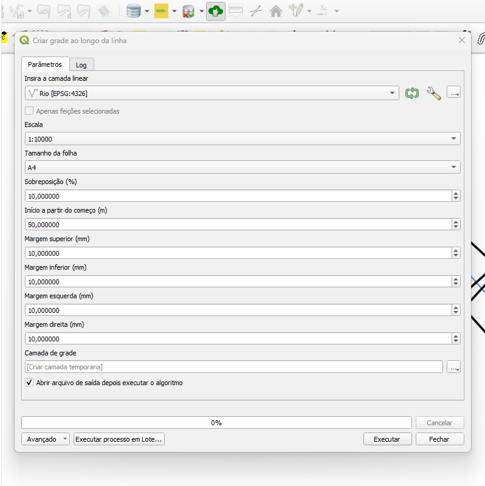
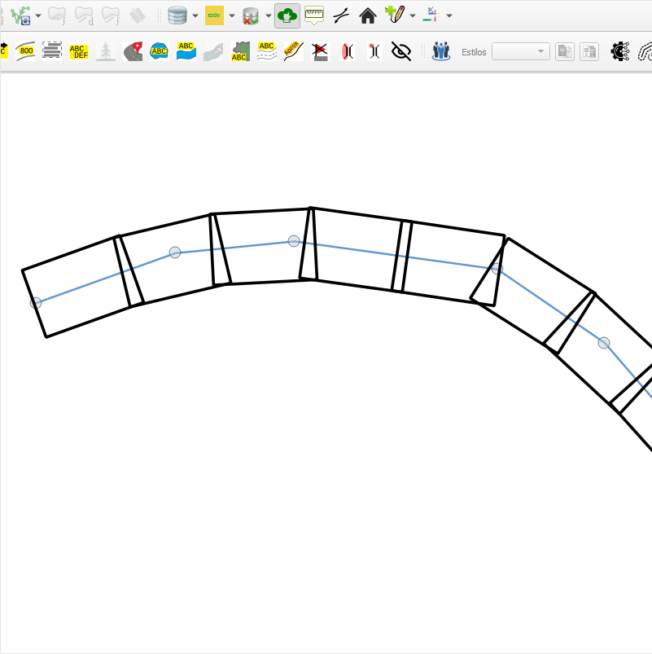

## Algoritmo: Create Grid Along Line (Criar grade ao longo da linha)

## 1. Introdução

O algoritmo `Create Grid Along Line` permite a geração de uma **grade linear** segmentada ao longo de uma ou mais feições do tipo **linha**. Cada célula da grade corresponde a um quadro com dimensões calculadas a partir da escala e do tamanho do papel selecionado, ideal para apoiar a produção cartográfica orientada por feições lineares, como rios, estradas ou oleodutos.

> 💡 **Dica:** Muito útil na produção de mapas por quadros (map series), especialmente para impressão sequencial de seções ao longo de eixos lineares.

---

## 2. Parâmetros de Entrada

| Parâmetro               | Descrição                                                                 |
|-------------------------|---------------------------------------------------------------------------|
| `Insert the line layer` | Camada vetorial do tipo linha a ser utilizada como base para o grid       |
| `Scale`                 | Escala de visualização/detecção da feição (ex: 1:2000, 1:5000 etc.)        |
| `Sheet Size`            | Tamanho da folha para cálculo da área de cada quadro (A4 ou A3)           |
| `Overlap (%)`           | Sobreposição entre quadros consecutivos, em percentual                   |
| `Start from begin (m)`  | Distância inicial antes do primeiro quadro, ao longo da linha             |
| `Top Margin (mm)`       | Margem superior da folha a ser descontada do quadro                      |
| `Bottom Margin (mm)`    | Margem inferior da folha a ser descontada do quadro                      |
| `Left Margin (mm)`      | Margem esquerda da folha a ser descontada do quadro                      |
| `Right Margin (mm)`     | Margem direita da folha a ser descontada do quadro                       |
| `Grid Layer`            | Camada de saída contendo os polígonos dos quadros gerados                |

### Interface de Parâmetros

A interface do algoritmo no provedor DSGTools permite ao usuário configurar com precisão os valores para escala, margens, sobreposição e folha.

  
*Figura 4.4 – Interface do algoritmo "Create Grid Along Line" com os parâmetros preenchidos.*

> ⚠️ **Importante:** As dimensões do quadro são calculadas automaticamente a partir da escala e do tamanho do papel, considerando as margens informadas.

---

## 3. Funcionamento

1. A geometria de entrada (linha) é estendida a partir de seu início (`Start from begin`) para permitir geração de quadros desde o início do traçado.
2. Com base no tamanho do papel (A4 ou A3) e na escala selecionada, o algoritmo calcula a **largura e altura reais de cada quadro** no terreno.
3. Os quadros são criados ao longo da linha usando o método de interpolação, com sobreposição controlada entre eles (`Overlap (%)`).
4. Cada quadro é um polígono orientado de acordo com o azimute entre os pontos inicial e final de cada segmento.
5. A camada resultante contém os quadros com atributos de ordenamento e identificação da linha base.

> 💡 **Dica:** Utilize geometrias bem construídas e topologicamente corretas para melhores resultados.

---

## 4. Fluxo Operacional

1. Carregar a camada de linha no QGIS  
2. Abrir o plugin DSGTools e localizar o algoritmo `Create Grid Along Line`  
3. Definir a escala e tamanho da folha desejados  
4. Ajustar sobreposição e margens conforme necessário  
5. Executar o algoritmo e revisar a grade gerada na saída  

---

## 5. Atributos da Camada de Saída

| Campo      | Descrição                                              |
|------------|--------------------------------------------------------|
| `ord`      | Número sequencial de cada quadro ao longo da linha     |
| `id`       | ID da feição da camada de linha usada como base        |

> 🔎 **Observação:** Não há campos para IDs de tarefa ou etapa, pois o foco aqui é a geração de quadros cartográficos, não necessariamente ligados ao fluxo de revisão.

---

## 6. Saída Esperada

- Uma camada vetorial do tipo polígono representando os quadros dispostos sequencialmente ao longo da linha de entrada  
- Geometria dos quadros com rotação e posicionamento corretos em função do azimute do traçado  
- Atributos que indicam a ordem dos quadros (`ord`) e ID da feição base (`id`)  

  
*Figura 4.5 – Resultado visual da geração do grid ao longo da linha.*

---

## 7. Aplicações Práticas

- Geração de mapas por quadros ao longo de rodovias, ferrovias ou rios  
- Impressão sequencial com sobreposição para navegação cartográfica  
- Planejamento de inspeções lineares (ex: oleodutos, linhas de transmissão)  
- Suporte à visualização de feições contínuas em escalas fixas

---

## 8. Resumo

- Gera quadros cartográficos ao longo de feições lineares  
- Baseado em parâmetros de escala, papel, sobreposição e margens  
- Ideal para map series e inspeções técnicas orientadas por linha  

> 🔹 **Recomendado:** Use um CRS projetado (como UTM) para garantir medidas em metros.  
> ⚠️ **Atenção:** A camada de entrada deve conter feições do tipo **linha**, com extensão suficiente para suportar a geração dos quadros.