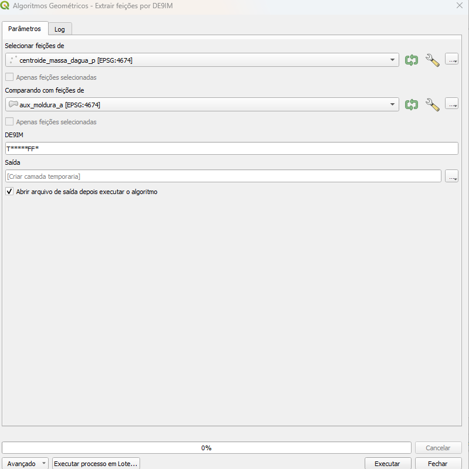
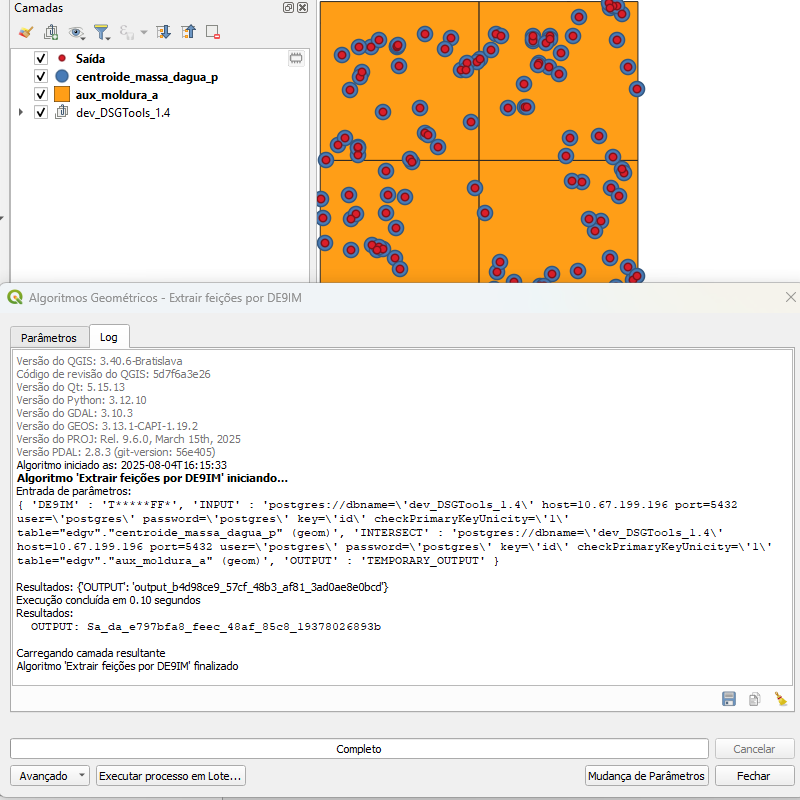

# Módulo 4: Provedor de Algoritmos - Algoritmos Geométricos

## Algoritmo: Extrair Feições por DE9IM

---

## 1. Introdução

O algoritmo **Extrair Feições por DE9IM** permite selecionar e extrair feições de uma camada com base em relações espaciais complexas definidas pela matriz **DE9IM** (Dimensionally Extended Nine-Intersection Model).

Esse modelo é utilizado para descrever de forma precisa como duas geometrias se relacionam espacialmente, possibilitando extrações avançadas baseadas em padrões como sobreposição parcial, tangência, interior compartilhado, entre outros.

> 💡 *Dica:* Utilize este algoritmo quando as operações padrão de interseção (como "intersecta", "contém", "dentro de") não forem suficientes para representar relações espaciais desejadas.

---

## 2. Parâmetros de Entrada

| Parâmetro                     | Descrição                                                                 |
|------------------------------|---------------------------------------------------------------------------|
| Selecionar feições de        | Camada vetorial que será filtrada com base nas relações espaciais        |
| Comparando com feições de    | Camada vetorial que será usada como referência para comparação espacial  |
| DE9IM                         | Cadeia de 9 caracteres definindo a relação espacial (ex: `T*****FF*`)     |
| Saída                        | Camada vetorial com as feições extraídas                                  |

### Especificações do parâmetro "DE9IM"
| Código DE-9IM    | Relação Espacial           | Descrição                                                                 |
|------------------|----------------------------|---------------------------------------------------------------------------|
| `T********`       | `intersects(A, B)`         | A interseção entre A e B é não vazia.                                     |
| `T*F**F***`       | `touches(A, B)`            | A e B compartilham fronteira, mas não têm interior em comum.              |
| `T*F**FFF`        | `touches (ponto em polígono)` | Ponto toca a linha/polígono apenas pela borda.                        |
| `*T*******`       | `within(A, B)`             | A está completamente dentro de B.                                         |
| `T*T***T**`       | `equals(A, B)`             | A e B são geometricamente idênticos.                                      |
| `T*F**F***`       | `crosses(A, B)`            | A e B se cruzam, mas não estão contidos um no outro.                      |
| `T*****FF*`       | `contains(A, B)`           | A contém completamente B (sem tocar a borda).                             |
| `T*F**F***`       | `overlaps(A, B)`           | A e B têm parte comum, mas não um dentro do outro.                        |
| `FF*FF****`       | `disjoint(A, B)`           | A e B não compartilham nenhum ponto.                                      |
| `*********`       | `relate(A, B, 'máscara')`  | Permite verificar qualquer máscara DE-9IM personalizada.                  |

### Interface de Parâmetros

A interface do algoritmo "Extrair Feições por DE9IM" no provedor DSGTools permite definir as duas camadas envolvidas na operação, o padrão DE9IM desejado e o local de gravação do resultado.

*Figura 4.3 – Interface do algoritmo com os parâmetros de entrada configurados.*

> ⚠️ *Atenção:* O padrão DE9IM deve conter **exatamente 9 caracteres**, sendo uma combinação de `F`, `T`, `0`, `1`, `2` e `*`.  
> Caso deseje usar relações comuns como "sobrepõe parcialmente", consulte a documentação do QGIS sobre DE9IM ou utilize um modelo pré-definido como `T*F**F***`.

---

## 3. Fluxo Operacional

1. Abrir o QGIS e carregar o plugin DSGTools.
2. Navegar até o provedor de algoritmos e localizar "Extrair Feições por DE9IM" (`extractbyde9im`).
3. Selecionar a camada de entrada e a camada de referência.
4. Inserir o padrão DE9IM desejado (ex: `T*F**F***`).
5. Executar o algoritmo.
6. Visualizar a nova camada com as feições extraídas.

---

## 4. Funcionamento

O algoritmo executa uma varredura espacial entre feições de duas camadas vetoriais, verificando se a relação geométrica definida pela **matriz DE9IM** é satisfeita.  
Para cada feição da camada de comparação, o algoritmo verifica quais feições da camada de entrada possuem a relação espacial desejada, e as adiciona ao resultado.

> 💡 *Dica:* Quando possível, utilize camadas com índices espaciais otimizados para melhor desempenho.

---

## 5. Saída Esperada

* Uma camada vetorial contendo apenas as feições da camada de entrada que satisfazem a condição espacial definida pelo padrão DE9IM em relação à camada de comparação.
* Geometrias válidas e compatíveis com análise espacial avançada.

*Figura 4.4: Exemplo de feições extraídas por padrão espacial específico via DE9IM.*

---

## 6. Aplicações Práticas

* Extração de feições com contato apenas tangencial com outras geometrias
* Identificação de feições parcialmente sobrepostas
* Seleção espacial baseada em critérios avançados de relação geométrica
* Pré-processamento para validação topológica detalhada

---

## 7. Resumo

* Algoritmo avançado de extração espacial baseado em matriz DE9IM
* Permite identificar relações complexas entre feições
* Ideal para análises topológicas ou filtros espaciais refinados
* Compatível com qualquer tipo de geometria (ponto, linha, polígono)

> 🔹 *Recomendado:* Utilize este algoritmo em conjunto com a documentação oficial do QGIS sobre DE9IM para compreender melhor os padrões válidos.

> ⚠️ *Atenção:* Certifique-se de que ambas as camadas estão no mesmo sistema de referência espacial (CRS) para evitar erros de comparação geométrica.

