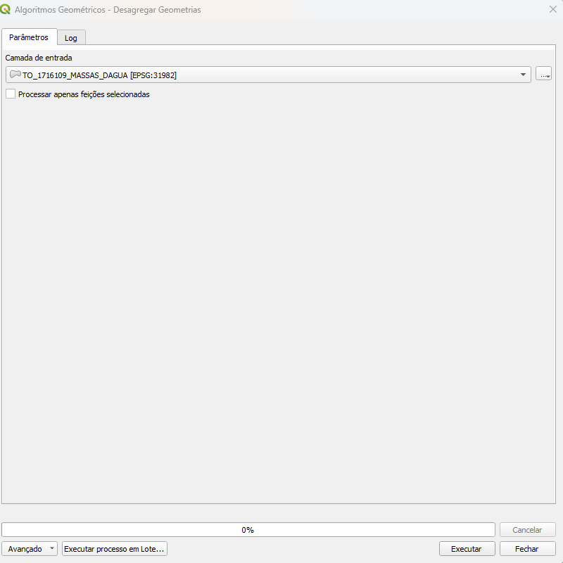
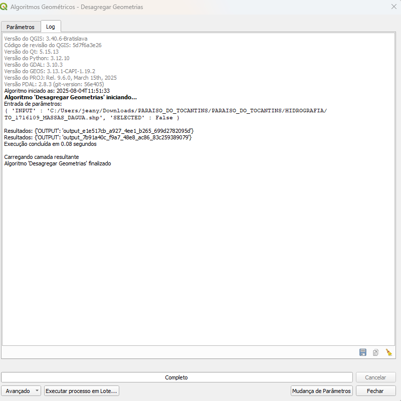

# Módulo 4: Provedor de Algoritmos - Algoritmos Geométricos

## Algoritmo: Desagregar Geometrias

---

## 1. Introdução

O algoritmo **Desagregar Geometrias** permite identificar feições compostas (multipartes) em uma camada vetorial e separá-las em feições simples (uma geometria por feição). Esse processo é essencial para garantir a integridade dos dados geoespaciais e viabilizar análises mais precisas.

> **💡 Dica:** Feições multipartes podem atrapalhar a execução de regras espaciais e análises topológicas. Separá-las facilita a manipulação individual.

---

## 2. Parâmetros de Entrada

| Parâmetro                        | Descrição                                                                 |
|----------------------------------|---------------------------------------------------------------------------|
| Camada de entrada                | Camada vetorial com geometrias a serem analisadas                         |
| Processar apenas feições selecionadas | Se marcado, o algoritmo atuará apenas sobre as feições selecionadas      |

### Interface de Parâmetros

A interface do algoritmo no QGIS é simples e objetiva:

  
*Figura 4.X – Interface do algoritmo "Desagregar Geometrias"*

> **⚠️ Atenção:** O algoritmo ignora feições sem geometria e as remove automaticamente.

---

## 3. Fluxo Operacional

1. Abrir o QGIS e carregar o plugin DSGTools.
2. Acessar o algoritmo pelo provedor (atalho: `desagregargeometrias`).
3. Escolher a camada de entrada.
4. Opcionalmente, selecionar feições específicas e ativar a opção de “Processar apenas selecionadas”.
5. Executar o algoritmo e verificar o resultado na própria camada de origem.

---

## 4. Funcionamento

O algoritmo realiza as seguintes etapas:

1. **Criação de identificador interno**  
   Um campo chamado `_featid` é adicionado com o identificador original da feição.

2. **Conversão Multipartes → Simples**  
   Utiliza o processo de *quebra* das geometrias para separar os componentes em feições distintas.

3. **Verificação de múltiplas ocorrências**  
   Apenas as feições que de fato foram divididas (ou seja, ocorreram mais de uma vez com o mesmo `_featid`) são consideradas.

4. **Atualização da camada de origem**  
   - A geometria da feição original é substituída.
   - Novas feições resultantes são adicionadas.
   - Feições inválidas são excluídas do projeto.

> **💡 Dica:** Use este algoritmo após importações ou conversões de dados para evitar feições agrupadas indevidamente.

---

## 5. Saída Esperada

- Modificação direta da camada de entrada.
- As feições compostas são substituídas por múltiplas feições simples.
- Inclusão automática das novas feições resultantes.

  
*Figura 4.X – Antes (multipartes) e depois (feições simples) do processo de desagregação*

---

## 6. Aplicações Práticas

- **Normalização de geometrias** para análises topológicas.
- **Preparação de dados** para validação de regras espaciais.
- **Separação de feições** para edição individual.
- **Correção de geometrias** originadas por fontes externas ou processos automáticos.

---

## 7. Resumo

- Algoritmo útil para transformar feições compostas em feições simples.
- Atua diretamente sobre a camada vetorial, com suporte à seleção prévia.
- Facilita a análise e validação ao tratar individualmente as geometrias.
- Ideal para processos que exigem granularidade geométrica.

> **🔹 Recomendado:** Utilize em conjunto com processos de validação e edição de dados.

> **⚠️ Atenção:** O algoritmo modifica a camada original. É recomendável trabalhar com cópias ou backups.
