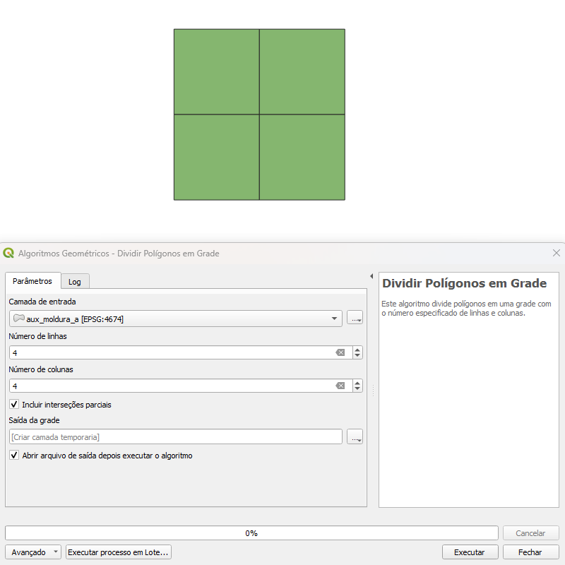
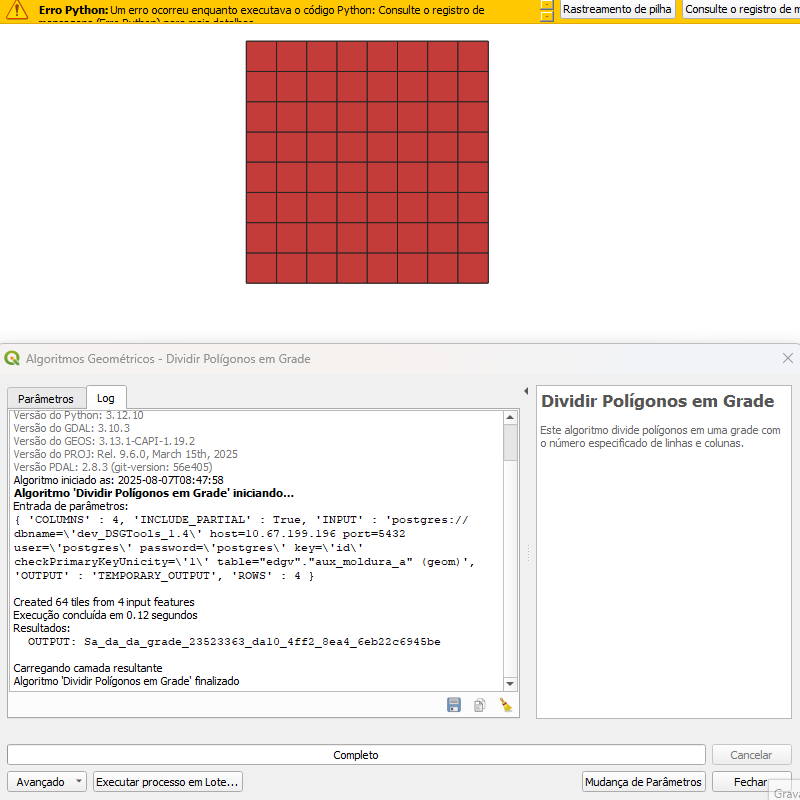

# Módulo 4: Provedor de Algoritmos - Geométricos

## Algoritmo: Dividir Polígonos em Grade

---

## 1. Introdução

O algoritmo **Dividir Polígonos em Grade** permite fragmentar feições do tipo polígono em células regulares definidas por um número específico de linhas e colunas. Cada célula resultante é uma nova feição poligonal derivada da interseção entre a malha e o polígono original.

> 💡 *Dica:* Esse processo é útil para dividir grandes áreas em blocos menores para facilitar a análise ou o processamento distribuído.

---

## 2. Parâmetros de Entrada

| Parâmetro                      | Descrição                                                                 |
| ----------------------------- | ------------------------------------------------------------------------- |
| Camada de entrada             | Camada vetorial contendo feições do tipo polígono                        |
| Número de linhas              | Quantidade de linhas na subdivisão da grade                              |
| Número de colunas             | Quantidade de colunas na subdivisão da grade                             |
| Incluir interseções parciais  | Se marcado, inclui células que cruzam parcialmente o polígono original   |
| Saída                         | Camada vetorial com os polígonos resultantes da interseção               |

### Interface de Parâmetros

Recomenda-se que a interface seja composta por caixas numéricas para linhas e colunas, com valores mínimos de 1. Um checkbox deve permitir definir se as interseções parciais serão incluídas ou não.

*Figura 4.3 – Interface do algoritmo "Inventário de Arquivos" com os parâmetros configuráveis*
> ⚠️ *Atenção:*
> - Evite usar valores muito altos de linhas e colunas, pois isso pode gerar milhares de feições e comprometer a performance.
> - Caso a célula gerada seja muito pequena, pode haver problemas de precisão ao calcular interseções geométricas.

---

## 3. Fluxo Operacional

1. Abrir o QGIS e acessar o plugin DSGTools.
2. No *Provedor de Algoritmos*, buscar por **Dividir Polígonos em Grade** (atalho: `polygontiler`).
3. Selecionar a camada poligonal desejada.
4. Definir o número de linhas e colunas para a grade.
5. Escolher se deseja ou não incluir interseções parciais.
6. Executar o algoritmo e visualizar a camada gerada.

---

## 4. Funcionamento

O algoritmo realiza os seguintes passos:

- Calcula o retângulo envolvente (bounding box) de cada polígono.
- Divide esse retângulo em uma grade regular de células.
- Avalia cada célula: se houver interseção com o polígono, essa interseção é computada.
- Se o parâmetro “Incluir interseções parciais” estiver desmarcado, apenas células totalmente contidas no polígono original são consideradas.
- Para cada célula válida, uma nova feição é criada com dois atributos adicionais: `_row` e `_column`, que indicam a posição da célula na grade.

> 💡 *Dica:* Utilize esse algoritmo em áreas contínuas para geração de *tiles* que facilitarão a extração vetorial em blocos menores ou geração de mosaicos cartográficos.

---

## 5. Saída Esperada

* Uma camada vetorial com feições poligonais resultantes da interseção entre as células da grade e os polígonos de entrada.
* Cada feição resultante possuirá os atributos originais da feição base, além dos campos `_row` e `_column`.

*Figura 4.X – Exemplo da divisão de um polígono em grade de linhas e colunas com interseções parciais ativadas.*

---

## 6. Aplicações Práticas

* Fragmentação de áreas para processamento paralelo.
* Geração de *tiles* para controle de extração vetorial.
* Criação de quadros para exportação cartográfica.
* Distribuição espacial para amostragem ou inspeções por setor.

---

## 7. Resumo

* Algoritmo para fragmentação de polígonos em células regulares.
* Permite incluir ou excluir interseções parciais.
* Gera saída com rastreabilidade espacial via `_row` e `_column`.
* Ideal para preparação de dados para workflows de extração ou validação distribuída.

> 🔹 *Recomendado:* Use o algoritmo em conjunto com filtros espaciais para dividir grandes projetos em partes menores e mais gerenciáveis.

> ⚠️ *Atenção:* Este algoritmo pode gerar um grande número de feições, dependendo da densidade e complexidade da camada de entrada.
