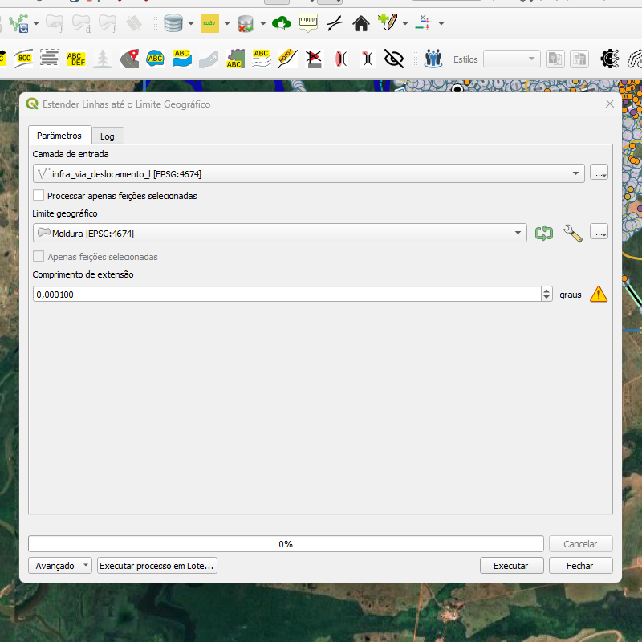

## Algoritmo: Extend Lines To Geographic Bounds (Estender linhas para limites geográficos)

## 1. Introdução

O algoritmo `Extend Lines To Geographic Bounds` realiza a extensão automática de linhas até os limites definidos por uma camada poligonal de referência. É utilizado para garantir que feições lineares encostem ou interceptem bordas geográficas específicas, como limites de folhas cartográficas ou regiões de interesse.

> 💡 **Dica:** Ideal para finalizar redes hidrográficas, viárias ou outras feições que devem tocar os limites da área mapeada.

---

## 2. Parâmetros de Entrada

| Parâmetro             | Descrição                                                                 |
|-----------------------|---------------------------------------------------------------------------|
| `Input layer`         | Camada de entrada com feições lineares                                    |
| `Process only selected features` | Define se apenas feições selecionadas devem ser processadas         |
| `Geographic bounds`   | Camada poligonal usada como limite para extensão das linhas               |
| `Extend length`       | Comprimento da extensão (em unidades do CRS da camada)                    |

### Interface de Parâmetros

  
*Figura 4.4 – Interface do algoritmo "Extend Lines To Geographic Bounds" com os parâmetros preenchidos.*

> ⚠️ **Atenção:** A camada de referência deve estar bem definida e conter pelo menos uma feição poligonal.

---

## 3. Funcionamento

1. O algoritmo dissolve e transforma o polígono de referência em segmentos de linha.
2. Esses segmentos são utilizados para criar um buffer que representa a região-alvo para interceptação.
3. As linhas que não estão fechadas e cujos vértices extremos (início ou fim) caem dentro do buffer são identificadas.
4. Cada linha é estendida no vértice relevante até que toque o limite definido, respeitando a tolerância informada.
5. As geometrias originais são atualizadas com as novas linhas estendidas.

---

## 4. Fluxo Operacional

1. Carregar a camada de linha e o polígono de referência no QGIS  
2. Abrir o plugin DSGTools e selecionar o algoritmo `Extend Lines To Geographic Bounds`  
3. Informar a camada de entrada, os limites geográficos e a distância de extensão desejada  
4. (Opcional) Selecionar apenas feições específicas para processamento  
5. Executar o algoritmo e revisar o resultado diretamente na camada original  

---

## 5. Saída Esperada

- A camada original será atualizada com as geometrias estendidas  
- Linhas fechadas (`is_closed($geometry)`) não serão modificadas  
- A extensão ocorre de forma precisa e controlada com base na tolerância definida

  
*Figura 4.5 – Resultado visual da extensão das linhas até os limites geográficos.*

---

## 6. Aplicações Práticas

- Ajuste final de redes hidrográficas para atingir limites de folha  
- Extensão de vias urbanas ou rurais até bordas de quadros cartográficos  
- Garantia de aderência espacial em produtos cartográficos sistemáticos  
- Pós-processamento de feições lineares para fechamento topológico

---

## 7. Resumo

- Estende linhas abertas até o limite de uma camada poligonal  
- Usa buffers e análise espacial para identificar vértices a serem modificados  
- Preserva geometrias fechadas e respeita a distância máxima configurada

> 🔹 **Recomendado:** Utilize tolerâncias pequenas para não ultrapassar os limites, especialmente em escala grande.  
> ⚠️ **Atenção:** Linhas que já tocam o limite não são modificadas. A camada original será editada diretamente.