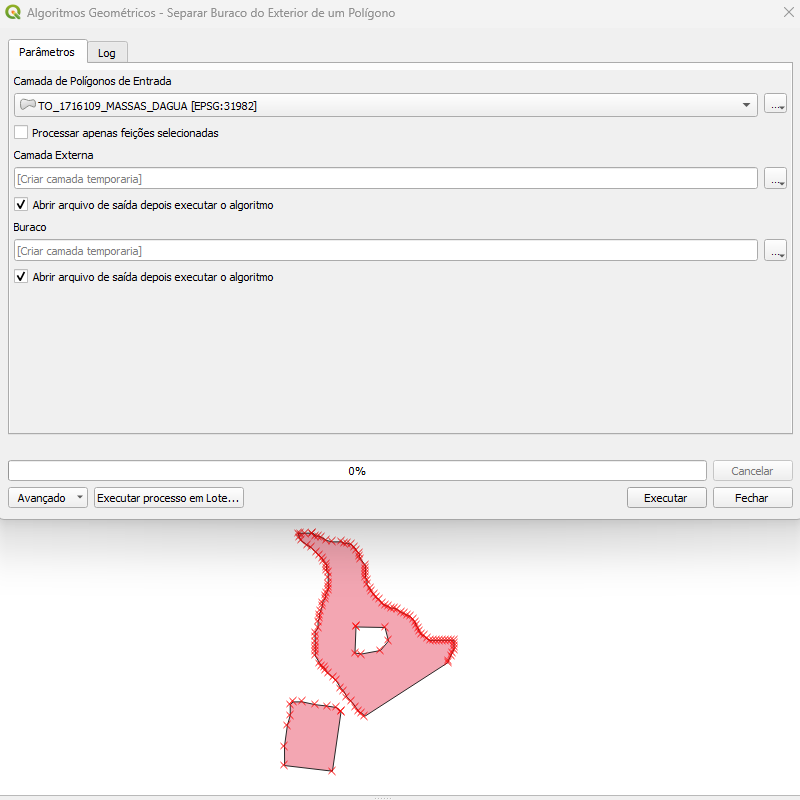
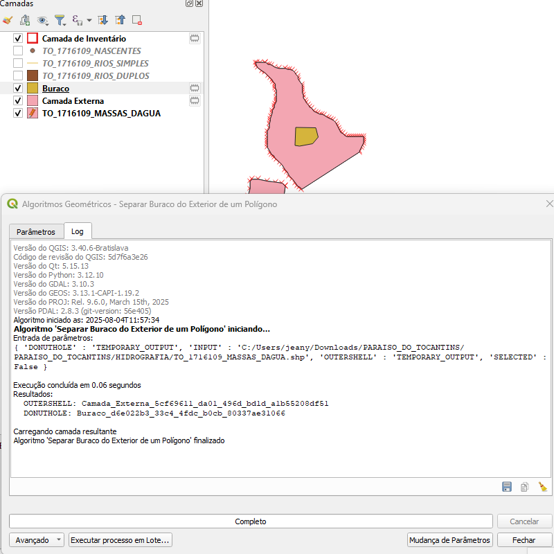

# Módulo 4: Provedor de Algoritmos - Algoritmos Geométricos

## Algoritmo: Extrair Buracos de Polígonos

## 1. Introdução

O algoritmo **Extrair Buracos de Polígonos** permite separar, de maneira automatizada, as partes internas de um polígono (buracos ou *donut holes*) da sua geometria exterior (*outer shell*). Esse processo é especialmente útil em verificações topológicas, validação de geometrias complexas e etapas de limpeza ou transformação de dados.

> 💡 *Dica:* Ideal para análise de camadas onde buracos internos podem representar elementos cartográficos específicos, como clareiras em vegetação ou ilhas em corpos d’água.

---

## 2. Parâmetros de Entrada

| Parâmetro                      | Descrição                                                                 |
| ----------------------------- | ------------------------------------------------------------------------- |
| Camada de entrada             | Camada vetorial poligonal a ser processada                                |
| Processar apenas selecionados | Define se o algoritmo atua apenas sobre feições selecionadas             |
| Invólucro externo             | Camada de saída contendo os polígonos sem buracos (apenas contorno externo) |
| Buracos internos              | Camada de saída contendo os buracos internos extraídos como novos polígonos |

### Interface de Parâmetros

A interface apresenta campos simples e diretos:

- Escolha da camada poligonal
- Caixa de seleção para limitar a feições selecionadas
- Definição de duas saídas: *Invólucro Externo* e *Buracos Internos*
  
*Figura 4.X – Interface do algoritmo "Extrair Buracos de Polígonos"*
> ⚠️ *Atenção:* Certifique-se de que a camada de entrada possua geometria poligonal e que as feições contenham buracos internos, caso contrário, a camada de saída de buracos será vazia.

---

## 3. Fluxo Operacional

1. Carregar a camada poligonal no QGIS
2. Acessar o algoritmo no provedor DSGTools (atalho: `donutholeextractor`)
3. Marcar se deseja processar apenas feições selecionadas
4. Executar o algoritmo
5. Visualizar as duas novas camadas geradas:
   - Uma contendo apenas os contornos externos
   - Outra contendo os buracos extraídos como feições independentes

---

## 4. Funcionamento

O algoritmo percorre cada feição da camada poligonal e utiliza métodos geométricos para separar a geometria do invólucro externo das anéis internos (*holes*). Cada anel interno é transformado em uma feição poligonal autônoma.

A separação ocorre de forma precisa mesmo em geometrias do tipo multipolígono.

---

## 5. Saída Esperada

- **Camada de Invólucros Externos:** Feições idênticas à original, porém sem os buracos internos.
- **Camada de Buracos Internos:** Cada buraco é convertido em uma nova feição vetorial com atributos herdados da original.

*Figura 4.6 – Visualização da separação entre buracos e casca externa de um polígono*

---

## 6. Aplicações Práticas

- Validação de geometrias complexas com múltiplos anéis
- Preparação de dados para análise topológica
- Conversão de buracos em entidades próprias (ex.: clareiras, ilhas)
- Processamento de dados cartográficos para modelagens específicas

---

## 7. Resumo

- Separação automática de buracos internos de polígonos
- Saídas vetoriais independentes para buracos e cascas externas
- Suporte a feições do tipo multipolígono
- Útil para verificação e manipulação de geometrias complexas

> 🔹 *Recomendado:* Use este algoritmo antes de realizar validações topológicas que dependem da distinção entre buracos e polígonos independentes.

> ⚠️ *Atenção:* A ausência de buracos em uma feição resultará em uma única saída no invólucro externo.
