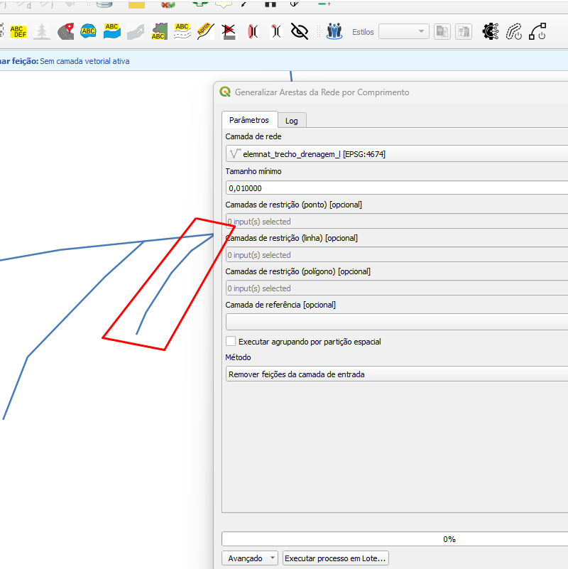
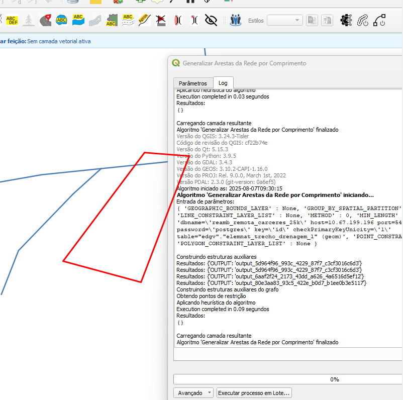

# Módulo 4: Provedor de Algoritmos - Generalização

## Algoritmo: Generalize Network Edges With Length (Generalizar arestas de rede com comprimento)

## 1. Introdução

O algoritmo `Generalize Network Edges With Length` permite a simplificação de redes lineares com base em um valor mínimo de comprimento. Essa ferramenta é essencial para a generalização cartográfica em escalas menores, eliminando arestas com pouco impacto visual.

> **💡 Dica:** Ideal para representar redes (como drenagem ou estradas) em mapas temáticos de pequena escala.

---

## 2. Parâmetros de Entrada

| Parâmetro                          | Descrição                                                                 |
|-----------------------------------|---------------------------------------------------------------------------|
| `Network layer`                   | Camada vetorial linear com a rede a ser generalizada                     |
| `Minimum size`                    | Comprimento mínimo das arestas que devem permanecer                      |
| `Point constraint Layers`         | Camadas com pontos que funcionam como restrições para a generalização    |
| `Line constraint Layers`          | Camadas com linhas que funcionam como restrições                         |
| `Polygon constraint Layers`       | Camadas com polígonos que funcionam como restrições                      |
| `Reference layer`                 | Limites geográficos para particionamento e análise localizada            |
| `Run algorithm grouping by spatial partition` | Agrupar por partições espaciais ao executar                             |
| `Method`                          | Define se as feições serão apagadas ou apenas selecionadas               |

### Interface de Parâmetros

*Figura 4.6 – Interface do algoritmo "Generalize Network Edges With Length".*

---

## 3. Fluxo Operacional

1. Carregue a camada de rede (linhas)
2. Defina o valor mínimo de comprimento
3. Indique se deseja agrupar por partição espacial
4. Escolha o método de saída (exclusão ou seleção)
5. Execute o algoritmo e avalie os resultados

---

## 4. Funcionamento

O algoritmo constrói um grafo da rede e elimina as arestas que não atendem ao comprimento mínimo e que não estão conectadas a elementos restritivos (pontos, linhas ou polígonos).

> **⚠️ Atenção:** A generalização leva em conta conectividade e topologia. Restrições espaciais evitam perda de informações críticas.

---

## 5. Saída Esperada

* Camada com menos feições lineares, mantendo a coerência topológica
* Melhoria na legibilidade em escalas menores
* Possibilidade de manter os dados originais com seleção em vez de exclusão

*Figura 4.7 – Resultado da generalização com base no comprimento mínimo.*

---

## 6. Aplicações Práticas

* Simplificação de redes de drenagem para mapas temáticos
* Redução de complexidade para visualização em escalas pequenas
* Otimização de dados vetoriais para webmapping

---

## 7. Resumo

* Elimina arestas com base em comprimento
* Permite restrições por feições (ponto, linha, polígono)
* Pode ser executado por partições espaciais
* Flexibilidade de saída: apagar ou selecionar feições

