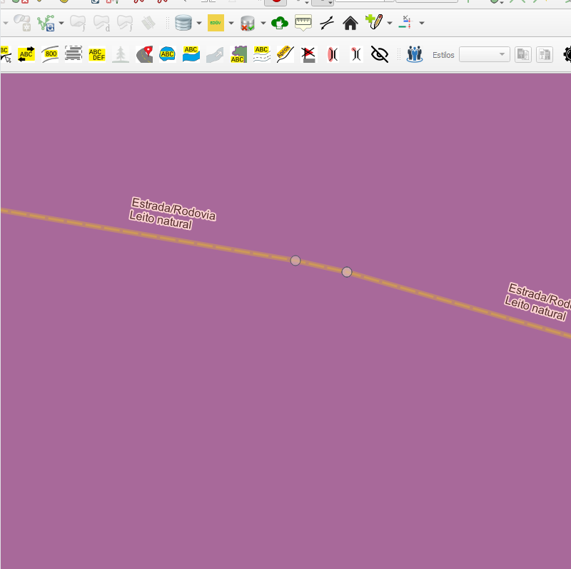

# Módulo 4: Provedor de Algoritmos - QA Tools: Snap Processes

## Algoritmo: Hierarchical Snap layer on layer (Snap hierárquico camada sobre camada)

## 1. Introdução

O algoritmo `Hierarchical Snap layer on layer` tem como objetivo realizar o ajuste (snap) de feições vetoriais de diferentes camadas, respeitando uma hierarquia definida pelo usuário. Esse processo é essencial para garantir o alinhamento topológico entre feições de diferentes temas em bases cartográficas.

---

## 2. Parâmetros de Entrada

| Parâmetro                | Descrição                                                                 |
|--------------------------|---------------------------------------------------------------------------|
| `Snap hierarchy`         | Lista hierárquica de camadas com definições de tolerância e modo de snap |
| `Process only selected`  | Se verdadeiro, apenas feições selecionadas serão processadas             |
| `Geographic Boundary`    | Camada poligonal que restringe espacialmente o processo de snapping       |

### Interface de Parâmetros

*Figura 4.1 – Interface do algoritmo "Hierarchical Snap layer on layer".*

---

## 3. Funcionamento

O algoritmo executa o snapping das camadas de acordo com a ordem e parâmetros definidos na hierarquia fornecida. O processo inclui:

1. **Preparação das camadas** (filtrando seleção e limites geográficos).
2. **Snapping com a camada de limite geográfico**, se fornecida.
3. **Snapping interno das camadas (self-snap)** respeitando o modo escolhido.
4. **Snapping entre camadas subordinadas e a camada de referência**.
5. **Atualização das camadas originais com as geometrias ajustadas**.

Cada etapa é monitorada por feedback de progresso e otimizada com uso de índices espaciais.

---

## 4. Saída Esperada

* As camadas originais ajustadas geometricamente segundo a hierarquia definida.
* Garantia de topologia consistente entre diferentes temas.

*Figura 4.2 – Exemplo de ajuste hierárquico entre camadas vetoriais.*

---

## 5. Aplicações Práticas

* Alinhamento de dados entre camadas como rios, estradas e limites administrativos
* Preparação de dados para validação topológica
* Integração de camadas em projetos cartográficos
* Harmonização de dados de múltiplas fontes ou escalas

---

## 6. Resumo

* Algoritmo de snapping hierárquico entre camadas
* Permite restrição espacial e ajuste seletivo
* Ferramenta poderosa para garantir integridade geométrica entre temas

> **ℹ️ Dica:** Use este algoritmo antes de realizar análises topológicas ou validações estruturais entre camadas.
