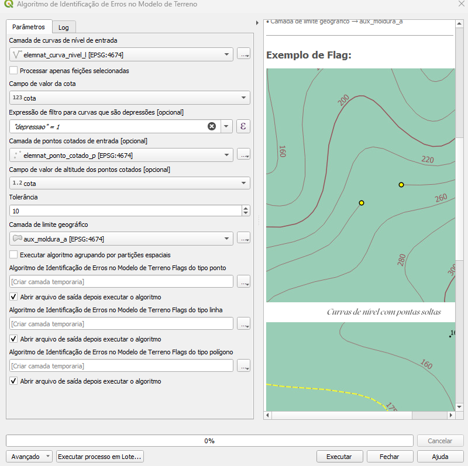
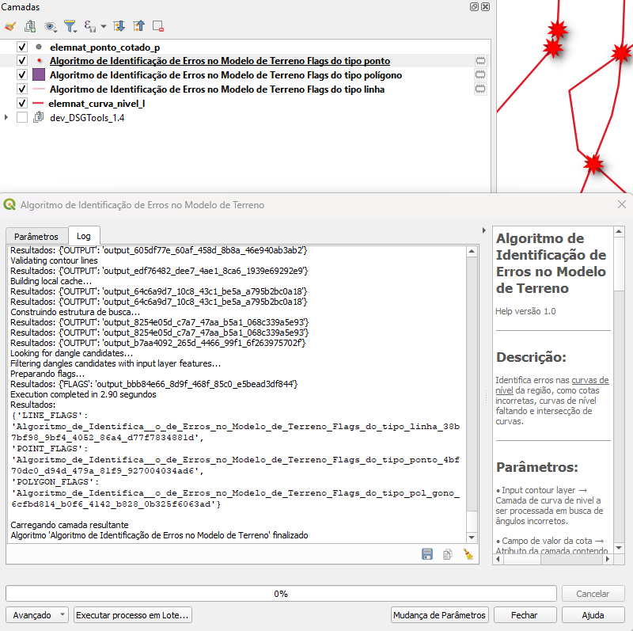

# Módulo 4: Provedor de Algoritmos – Processos de Terreno

## Algoritmo: Identificar Erros no Modelo de Terreno

## 1. Introdução
O algoritmo **Identificar Erros no Modelo de Terreno** executa uma série de checagens geométricas e altimétricas para localizar inconsistências em curvas de nível, pontos cotados e demais elementos do Modelo Digital de Terreno (MDT). Ele verifica discrepâncias de cota, supressão de depressões, incoerências de intervalos e posicionamento incorreto de feições em relação ao limite geográfico do mapeamento.

> *💡 Dica:* Utilize este algoritmo como etapa final de QA/QC antes de integrar o MDT a modelos hidrológicos ou análises de visibilidade.

---

## 2. Parâmetros de Entrada

| Parâmetro | Descrição |
|-----------|-----------|
| **Camada de curvas de nível** | Feições lineares que representam curvas de nível (obrigatório) |
| **Processar apenas feições selecionadas** | Limita as verificações às curvas destacadas |
| **Campo de cota da curva** | Atributo numérico com o valor altimétrico da curva |
| **Expressão de depressão** | Filtro para diferenciar curvas de depressão (*opcional*) |
| **Camada de pontos cotados** | Pontos com elevação conhecida (*opcional*) |
| **Campo de cota do ponto cotado** | Atributo numérico referente à elevação do ponto (*obrigatório se houver pontos*) |
| **Threshold** | Variação máxima aceitável (em metros) entre curva e ponto cotado |
| **Camada de moldura geográfica** | Limite poligonal do mapeamento para corte das feições |
| **Executar por partição espacial** | Ativa processamento paralelo por recortes da moldura |
| **Saída de flags (ponto)** | Camada de pontos que registra erros pontuais |
| **Saída de flags (linha)** | Camada de linhas que registra erros lineares |
| **Saída de flags (polígono)** | Camada de polígonos que registra erros em área |

### Interface de Parâmetros

*Figura 4.X – Tela de configuração do algoritmo.*

> ⚠️ **Atenção:** O campo de cota do ponto cotado **deve** ser informado se uma camada de pontos for fornecida.

---

## 3. Fluxo Operacional

1. **Preparação dos dados**  
   - Adicione as curvas de nível, pontos cotados (se existirem) e a moldura geográfica ao projeto QGIS.  
   - Selecione feições específicas caso deseje limitar a análise.  

2. **Configuração dos parâmetros**  
   - Abra o painel **Processamento › DSGTools › Processos de Terreno** e escolha *“Identificar Erros no Modelo de Terreno”*.  
   - Defina o campo de cota, a expressão para curvas de depressão (se aplicável) e o valor de **Threshold**.  
   - Decida se o processamento será executado por partição espacial (recomendado para áreas extensas).  

3. **Execução do algoritmo**  
   - O algoritmo realiza recorte pela moldura, converte curvas multipart em single‑part, constrói o modelo de terreno e aplica as verificações descritas na seção **Funcionamento**.  
   - Flags pontuais, lineares e poligonais são gravadas conforme a natureza do erro encontrado.  

4. **Análise dos resultados**  
   - Carregue as camadas de flags geradas e investigue cada ocorrência.  
   - Corrija a geometria ou o atributo de cota, conforme apropriado, e reexecute o algoritmo para validar as correções.

---

## 4. Funcionamento

| Etapa | Descrição | Tipo de Flag |
|-------|-----------|--------------|
| **Recorte pela moldura** | As curvas são recortadas pela moldura geográfica, com *buffer* mínimo para incluir trechos limítrofes | – |
| **Conversão para partes simples** | Curvas multipart são separadas para análise isolada | – |
| **Construção do modelo de terreno** | Gera estrutura espacial que relaciona curvas, depressões e pontos cotados | – |
| **Checagem de consistência de cota** | Verifica se a diferença entre curvas adjacentes ou pontos cotados excede o **Threshold** | Ponto |
| **Detecção de inversão altimétrica** | Identifica casos onde curvas internas possuem cota maior que curvas externas (vales invertidos) | Linha |
| **Verificação de depressões ausentes** | Confere se curvas marcadas como depressão encontram‑se abaixo das vizinhas | Polígono |
| **Comparação com pontos cotados** | Mede desvio entre altura da curva e ponto cotado coincidente | Ponto |
| **Avaliação de continuidade** | Detecta falhas ou sobreposições em curvas de mesmo nível | Linha |

> *💡 Dica:* Ative **Executar por partição espacial** para acelerar o processo em máquinas multicore; cada partição é processada em *threads* paralelas.

---

## 5. Saída Esperada

* **Camada de pontos:** erros de cota isolados, discrepâncias pontuais ou valores fora do limite.  
* **Camada de linhas:** segmentos com ordem altimétrica invertida ou lacunas na continuidade.  
* **Camada de polígonos:** áreas onde depressões estão mal classificadas ou inconsistentes.

*Figura 4.Y – Exemplo de flags pontuais (vermelho), lineares (amarelo) e poligonais (roxo).*

---

## 6. Aplicações Práticas

* Validação final antes de publicar MDT para órgãos cartográficos.  
* Detecção de erros que afetam análise de escoamento superficial.  
* Garantia de coerência altimétrica em cartas topográficas de alta precisão.  
* Pré‑processamento para modelagem hidrológica automatizada (ex.: SWAT, HEC‑RAS).

---

## 7. Resumo

* Verifica múltiplas inconsistências altimétricas e geométricas em curvas de nível e pontos cotados.  
* Suporta execução paralela por partições, aumentando desempenho em grandes áreas.  
* Gera camadas de flags separadas (ponto, linha, polígono) para inspeção e correção direcionada.

> *🔹 Recomendado:* Após corrigir erros, crie um índice espacial nas curvas atualizadas e repita o algoritmo para confirmar a qualidade do MDT.

