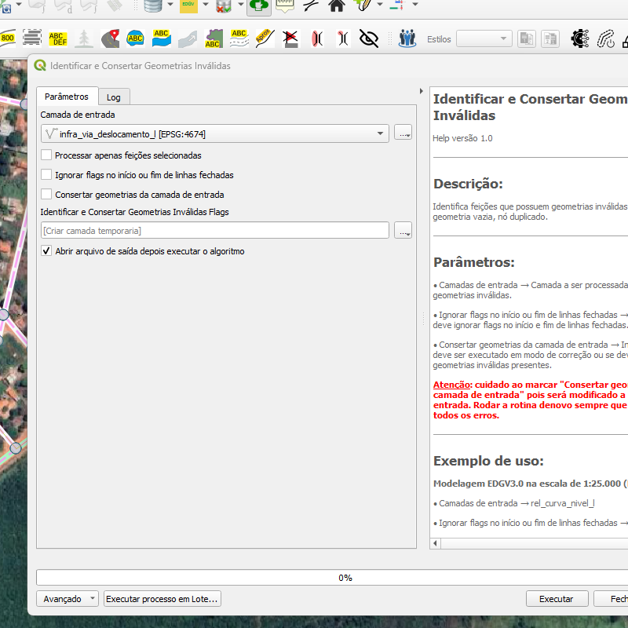
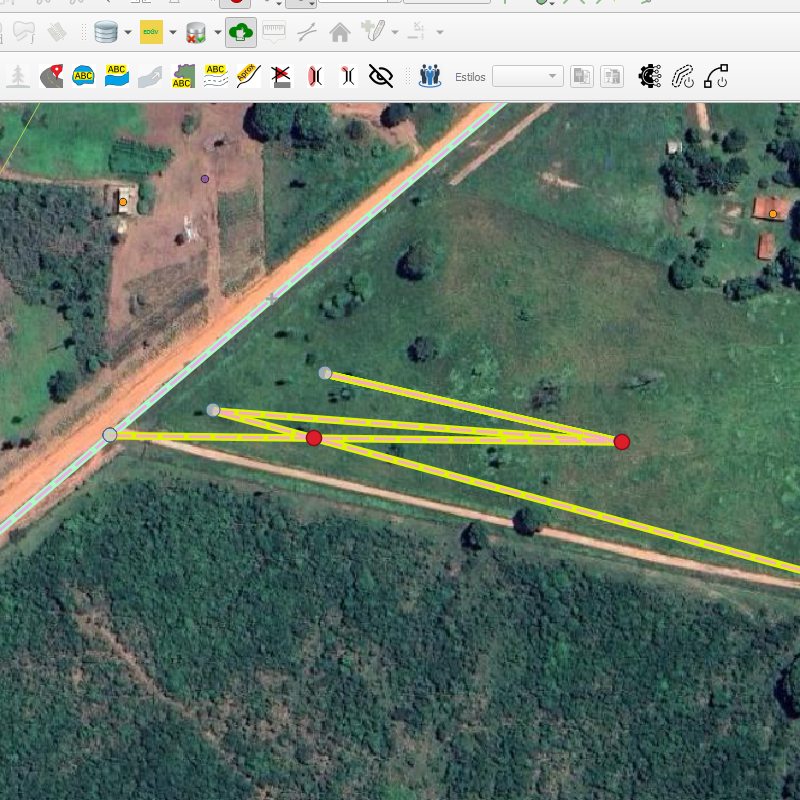

# Módulo 4: Provedor de Algoritmos - QA Tools

## Algoritmo: Identify And Fix Invalid Geometries (Identificar e corrigir geometrias inválidas)

## 1. Introdução

O algoritmo `Identify And Fix Invalid Geometries` realiza a identificação de geometrias inválidas em uma camada vetorial e, opcionalmente, corrige esses problemas automaticamente.

> **💡 Dica:** Essa ferramenta é fundamental para manter a integridade topológica dos dados, evitando erros em análises espaciais ou exportações.

---

## 2. Parâmetros de Entrada

| Parâmetro                      | Descrição                                                                 |
|-------------------------------|---------------------------------------------------------------------------|
| `Input layer`                 | Camada vetorial a ser avaliada                                           |
| `Process only selected features` | Se ativado, o algoritmo será aplicado apenas às feições selecionadas     |
| `Ignore flags on start/end of closed linestrings` | Ignora problemas em pontos de fechamento de linhas fechadas             |
| `Fix input geometries`        | Se ativado, corrige automaticamente as geometrias inválidas              |
| `Flags`                       | Saída vetorial com os pontos onde foram encontradas geometrias inválidas |

### Interface de Parâmetros

Abaixo, uma pré-visualização ilustrativa da interface do algoritmo:

*Figura 4.6 – Interface do algoritmo "Identify And Fix Invalid Geometries".*

---

## 3. Fluxo Operacional

1. Carregar a camada vetorial no QGIS
2. Acessar o algoritmo pelo provedor DSGTools
3. Definir se deseja corrigir as geometrias automaticamente
4. Escolher se serão processadas todas as feições ou apenas as selecionadas
5. Executar o algoritmo e revisar a camada de `flags` gerada

---

## 4. Funcionamento

O algoritmo percorre cada feição da camada vetorial para verificar inconsistências geométricas, como:

- Autointersecções
- Pontos duplicados
- Buracos inválidos
- Linhas abertas onde não deveriam

Se a opção de correção estiver ativada, ele tenta ajustar automaticamente essas geometrias, e marca os pontos críticos com `flags`.

> ⚠️ **Atenção:** As correções são realizadas diretamente na camada. Recomenda-se trabalhar com cópias em processos críticos.

---

## 5. Saída Esperada

* Uma camada vetorial com pontos (`flags`) indicando as geometrias inválidas
* Correções automáticas aplicadas, se selecionado
* Identificação precisa dos problemas com indicação textual (`reason`)

*Figura 4.7 – Exemplo de pontos indicativos de geometrias inválidas na camada original.*

---

## 6. Aplicações Práticas

* Validação de bases cartográficas antes de análises
* Correção automatizada em fluxos de produção
* Apoio ao controle de qualidade em bases geoespaciais
* Identificação de problemas para auditorias ou inspeções

---

## 7. Resumo

* Identifica geometrias inválidas em camadas vetoriais
* Corrige automaticamente (se configurado)
* Gera camada auxiliar de `flags` para visualização dos problemas

> 🔹 **Recomendado:** Execute este algoritmo antes de operações como união espacial, dissolução ou exportação de dados.

> ⚠️ **Importante:** Mantenha backups da camada original para garantir segurança dos dados em processos automatizados.
