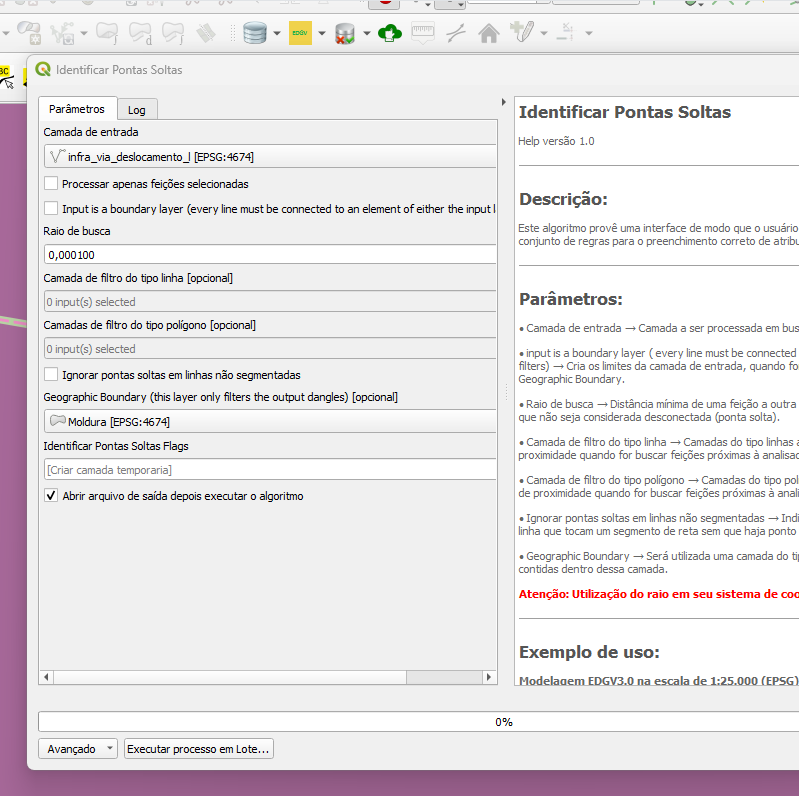
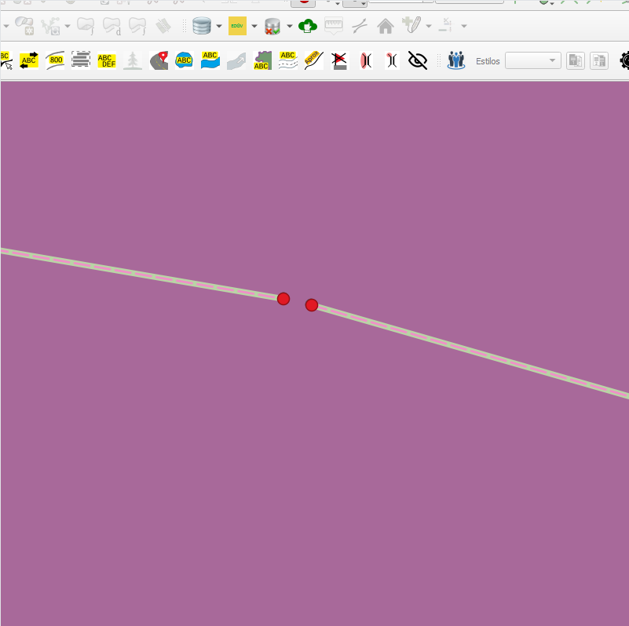

# Módulo 4: Provedor de Algoritmos - QA Tools: Line Handling

## Algoritmo: Identify Dangles (Identificar Pontas Soltas)

## 1. Introdução

O algoritmo `Identify Dangles` tem como objetivo identificar pontos terminais (dangles) em feições lineares que não estejam conectadas corretamente a outras geometrias ou à camada de referência, considerando critérios definidos pelo usuário. Ele é útil para verificar a integridade topológica de redes lineares, como rodovias, drenagens ou limites.

---

## 2. Parâmetros de Entrada

| Parâmetro                                        | Descrição                                                                                         |
|--------------------------------------------------|-----------------------------------------------------------------------------------------------------|
| `Input layer`                                    | Camada vetorial do tipo linha na qual serão buscados os dangles                                   |
| `Process only selected features`                 | Se verdadeiro, apenas feições selecionadas serão processadas                                       |
| `Input is a boundary layer`                      | Se verdadeiro, todas as linhas devem se conectar a elementos da própria camada ou filtros          |
| `Search radius`                                  | Raio de busca (em unidades da camada) para considerar vizinhança de conexão                        |
| `Linestring Filter Layers`                       | Camadas adicionais de linhas que serão consideradas para conexão                                   |
| `Polygon Filter Layers`                          | Camadas poligonais cujos limites serão convertidos em linhas para o mesmo fim                      |
| `Ignore dangle on unsegmented lines`             | Ignora dangles em linhas não segmentadas                                                           |
| `Geographic Boundary`                            | Limite geográfico usado apenas para filtrar os dangles identificados                               |

### Interface de Parâmetros

*Figura 4.X – Interface do algoritmo "Identify Dangles".*

> **🔍 Observação:** O uso de camadas de filtro melhora a acurácia da detecção de dangles, simulando contexto topológico.

---

## 3. Funcionamento

1. Cria-se uma versão temporária da camada com campo incremental e índice espacial.
2. São extraídos os vértices finais de cada linha.
3. Para cada ponto terminal:
   - Verifica-se se está isolado em relação às outras feições da mesma camada.
   - Se existirem camadas de filtro, também se verifica sua conexão com elas.
   - Se for dangle válido (conforme os critérios e tolerância), o ponto é marcado.
4. São criadas feições do tipo ponto nas localizações dos dangles, com mensagem explicativa.

---

## 4. Saída Esperada

* Camada do tipo `Point` com as localizações dos dangles identificados.
* Cada ponto inclui a mensagem: `Dangle on <nome da camada>`.

*Figura 4.X – Exemplo de dangles identificados pelo algoritmo.*

---

## 5. Aplicações Práticas

* Validação topológica de redes hidrográficas e viárias
* Controle de qualidade em bases cartográficas
* Verificação de conectividade em feições de limite territorial
* Diagnóstico de erros de digitalização

---

## 6. Resumo

* Algoritmo para detecção de dangles (extremidades desconectadas)
* Aceita filtros externos (camadas de linha e polígono)
* Considera tolerância de distância para conexão
* Saída pontual com feições de erro mapeadas

> **ℹ️ Dica:** Combine com o algoritmo `Snap Geometries to Layer` para corrigir dangles após identificação.
