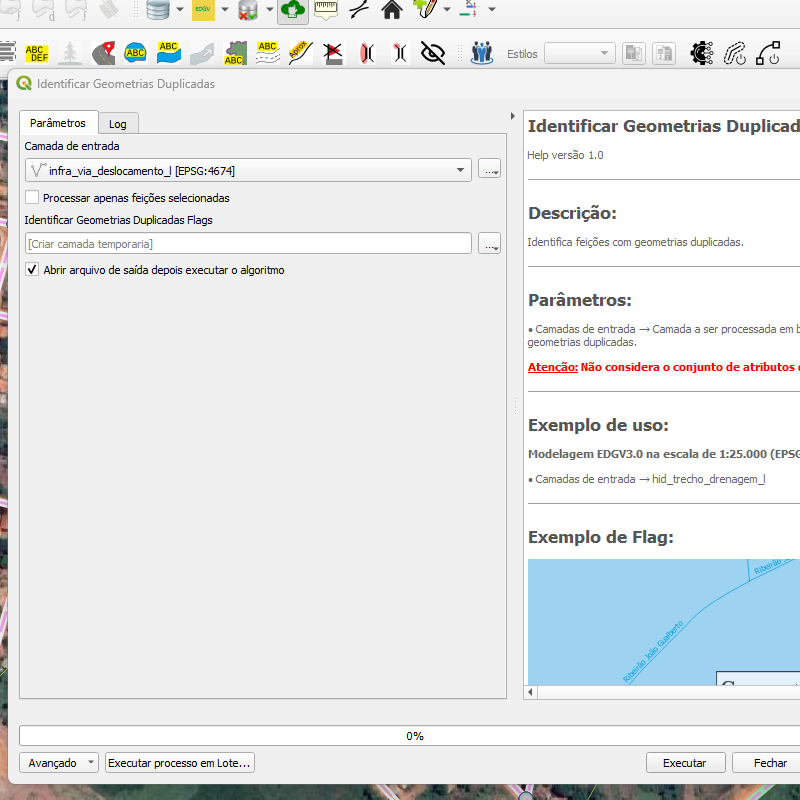
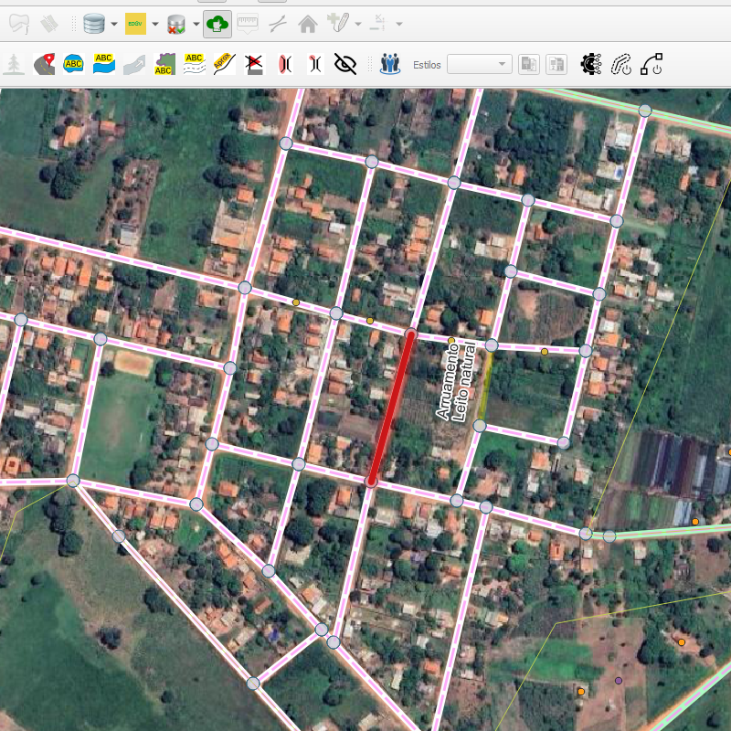

# Módulo 4: Provedor de Algoritmos - QA Tools

## Algoritmo: Identify Duplicated Features (Identificar feições duplicadas)

## 1. Introdução

O algoritmo `Identify Duplicated Features` realiza a identificação de feições com atributos duplicados em uma camada vetorial. Pode-se configurar campos a serem ignorados, inclusive chaves primárias e campos virtuais.

> **💡 Dica:** Ideal para encontrar registros redundantes em bases geográficas, especialmente quando diferentes feições compartilham a mesma geometria e atributos.

---

## 2. Parâmetros de Entrada

| Parâmetro                       | Descrição                                                                 |
|--------------------------------|---------------------------------------------------------------------------|
| `Input layer`                  | Camada vetorial que será analisada                                        |
| `Process only selected features` | Se ativado, o algoritmo considera apenas as feições selecionadas          |
| `Fields to ignore`             | Lista de campos que não serão considerados na verificação de duplicidade  |
| `Ignore virtual fields`        | Ignora campos calculados virtualmente pelo QGIS                           |
| `Ignore primary key fields`    | Ignora campos definidos como chave primária                               |
| `Flags`                        | Camada de saída com marcações (`flags`) nas feições duplicadas            |

### Interface de Parâmetros

*Figura 4.X – Interface do algoritmo "Identify Duplicated Features".*

---

## 3. Fluxo Operacional

1. Carregue a camada vetorial no QGIS
2. Execute o algoritmo pelo grupo `QA Tools: Duplicated Object Handling`
3. Defina quais campos devem ser ignorados
4. Escolha se serão consideradas apenas as feições selecionadas
5. Execute e analise a camada de `flags` gerada

---

## 4. Funcionamento

O algoritmo percorre as feições da camada, agrupando aquelas que possuem exatamente os mesmos atributos (excetuando os campos ignorados). Se ao menos dois registros forem iguais, uma flag será criada na posição de uma delas, indicando a duplicidade.

> ⚠️ **Atenção:** A comparação considera valores idênticos em todos os campos relevantes. Tipos de dados e campos nulos também são levados em conta.

---

## 5. Saída Esperada

* Uma camada vetorial com `flags` sobre as geometrias identificadas como duplicadas
* Indicação textual com os IDs das feições repetidas

*Figura 4.X – Exemplo de duplicidade detectada entre feições com atributos idênticos.*

---

## 6. Aplicações Práticas

* Verificação de consistência em bases cartográficas
* Detecção de duplicações causadas por falhas em processos de importação
* Apoio a revisões manuais e auditorias
* Higienização de bases geoespaciais

---

## 7. Resumo

* Identifica feições duplicadas com base nos atributos
* Permite personalizar campos ignorados na verificação
* Gera camada auxiliar com `flags` nas ocorrências

> 🔹 **Recomendado:** Use este algoritmo como etapa de pré-validação antes da integração de camadas ou submissão de dados.

> ⚠️ **Importante:** Certifique-se de revisar os campos ignorados para evitar falsos positivos ou negativos.
