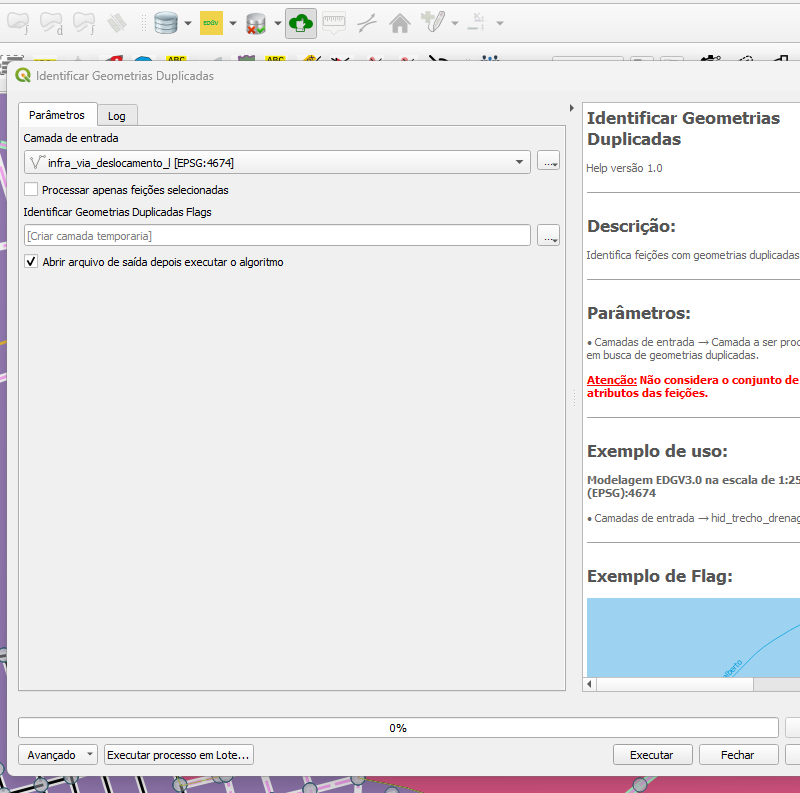
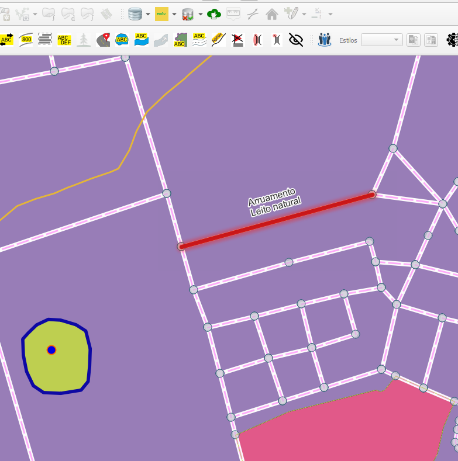

# Módulo 4: Provedor de Algoritmos - QA Tools

## Algoritmo: Identify Duplicated Geometries (Identificar geometrias duplicadas)

## 1. Introdução

O algoritmo `Identify Duplicated Geometries` permite identificar geometrias duplicadas em uma camada vetorial. Diferente de feições duplicadas, que são aquelas com geometria e atributos idênticos, o que pode causar problemas em análises espaciais e gerar redundâncias desnecessárias.

> **💡 Dica:** É altamente recomendável utilizar este algoritmo antes de exportações e análises estatísticas para evitar duplicidade de dados.

---

## 2. Parâmetros de Entrada

| Parâmetro                      | Descrição                                                                 |
|-------------------------------|---------------------------------------------------------------------------|
| `Input layer`                 | Camada vetorial a ser analisada                                          |
| `Process only selected features` | Se ativado, o algoritmo será aplicado apenas às feições selecionadas     |
| `Flags`                       | Saída vetorial com as localizações onde foram encontradas duplicatas     |

### Interface de Parâmetros

Abaixo, uma pré-visualização ilustrativa da interface do algoritmo:

*Figura 4.8 – Interface do algoritmo "Identify Duplicated Geometries".*

---

## 3. Fluxo Operacional

1. Carregar a camada vetorial no QGIS
2. Abrir o provedor de algoritmos DSGTools
3. Selecionar o algoritmo "Identify Duplicated Geometries"
4. Marcar a opção de processar apenas feições selecionadas (se desejado)
5. Executar o algoritmo e revisar a camada de `flags` com os pontos duplicados

---

## 4. Funcionamento

O algoritmo analisa todas as feições da camada vetorial e cria um dicionário com grupos de geometrias. Sempre que dois ou mais elementos coincidem totalmente, ele marca como duplicado e gera um `flag` na primeira ocorrência da geometria repetida.

> ⚠️ **Atenção:** Este algoritmo apenas sinaliza uma das ocorrências da duplicação. A remoção deve ser feita manualmente ou por outros algoritmos específicos.

---

## 5. Saída Esperada

* Uma camada vetorial com pontos (`flags`) indicando as geometrias duplicadas
* Identificação textual da duplicação com os respectivos IDs

*Figura 4.9 – Exemplo de identificação de geometrias duplicadas na camada original.*

---

## 6. Aplicações Práticas

* Validação de bases de dados para exportação
* Detecção de erros em processos de digitalização ou importação
* Apoio em auditorias cartográficas
* Garantia de unicidade em bancos espaciais

---

## 7. Resumo

* Identifica feições duplicadas com base na geometria e atributos
* Gera uma camada auxiliar de `flags` para visualização
* Ideal para validações em bases corporativas ou cartográficas

> 🔹 **Recomendado:** Execute em conjunto com algoritmos de verificação de topologia para maior robustez.

> ⚠️ **Importante:** Revise os dados manualmente antes de realizar exclusões automáticas.

