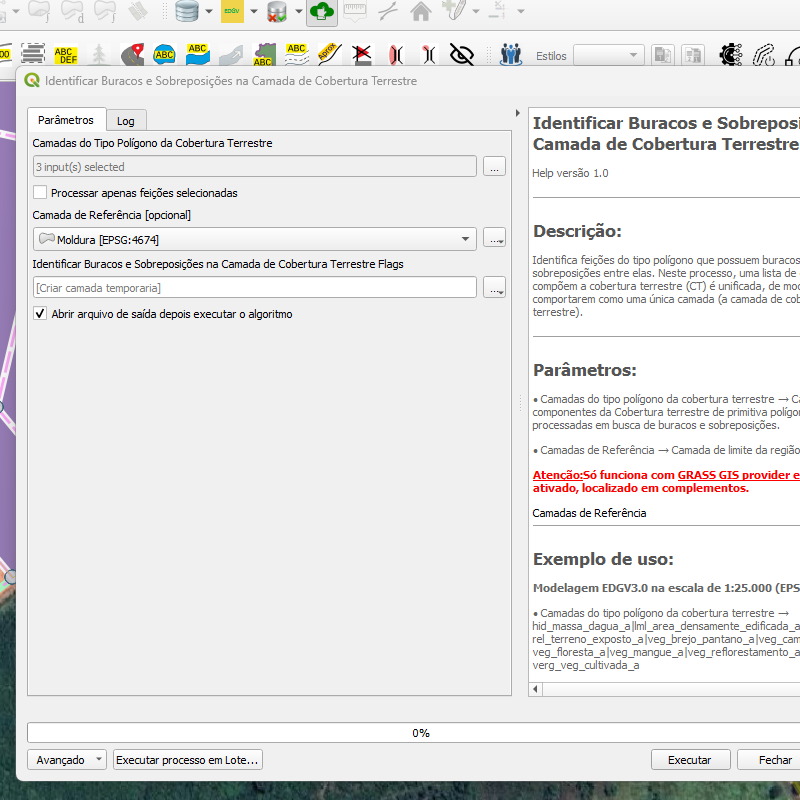
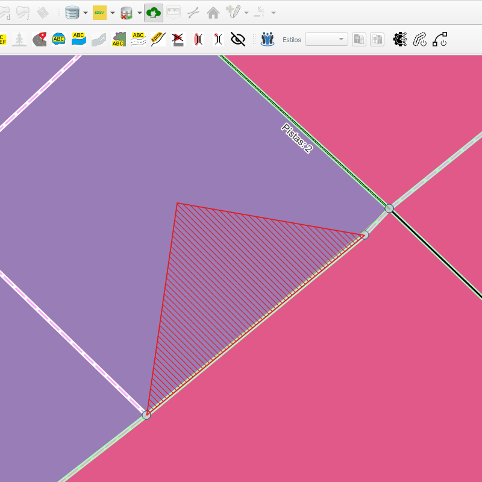

# Módulo 4: Provedor de Algoritmos - QA Tools

## Algoritmo: Identify Gaps and Overlaps in Coverage Layers (Identificar lacunas e sobreposições em camadas de cobertura)

## 1. Introdução

O algoritmo `Identify Gaps and Overlaps in Coverage Layers` tem como objetivo identificar lacunas (gaps) e sobreposições (overlaps) em camadas poligonais de cobertura, considerando opcionalmente uma camada de moldura (frame).

> **💡 Dica:** Essencial para verificação de completude e consistência topológica em projetos cartográficos baseados em polígonos contínuos, como cobertura de uso da terra.

---

## 2. Parâmetros de Entrada

| Parâmetro                      | Descrição                                                                 |
|-------------------------------|---------------------------------------------------------------------------|
| `Coverage Polygon Layers`     | Lista de camadas poligonais que compõem a cobertura a ser analisada       |
| `Process only selected features` | Se ativado, o algoritmo será aplicado apenas às feições selecionadas     |
| `Frame Layer`                 | Camada de moldura para limitar a área de análise (opcional)              |
| `Flags`                       | Camada de saída com os polígonos problemáticos (gaps/overlaps)           |

### Interface de Parâmetros

Abaixo, uma visualização simulada da interface do algoritmo:

*Figura 4.X – Interface do algoritmo "Identify Gaps and Overlaps in Coverage Layers".*

---

## 3. Fluxo Operacional

1. Selecionar as camadas de cobertura poligonais
2. (Opcional) Selecionar camada de moldura para limitar a análise
3. Escolher se quer analisar todas as feições ou apenas as selecionadas
4. Executar o algoritmo
5. Analisar camada de saída com os `flags`

---

## 4. Funcionamento

O algoritmo realiza os seguintes passos:

- Une todas as feições das camadas de entrada
- Realiza uma sobreposição para detectar geometrias redundantes (sobrepostas)
- Identifica buracos (gaps) entre polígonos
- Caso fornecida a camada de moldura, também identifica áreas que deveriam estar cobertas e não estão (gaps externos)
- Gera uma camada com os `flags` dos problemas detectados

> ⚠️ **Atenção:** Para garantir resultados corretos, todas as camadas devem estar no mesmo SRC e não devem conter geometrias inválidas.

---

## 5. Saída Esperada

* Camada vetorial com feições representando os `gaps` e `overlaps` identificados
* Textos explicativos nos atributos indicando o tipo de erro
* Precisão espacial para auditoria visual e correção

*Figura 4.X – Saída do algoritmo com flags para gaps internos e externos, e sobreposições.*

---

## 6. Aplicações Práticas

* Controle de qualidade em mapeamentos contínuos (uso da terra, cobertura vegetal, etc.)
* Análise de consistência de dados em projetos cadastrais
* Validação de blocos cartográficos antes da integração em bases nacionais
* Identificação de falhas na cobertura cartográfica

---

## 7. Resumo

* Detecta lacunas e sobreposições em camadas poligonais
* Opcionalmente considera moldura para gaps externos
* Gera camada com `flags` para correções manuais ou automatizadas

> 🔹 **Recomendado:** Execute este algoritmo após edições colaborativas em blocos contíguos para garantir continuidade espacial.

> ⚠️ **Importante:** As geometrias de entrada devem estar limpas e topologicamente corretas para resultados confiáveis.
