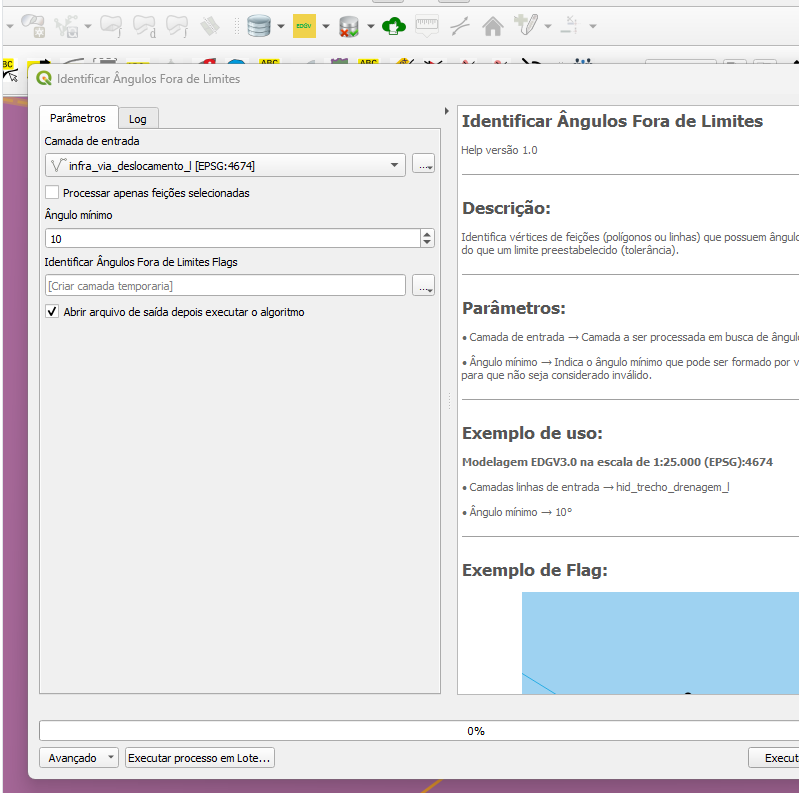
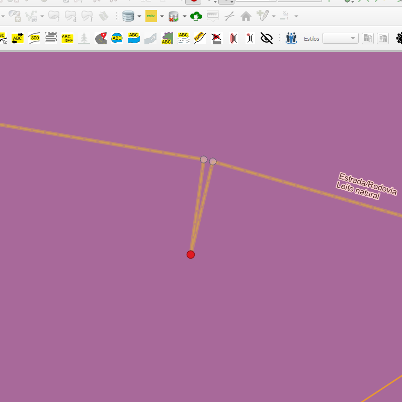

# Módulo 4: Provedor de Algoritmos - QA Tools: Basic Geometry Construction Issues Handling

## Algoritmo: Identify Out Of Bounds Angles (Identificar ângulos fora dos limites)

## 1. Introdução

O algoritmo `Identify Out Of Bounds Angles` tem como objetivo identificar **ângulos muito agudos** (abaixo de um limiar definido pelo usuário) em geometrias do tipo **linha** ou **polígono**. Esses ângulos podem indicar problemas de construção, como vértices mal posicionados ou distorções cartográficas, e são especialmente críticos em dados de precisão.

> 💡 **Dica:** Útil para detectar geometrias mal formadas ou ruídos em processos de digitalização e vetorização.

---

## 2. Parâmetros de Entrada

| Parâmetro                         | Descrição                                                                 |
|----------------------------------|---------------------------------------------------------------------------|
| `Input layer`                    | Camada vetorial do tipo linha ou polígono que será inspecionada          |
| `Process only selected features` | Se marcado, processa apenas as feições selecionadas                      |
| `Minimum angle`                  | Valor mínimo de ângulo (em graus) aceito entre segmentos                  |
| `Flags`                          | Camada de saída com os pontos de ângulo crítico detectados               |

### Interface de Parâmetros

Abaixo, uma pré-visualização ilustrativa da interface do algoritmo:

*Figura 4.8 – Interface do algoritmo "Identify Out Of Bounds Angles".*

---

## 3. Fluxo Operacional

1. O algoritmo percorre cada feição da camada informada  
2. Em cada vértice, calcula os ângulos formados entre segmentos consecutivos  
3. Se algum ângulo for menor que a tolerância especificada, um ponto é marcado na saída  
4. Cada ponto contém um atributo descritivo da ocorrência do problema  

> ⚠️ **Atenção:** O cálculo do ângulo considera a geometria projetada. Em CRS geográficos (graus), os resultados podem não ser precisos.

---

## 4. Funcionamento

O algoritmo utiliza uma função especializada para percorrer vértices internos de cada geometria e calcular os ângulos entre segmentos adjacentes. Os pontos com ângulos abaixo do limite são armazenados em uma camada de saída com atributos descritivos.

---

## 5. Saída Esperada

- Camada do tipo ponto indicando os locais onde os ângulos estão fora da tolerância  
- Campo de texto indicando a feição original e o valor do ângulo encontrado  
- Mensagens como: `"Feature from layer <nome> with id=<id> has angle of value <X> degrees..."`

*Figura 4.X – Saída do algoritmo com flags para ângulos fora de limites.*

---

## 6. Aplicações Práticas

- Detecção de geometrias com picos ou dentes indesejados  
- Verificação de qualidade em polígonos de parcelamento urbano, uso da terra ou vegetação  
- Suporte à reconstrução de geometria limpa e suavizada  
- Inspeção de dados digitalizados manualmente

---

## 7. Resumo

- Verifica ângulos internos entre segmentos de uma geometria  
- Identifica vértices com ângulos abaixo de uma tolerância definida  
- Saída vetorial com pontos de alerta (flags)  

> 🔹 **Recomendado:** Use CRS projetado (como UTM) para melhor precisão nos cálculos.  
> ⚠️ **Atenção:** Geometrias muito densas podem gerar múltiplos pontos de alerta.