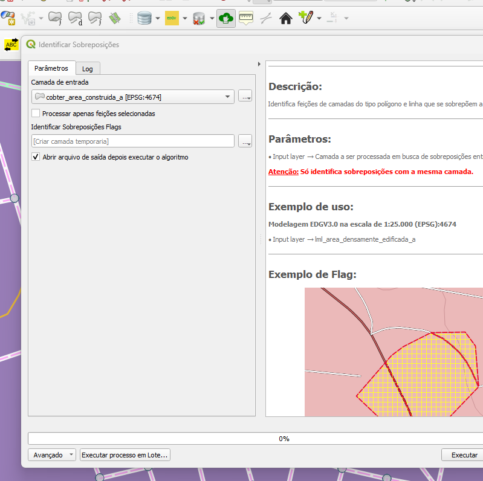
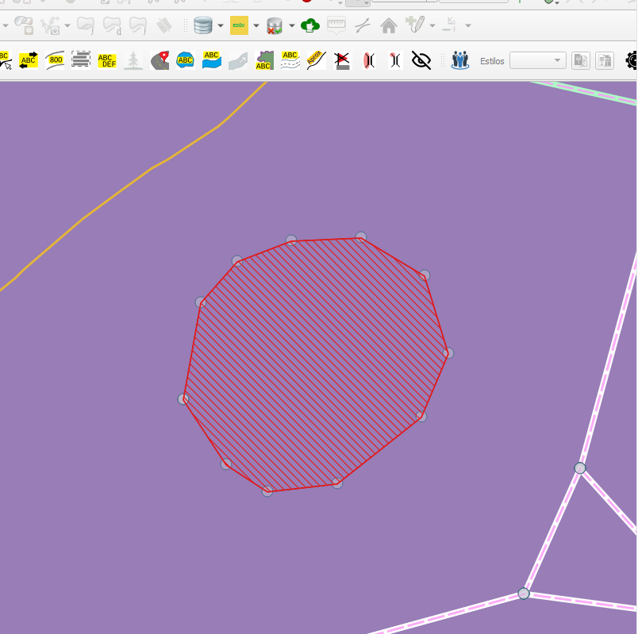

# Módulo 4: Provedor de Algoritmos - QA Tools: Basic Geometry Construction Issues Handling

## Algoritmo: Identify Overlaps (Identificar sobreposições)

## 1. Introdução

O algoritmo `Identify Overlaps` identifica **sobreposições geométricas** entre feições do tipo **linha** ou **polígono** dentro de uma mesma camada. É uma ferramenta essencial para verificação da **qualidade topológica**, permitindo detectar inconsistências em bases cartográficas antes de análises ou publicações.

> 💡 **Dica:** Muito útil para garantir a integridade de camadas vetoriais antes de processos como união, dissolução, análise espacial ou validação.

---

## 2. Parâmetros de Entrada

| Parâmetro                         | Descrição                                                                 |
|----------------------------------|---------------------------------------------------------------------------|
| `Input layer`                    | Camada de entrada (linhas ou polígonos) onde serão verificadas as sobreposições |
| `Process only selected features` | Se marcado, processa apenas as feições selecionadas                      |
| `Flags`                          | Camada de saída com geometrias sobrepostas encontradas                   |

### Interface de Parâmetros

Abaixo, uma pré-visualização ilustrativa da interface do algoritmo:

*Figura 4.8 – Interface do algoritmo "Identify Overlaps".*

---

## 3. Fluxo Operacional

1. Adiciona um campo incremental à camada para rastrear as feições  
2. Cria um índice espacial e estrutura auxiliar para otimizar a busca  
3. Executa um `join espacial` de feições contra elas mesmas  
4. Avalia pares com geometrias sobrepostas (evitando duplicidade e autointerseções)  
5. Gera uma camada com os trechos de interseção geométrica detectados  

> ⚠️ **Atenção:** Apenas interseções com o mesmo tipo geométrico são consideradas válidas (linha com linha, polígono com polígono).

---

## 4. Funcionamento

O algoritmo utiliza **estrutura auxiliar incremental** e **paralelização** com `ThreadPoolExecutor` para identificar pares de feições que se sobrepõem. Para cada par, a interseção geométrica é avaliada, e o trecho sobreposto é convertido em feição na camada de saída, com uma flag descritiva.

---

## 5. Saída Esperada

- Camada do tipo linha ou polígono, conforme a entrada, contendo geometrias sobrepostas  
- Campo descritivo de flag (`"Overlap on layer <nome>"`)  
- Apenas pares distintos são considerados (evita duplicidade ou autointerseção)  

*Figura 4.9 – Exemplo de identificação de geometrias duplicadas na camada original.*

---

## 6. Aplicações Práticas

- Validação topológica em bases cartográficas colaborativas  
- Identificação de duplicidade de vetores em camadas consolidadas  
- Análise de consistência em feições de uso da terra ou parcelamento urbano  
- Pré-processamento para ferramentas como `Eliminate`, `Dissolve`, `Topology Checker`  

---

## 7. Resumo

- Detecta sobreposições geométricas em camadas de linha ou polígono  
- Processamento paralelo e otimizado com índice espacial  
- Saída vetorial com interseções identificadas e rastreáveis por flag  

> 🔹 **Recomendado:** Use sobre camadas validadas para garantir resultados coerentes.  
> ⚠️ **Atenção:** Sobreposições internas ou muito pequenas podem não ser visíveis sem zoom adequado.