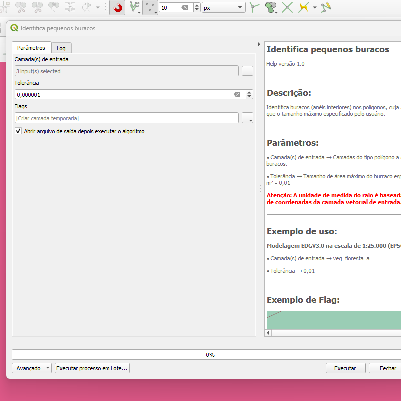
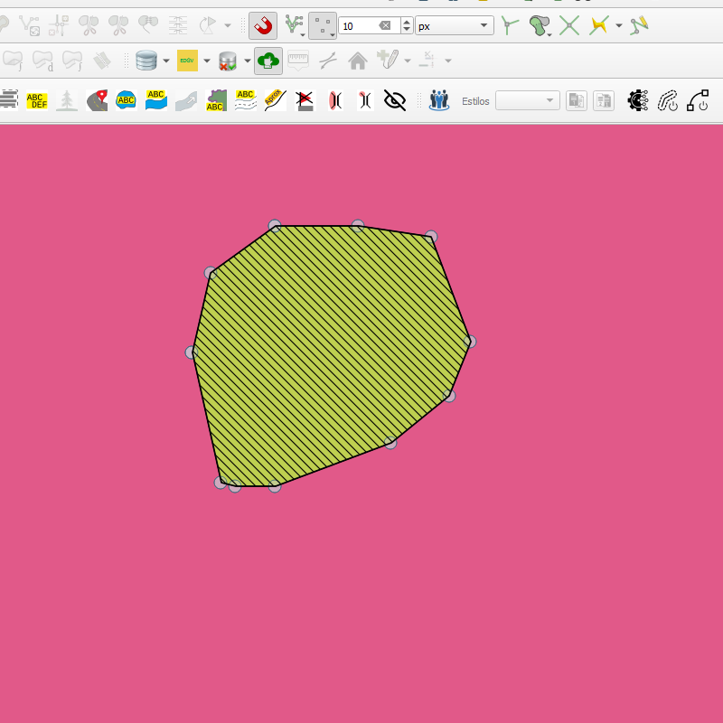

# Módulo 4: Provedor de Algoritmos - QA Tools: Small Object Handling

## Algoritmo: Identify Small Holes (Identificar pequenos buracos)

## 1. Introdução

O algoritmo `Identify Small Holes` tem como objetivo identificar furos (anéis interiores) em feições do tipo polígono que sejam menores do que uma tolerância definida pelo usuário. Ele é especialmente útil para detectar imperfeições ou inconsistências topológicas em bases cartográficas vetoriais.

---

## 2. Parâmetros de Entrada

| Parâmetro              | Descrição                                                                 |
|------------------------|---------------------------------------------------------------------------|
| `Input layer(s)`       | Camadas vetoriais do tipo polígono onde serão buscados furos              |
| `Tolerance`            | Valor numérico (em unidades da camada) que define a área máxima do furo   |

### Interface de Parâmetros

*Figura 4.1 – Interface do algoritmo "Identify Small Holes".*

> **🔍 Observação:** Certifique-se de que as camadas estejam com geometria válida e sistema de referência adequado.

---

## 3. Funcionamento

O algoritmo percorre todas as feições das camadas fornecidas e verifica se existe algum anel interno (furo) com área inferior à tolerância definida. Caso existam, esses furos são registrados como novas feições poligonais em uma camada de saída com campo informando a área de cada um.

---

## 4. Saída Esperada

* Uma camada do tipo `Multipolygon` contendo os furos encontrados.
* Campo `area` indicando a área de cada furo.
* Apenas os furos menores que a tolerância definida são incluídos.

*Figura 4.2 – Exemplo de furos identificados e extraídos pelo algoritmo.*

---

## 5. Aplicações Práticas

* Verificação de qualidade em bases cartográficas
* Pré-processamento para operações de simplificação ou reconstrução de geometria
* Validação topológica em processos de mapeamento colaborativo
* Detecção de inconsistências em vetores de uso e cobertura da terra

---

## 6. Resumo

* Algoritmo para detecção de furos em polígonos com base em limite de área
* Saída vetorial com geometria dos furos identificados
* Ideal para controle de qualidade e validação geométrica

> **ℹ️ Dica:** Use em conjunto com algoritmos de correção para eliminar furos indesejados após a identificação.