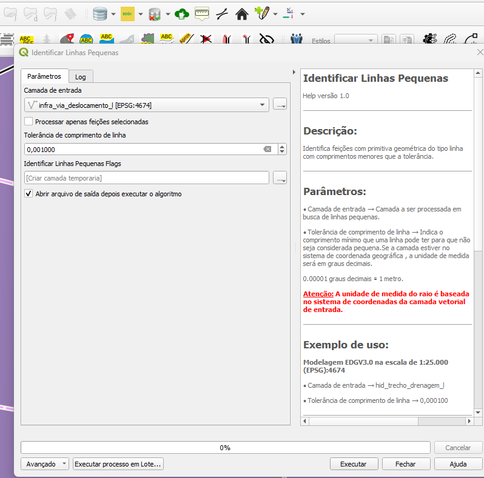
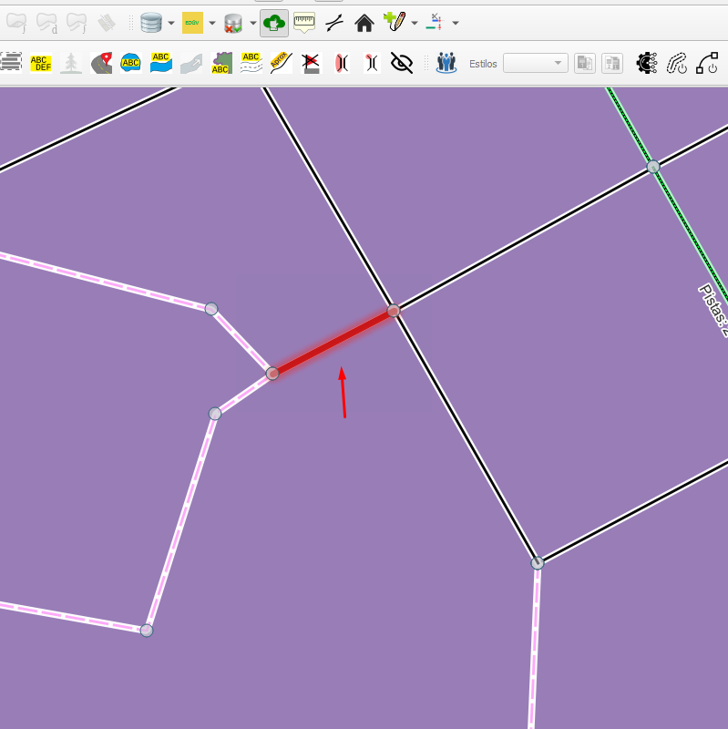

# Módulo 4: Provedor de Algoritmos - QA Tools

## Algoritmo: Identify Small Lines (Identificar pequenas linhas)

## 1. Introdução

O algoritmo `Identify Small Lines` realiza a identificação de feições lineares com comprimento inferior a um valor de tolerância definido pelo usuário. Esse processo é fundamental para detectar feições residuais ou erros de digitalização que podem comprometer a qualidade dos dados vetoriais.

> **💡 Dica:** Linhas muito pequenas podem ser indesejadas em processos de análise espacial, mapeamento temático ou exportação para outros formatos.

---

## 2. Parâmetros de Entrada

| Parâmetro                      | Descrição                                                                 |
|-------------------------------|---------------------------------------------------------------------------|
| `Input layer`                 | Camada vetorial linear a ser avaliada                                     |
| `Process only selected features` | Se ativado, o algoritmo será aplicado apenas às feições selecionadas     |
| `Line length tolerance`       | Valor de tolerância (em unidades do sistema de referência da camada)      |
| `Flags`                       | Saída vetorial com as feições lineares que foram identificadas como pequenas |

### Interface de Parâmetros

Abaixo, uma pré-visualização ilustrativa da interface do algoritmo:

*Figura 4.10 – Interface do algoritmo "Identify Small Lines".*

---

## 3. Fluxo Operacional

1. Carregar a camada linear no QGIS
2. Acessar o algoritmo pelo provedor DSGTools
3. Definir o valor de tolerância para o comprimento das linhas
4. Escolher se deseja processar apenas as feições selecionadas
5. Executar o algoritmo e analisar a camada `flags` gerada

---

## 4. Funcionamento

O algoritmo percorre cada feição da camada vetorial, calcula seu comprimento e compara com o valor de tolerância. Se o comprimento da linha for inferior ao valor definido, a feição é marcada e registrada na camada de saída (`flags`).

> ⚠️ **Atenção:** A unidade da tolerância deve ser coerente com o sistema de referência espacial da camada. Utilize valores em metros para sistemas projetados (ex: UTM).

---

## 5. Saída Esperada

* Uma camada vetorial com feições do tipo linha que têm comprimento menor que o valor de tolerância
* Texto explicativo em cada feição da saída (`flags`), informando o motivo da marcação

*Figura 4.11 – Exemplo de linhas pequenas identificadas pelo algoritmo.*

---

## 6. Aplicações Práticas

* Validação de feições lineares em bases cartográficas
* Identificação de erros de digitalização
* Apoio ao controle de qualidade em mapeamentos vetoriais
* Processos de depuração de dados antes de operações de rede

---

## 7. Resumo

* Identifica linhas com comprimento inferior a um valor definido
* Permite trabalhar apenas com feições selecionadas
* Gera uma camada auxiliar de `flags` com as linhas críticas

> 🔹 **Recomendado:** Use esse algoritmo antes de realizar simplificações ou generalizações em feições lineares.

> ⚠️ **Importante:** Certifique-se de que o valor de tolerância faz sentido para a escala de trabalho e o sistema de referência usado.
