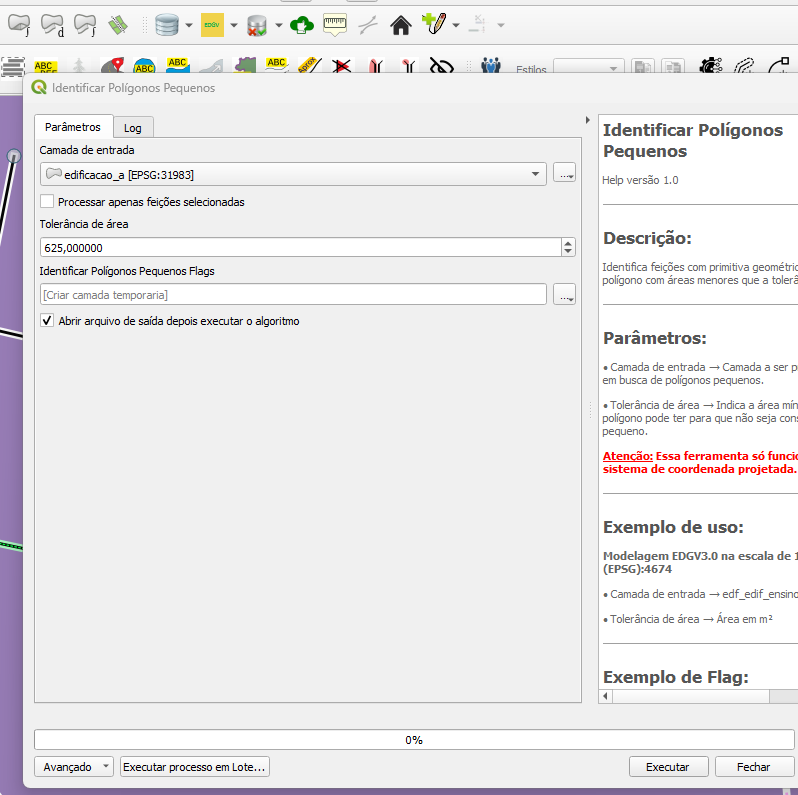

# Módulo 4: Provedor de Algoritmos - QA Tools

## Algoritmo: Identify Small Polygons (Identificar polígonos pequenos)

## 1. Introdução

O algoritmo `Identify Small Polygons` realiza a identificação de polígonos com área inferior a um valor mínimo (tolerância) definido pelo usuário.

> **💡 Dica:** Este algoritmo é útil para detectar feições espúrias ou pequenas falhas em bases cartográficas vetoriais.

---

## 2. Parâmetros de Entrada

| Parâmetro                      | Descrição                                                                 |
|-------------------------------|---------------------------------------------------------------------------|
| `Input layer`                 | Camada vetorial de entrada (tipo polígono)                               |
| `Process only selected features` | Se ativado, o algoritmo será aplicado apenas às feições selecionadas     |
| `Area tolerance`              | Valor de área (em unidades²) para identificar os polígonos pequenos      |
| `Flags`                       | Saída vetorial com os polígonos que foram identificados como pequenos    |

### Interface de Parâmetros

Abaixo, uma pré-visualização ilustrativa da interface do algoritmo:

  
*Figura 4.X – Interface do algoritmo "Identify Small Polygons".*

---

## 3. Fluxo Operacional

1. Carregar a camada vetorial de polígonos no QGIS
2. Acessar o algoritmo pelo provedor DSGTools
3. Definir a tolerância de área mínima para análise
4. Escolher se deseja processar todas as feições ou apenas as selecionadas
5. Executar o algoritmo e revisar a camada de `flags` gerada

---

## 4. Funcionamento

O algoritmo percorre cada feição da camada de entrada e calcula sua área. Se a área da geometria for inferior à tolerância definida, a feição é marcada com um `flag` descritivo.

> ⚠️ **Importante:** A análise considera a área planar da geometria e não altera a camada original.

---

## 5. Saída Esperada

* Uma camada vetorial de saída contendo os polígonos cuja área é inferior ao limite estabelecido
* Texto explicativo no atributo da feição flag indicando a área e o motivo do flag

  
*Figura 4.X – Exemplo de saída com feições pequenas destacadas.*

---

## 6. Aplicações Práticas

* Validação de polígonos espúrios em bases topográficas
* Identificação de áreas insignificantes após processos de união/dissolução
* Inspeção de qualidade cartográfica

---

## 7. Resumo

* Identifica polígonos com área menor que o valor definido
* Gera camada auxiliar de `flags` para visualização dos problemas
* Preserva a camada original

> 🔹 **Recomendado:** Use este algoritmo antes de processos de generalização ou exportação de bases cartográficas.

> ⚠️ **Importante:** Revise as feições marcadas antes de descartá-las — em alguns casos, podem representar elementos legítimos.
