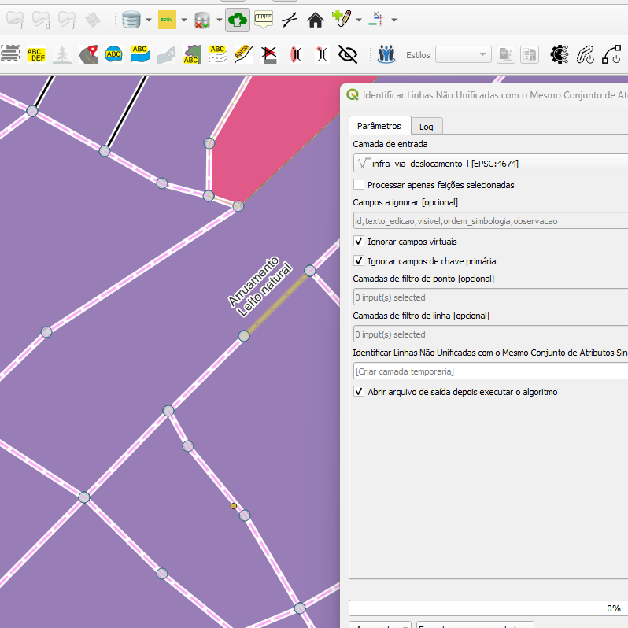
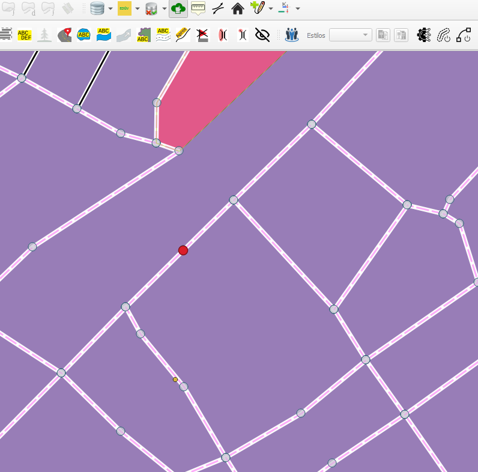

## Algoritmo: Identify Unmerged Lines With Same Attribute Set (Identificar linhas não mescladas com o mesmo conjunto de atributos)

## 1. Introdução

O algoritmo `Identify Unmerged Lines With Same Attribute Set` identifica feições do tipo linha que compartilham exatamente o mesmo conjunto de atributos e **não estão fundidas (mergeadas)**, ou seja, representam possíveis duplicidades ou descontinuidades na base vetorial. Esse processo é essencial para garantir a qualidade e consistência da geometria em bancos de dados espaciais.

> 💡 **Dica:** Muito útil em rotinas de QA/QC (Quality Assurance/Quality Control), especialmente para redes lineares como rodovias, rios ou linhas de transmissão.

---

## 2. Parâmetros de Entrada

| Parâmetro                             | Descrição                                                                 |
|---------------------------------------|---------------------------------------------------------------------------|
| `Input layer`                         | Camada de entrada do tipo linha                                           |
| `Process only selected features`      | Define se apenas feições selecionadas devem ser analisadas               |
| `Fields to ignore`                    | Lista de campos que serão ignorados na comparação de atributos           |
| `Ignore virtual fields`              | Ignora campos virtuais definidos no QGIS                                 |
| `Ignore primary key fields`           | Ignora campos de chave primária (IDs)                                     |
| `Point Filter Layers`                 | Camadas de pontos para filtrar conexões que não devem ser fundidas       |
| `Line Filter Layers`                  | Camadas de linha auxiliares para filtrar fusões inadequadas              |
| `Flags`                               | Saída com as geometrias pontuais que sinalizam os erros encontrados      |

### Interface de Parâmetros

*Figura 4.1 – Interface do algoritmo "Identify Unmerged Lines With Same Attribute Set".*

---

## 3. Funcionamento

1. A camada de entrada é convertida em um grafo bidirecional onde cada linha é uma aresta e os vértices iniciais e finais são nós.
2. O algoritmo constrói estruturas auxiliares para detectar conexões topológicas e checa atributos de cada par de linhas conectadas.
3. Se duas linhas são conectadas e têm o mesmo conjunto de atributos (excetuando os ignorados), mas **não estão unidas** como uma única geometria, o ponto de conexão é sinalizado.
4. O algoritmo permite uso de camadas filtro para impedir que determinadas conexões sejam consideradas erroneamente.

---

## 4. Fluxo Operacional

1. Carregar camada de linha no QGIS  
2. Abrir o plugin DSGTools e selecionar o algoritmo `Identify Unmerged Lines With Same Attribute Set`  
3. Configurar os campos que devem ser ignorados na análise  
4. (Opcional) Adicionar camadas filtro de ponto ou linha  
5. Executar o algoritmo e revisar os pontos sinalizados como possíveis falhas  

---

## 5. Saída Esperada

- Camada vetorial de pontos representando os nós onde a fusão deveria ocorrer  
- Cada ponto contém uma flag descritiva sobre o problema detectado  

  
*Figura 4.X – Exemplo de saída do algoritimo Identify Unmerged Lines.*

---

## 6. Aplicações Práticas

- Validação de redes hidrográficas (rios com mesmo nome e sem fusão)  
- Controle de qualidade em malhas viárias (estradas segmentadas indevidamente)  
- Análise de continuidade em dados importados ou digitados manualmente  
- Detecção de redundâncias geométricas não visuais  

---

## 7. Resumo

- Identifica linhas com atributos idênticos que estão separadas mas poderiam ser fundidas  
- Permite configurar campos ignorados e filtros espaciais auxiliares  
- Sinaliza os pontos problemáticos com geometria e descrição  

> 🔹 **Recomendado:** Use antes da entrega final de dados ou como parte do checklist de validação topológica.  
> ⚠️ **Atenção:** Exige a biblioteca `networkx` instalada no ambiente do QGIS para funcionar corretamente.