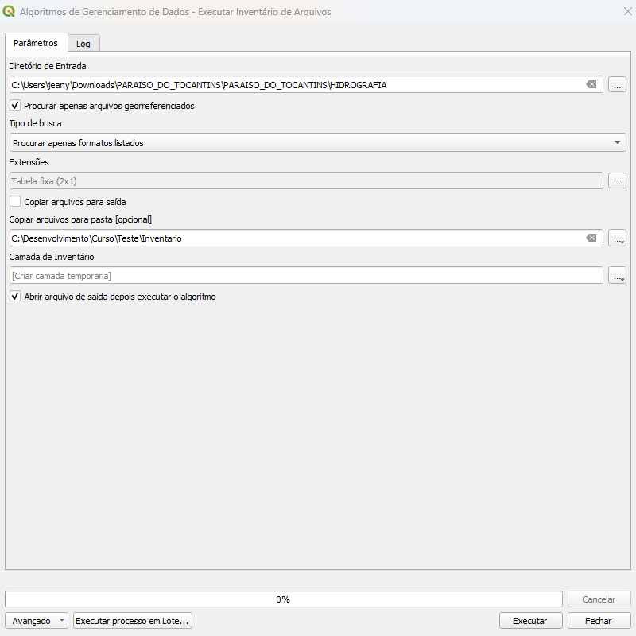

# Módulo 4: Provedor de Algoritmos - Inventário

## Algoritmo: Inventário de Arquivos (Run File Inventory)

---

## 1. Introdução

O algoritmo **Inventário de Arquivos** realiza uma varredura em um diretório especificado, identifican os arquivos espaciais (como shapefiles e rasters) e produz uma camada vetorial com informações sobre esses arquivos.
É uma ferramenta essencial para organização, gestão e preparo dos dados geoespaciais.
Com a camada criada é possivel verificar rapidamente quais insumos estão disponiveis, qual local do terreno e qual o dataset, ou seja, onde se encontra o arquivo.

> 💡 *Dica:* Utilize esse algoritmo para mapear rapidamente os dados disponíveis em pastas externas antes de iniciar os processos do preparo.

---

## 2. Parâmetros de Entrada

| Parâmetro                      | Descrição                                                                 |
| ----------------------------- | ------------------------------------------------------------------------- |
| Diretório de Entrada          | Caminho da pasta onde será feita a varredura                             |
| Procurar apenas georreferenciados | Filtra apenas arquivos com referência espacial                           |
| Tipo de Busca                 | Define se serão incluídas ou excluídas as extensões listadas             |
| Extensões                     | Lista de formatos (ex.: `shp`, `tif`) a incluir ou excluir                |
| Copiar arquivos para saída    | Se marcado, copia os arquivos encontrados para outra pasta               |
| Pasta de Cópia                | Caminho da pasta de destino para os arquivos copiados                    |
| Camada de Inventário (saída)  | Camada vetorial resultante com os arquivos identificados                 |

### Interface de Parâmetros

A seguir, temos um exemplo da interface do algoritmo *"Inventário de Arquivos"* no provedor de algoritmos do DSGTools, onde o usuário define o diretório, os filtros e os formatos desejados:

*Figura 4.3 – Interface do algoritmo "Inventário de Arquivos" com os parâmetros configuráveis*

> ⚠️ *Atenção:* 
>
> - O diretório de entrada deve existir e conter arquivos válidos.
> - As extensões não devem incluir ponto (use `shp`, e não `.shp`).
> - A pasta de cópia deve estar vazia ou ser usada com cuidado para não sobrescrever dados.

---

## 3. Fluxo Operacional

1. Abrir o QGIS e carregar o plugin DSGTools.
2. Acessar o algoritmo no provedor de algoritmos ou na busca dos processos "Executar inventário de Arquivos" (atalho: `runfileinventory`).
3. Informar o diretório de entrada com os arquivos.
4. Definir se deseja copiar os arquivos e para onde.
5. Escolher se a busca deve ser restritiva ou excludente quanto aos formatos.
6. Executar o algoritmo.
7. Visualizar e explorar a camada vetorial de inventário gerada.

---

## 4. Funcionamento

O algoritmo utiliza uma estrutura em *threads* para varrer todos os arquivos do diretório informado, verifica suas características espaciais (quando aplicável), e os transforma em feições poligonais, representando sua área de cobertura espacial.

Cada feição criada representa um arquivo, e inclui informações como:

| Campo       | Descrição                                 |
| ----------- | ----------------------------------------- |
| `fileName`  | Nome do arquivo                           |
| `filePath`  | Caminho completo                          |
| `extension` | Extensão do arquivo (formato)             |
| `geometry`  | Polígono de cobertura espacial            |
| `size`      | Tamanho em bytes                          |
| `crs`       | Sistema de referência espacial            |

> 💡 *Dica:* Arquivos raster (como `.tif`) e vetoriais (`.shp`, `.gpkg`) são detectados e convertidos em polígonos automaticamente.

---

## 5. Saída Esperada

* Camada vetorial com feições do tipo polígono.
* Cada feição representa um arquivo identificado no diretório.
* Atributos informativos disponíveis para análise e filtragem.

*Figura 4.4: Camada de inventário com arquivos geoespaciais encontrados*

---

## 6. Aplicações Práticas

* Auditoria de dados em servidores ou pastas locais.
* Mapeamento de acervo cartográfico para controle de qualidade.
* Identificação rápida de lacunas ou sobreposições entre arquivos.
* Geração de relatórios de cobertura por tipo de arquivo ou pasta.
* Análise rápida da distribuição espacial dos insumos.

---

## 7. Resumo

* Algoritmo para inventariar arquivos geoespaciais em diretórios.
* Identifica e registra arquivos shapefile, raster e outros.
* Permite ações automatizadas para recarregar camadas diretamente.
* Útil para organização, planejamento e validação de dados.

> 🔹 *Recomendado:* Utilize este algoritmo antes de carregar dados em banco, garantindo maior controle e padronização.

> ⚠️ *Atenção:* Sempre confira a consistência das extensões listadas e a validade dos arquivos no diretório.
