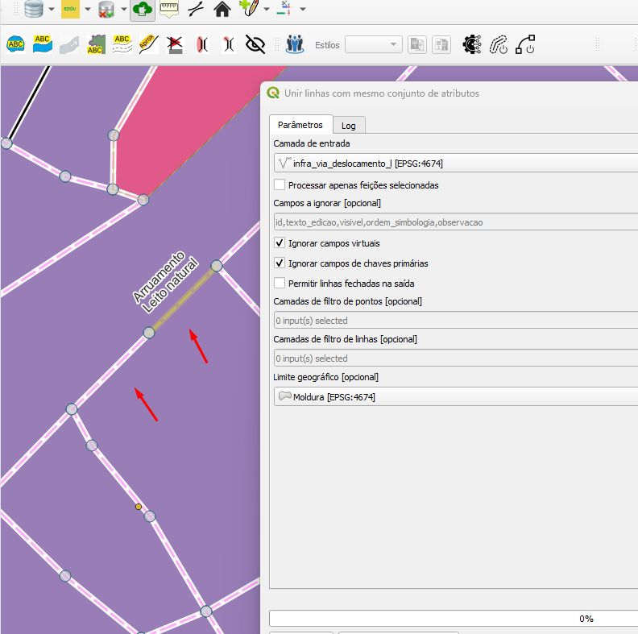
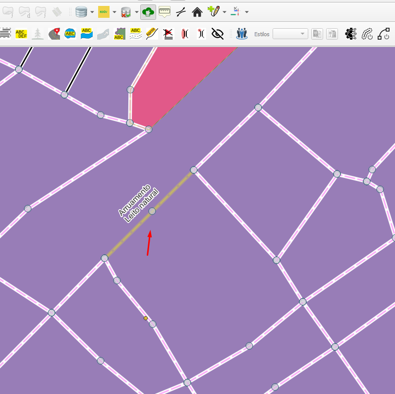

## Algoritmo: Merge Lines With Same Attribute Set (Mesclar linhas com o mesmo conjunto de atributos)

## 1. Introdução

O algoritmo `Merge Lines With Same Attribute Set` realiza a fusão (merge) de feições lineares que compartilham exatamente o mesmo conjunto de atributos. Esse processo é essencial para consolidar redes lineares segmentadas de forma redundante, garantindo maior integridade e simplicidade geométrica.

> 💡 **Dica:** Ideal para otimizar camadas de rios, estradas ou linhas de transmissão.

---

## 2. Parâmetros de Entrada

| Parâmetro                           | Descrição                                                                 |
|-------------------------------------|---------------------------------------------------------------------------|
| `Input layer`                       | Camada de entrada do tipo linha                                           |
| `Process only selected features`    | Indica se apenas as feições selecionadas devem ser processadas           |
| `Fields to ignore`                  | Campos ignorados na verificação de atributos                              |
| `Ignore virtual fields`            | Ignora campos virtuais definidos no QGIS                                 |
| `Ignore primary key fields`         | Ignora campos de chave primária                                           |
| `Allow closed lines on output`      | Permite que o resultado contenha linhas fechadas                         |
| `Point Filter Layers`               | Camadas de ponto que impedem fusões em nós coincidentes                  |
| `Line Filter Layers`                | Camadas de linha que atuam como restrições para fusões                   |
| `Geographic Boundary`               | Limite espacial no qual as fusões serão permitidas                       |

### Interface de Parâmetros

*Figura 4.1 – Interface do algoritmo "Merge Lines With Same Attribute Set".*

---

## 3. Funcionamento

1. A camada é convertida para uma estrutura de grafo multiconectado.
2. São identificadas as feições que compartilham atributos idênticos, conexões topológicas e não estão restritas por filtros ou limites.
3. Essas feições são agrupadas e fundidas em uma única geometria.
4. As geometrias originais redundantes são excluídas da camada.
5. O algoritmo atualiza a camada original diretamente, com suporte a desfazer/refazer (undo/redo).

> ⚠️ **Importante:** Para funcionar corretamente, requer a biblioteca `networkx` instalada no ambiente do QGIS.

---

## 4. Fluxo Operacional

1. Carregar a camada de linha no QGIS  
2. Acessar o plugin DSGTools e selecionar o algoritmo `Merge Lines With Same Attribute Set`  
3. Configurar os filtros e limites desejados (atributos ignorados, filtros espaciais, etc.)  
4. Executar o algoritmo e revisar o resultado diretamente na camada original  

---

## 5. Saída Esperada

- A camada original será editada com:
  - Novas geometrias fundidas substituindo grupos redundantes
  - Remoção de feições duplicadas com atributos iguais
- A operação respeita filtros espaciais, atributos ignorados e limites geográficos informados

  
*Figura 4.X – Exemplo de saída do algoritimo Merge Lines With Same Attribute Set.*

---

## 6. Aplicações Práticas

- Consolidação de segmentos de rios com mesmo nome
- Fusões em malhas viárias para simplificação cartográfica
- Otimização de camadas geradas por processos de extração automatizada
- Redução de complexidade em redes geométricas para análise topológica

---

## 7. Resumo

- Funde linhas que compartilham atributos iguais e conexão topológica
- Considera filtros de ponto, linha e limites espaciais
- Atualiza diretamente a camada original com suporte a edição

> 🔹 **Recomendado:** Execute após rodar o algoritmo `Identify Unmerged Lines With Same Attribute Set` para verificar o que pode ser fundido.  
> ⚠️ **Atenção:** Tenha certeza de que os atributos ignorados foram corretamente configurados, pois isso impacta diretamente a fusão.