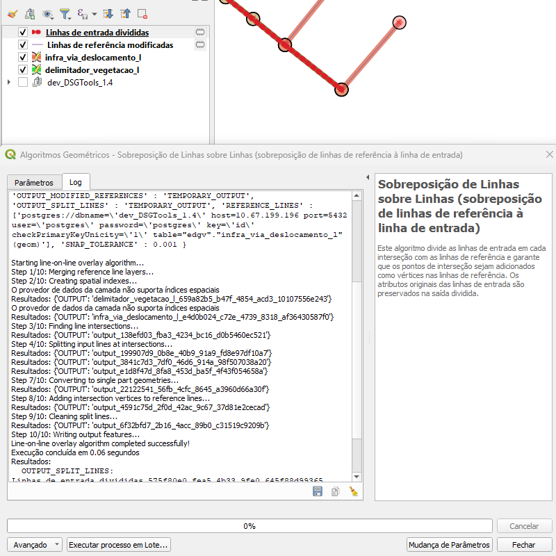

# Módulo 4: Provedor de Algoritmos - Geometria

## Algoritmo: Sobreposição de Linhas sobre Linhas

---

## 1. Introdução

O algoritmo **Sobreposição de Linhas sobre Linhas** realiza a divisão das linhas de entrada em todos os pontos de interseção com camadas de linhas de referência. Além disso, garante que os pontos de interseção também sejam inseridos como novos vértices nas linhas de referência, promovendo uma topologia consistente entre as camadas envolvidas.

> 💡 *Este processo é essencial para análises topológicas e construção de redes, especialmente em dados de infraestrutura viária, rede elétrica e drenagem.*

---

## 2. Parâmetros de Entrada

| Parâmetro                                 | Descrição                                                                 |
|-------------------------------------------|---------------------------------------------------------------------------|
| Camada de linhas de entrada               | Camada vetorial com feições do tipo linha que serão subdivididas         |
| Camadas de linhas de referência           | Lista de camadas que servirão como base para identificar interseções     |
| Tolerância de ajuste para inserção de vértices (opcional) | Distância máxima para considerar a inserção de vértices nos cruzamentos  |

> ⚠️ *Atenção:* A tolerância influencia na precisão do encaixe dos vértices nos pontos de interseção. Valores muito altos podem gerar vértices indevidos; valores muito baixos podem deixar interseções não tratadas.

---

### Interface de Parâmetros

*Figura 4.X – Interface do algoritmo com os parâmetros a serem definidos no QGIS.*

---

## 3. Fluxo Operacional

1. Carregar as camadas vetoriais de entrada e de referência no QGIS.
2. Abrir o plugin DSGTools e localizar o algoritmo “Sobreposição de Linhas sobre Linhas” no provedor (Atalho: `lineonlineoverlayer`).
3. Informar a camada de entrada e selecionar uma ou mais camadas de referência.
4. Definir, se necessário, uma tolerância de ajuste.
5. Executar o algoritmo e visualizar as camadas resultantes:
   - Linhas de entrada divididas
   - Linhas de referência com vértices inseridos

---

## 4. Funcionamento

O algoritmo executa as seguintes etapas:

1. Une todas as camadas de referência em uma única camada virtual (se houver múltiplas).
2. Cria índices espaciais para otimizar a busca de interseções.
3. Localiza todos os pontos de interseção entre as linhas de entrada e as de referência.
4. Realiza o *snap* das linhas de entrada nesses pontos de interseção.
5. Divide as linhas de entrada onde houver cruzamentos (inclusive cruzamentos entre si).
6. Insere vértices nas linhas de referência nos pontos de interseção detectados.
7. Remove geometrias nulas e converte geometrias multipart em single part.
8. Gera duas camadas de saída: uma com as linhas de entrada divididas e outra com as linhas de referência modificadas.

---

## 5. Saída Esperada

| Saída                           | Descrição                                                           |
|--------------------------------|----------------------------------------------------------------------|
| Linhas de entrada divididas    | Camada resultante com as geometrias da entrada subdivididas         |
| Linhas de referência modificadas | Camada de referência com vértices adicionados nas interseções       |

> 💡 *Dica:* Utilize a camada modificada de referência em validações topológicas futuras para garantir conectividade.

---

## 6. Aplicações Práticas

- **Modelagem de redes** (ex: vias, energia, esgoto)
- **Preparação de dados para análise de conectividade**
- **Validação de topologia com sobreposição exata entre camadas**
- **Pré-processamento para algoritmos de redes e fluxo**

---

## 7. Exemplo de Resultado

*Figura 4.X – Exemplo de saída com linhas subdivididas (em azul) e linhas de referência ajustadas (em vermelho).*

---

## 8. Resumo

* Algoritmo especializado para divisão de linhas em interseções
* Garante a integridade topológica com inserção de vértices
* Ideal para preparação de redes vetoriais
* Produz duas camadas resultantes: entrada dividida e referência modificada

> 🔹 *Recomendado:* Use camadas no mesmo sistema de referência para evitar desalinhamentos na inserção de vértices.

> ⚠️ *Atenção:* O algoritmo **não funciona com geometrias inválidas**. Use o validador de geometria antes da execução.
