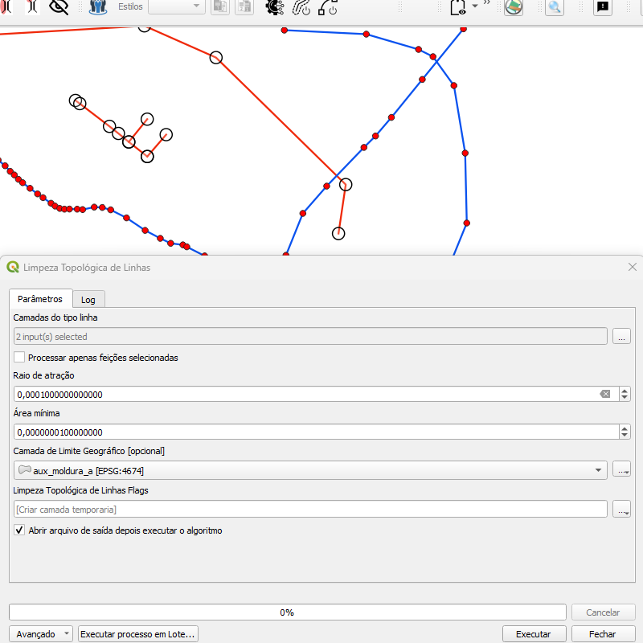
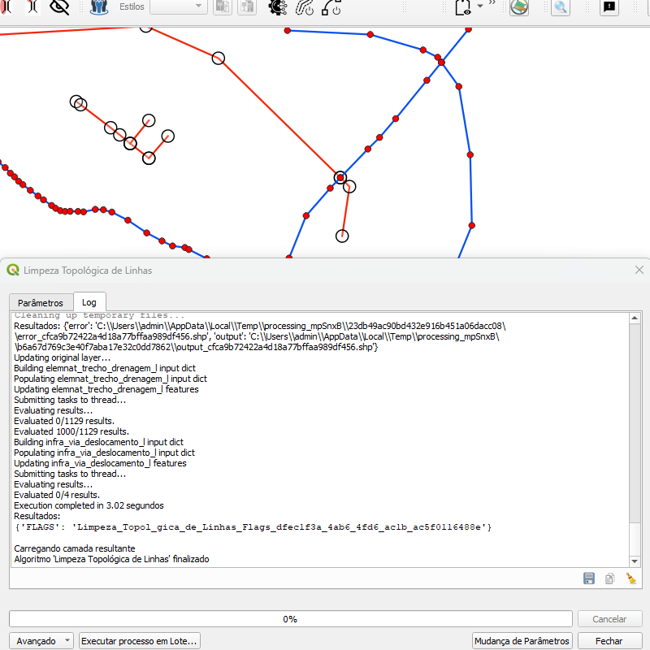

# Módulo 4: Provedor de Algoritmos - QA Tools: Topological Processes

## Algoritmo: Topological Clean Linestrings (Limpeza Topológica de Linhas)

## 1. Introdução

O algoritmo `Topological Clean Linestrings` tem como objetivo realizar uma limpeza topológica em camadas vetoriais do tipo linha, corrigindo pequenas imperfeições como sobreposições e imprecisões de geometria. Ele utiliza uma abordagem de tolerância espacial para alinhar vértices próximos e consolidar a cobertura topológica das feições.

---

## 2. Parâmetros de Entrada

| Parâmetro                  | Descrição                                                                 |
|----------------------------|---------------------------------------------------------------------------|
| `Linestring Layers`        | Lista de camadas vetoriais do tipo linha a serem limpas                   |
| `Process only selected features` | Define se o processamento será feito apenas nas feições selecionadas     |
| `Snap radius`              | Raio de ajuste para união de vértices próximos (em unidades da camada)    |
| `Minimum area`             | Área mínima para remoção de pequenos polígonos (em unidades da camada)    |
| `Geographic Bounds Layer`  | Limite geográfico para restringir a análise (opcional)                    |

### Interface de Parâmetros

*Figura 4.X – Interface do algoritmo "Topological Clean Linestrings".*

---

## 3. Funcionamento

O algoritmo segue os seguintes passos:

1. Realiza uma unificação topológica das camadas linha fornecidas.
2. Aplica a tolerância de "snap" para unir vértices próximos.
3. Remove feições muito pequenas, com base na área mínima definida.
4. Detecta e sinaliza feições com sobreposição ou ausência de atributos (gaps).
5. Cria uma camada de saída com os "flags" apontando os problemas identificados.

---

## 4. Saída Esperada

* Uma camada de pontos (flags) com geometrias representando os locais onde foram encontrados problemas topológicos.
* Mensagens descritivas no atributo de cada flag, como:
  - `"Gap in coverage."`
  - `"Features from [layer name] overlap."`

*Figura 4.X – Interface do algoritmo "Topological Clean Linestrings".*

---

## 5. Aplicações Práticas

* Correção e preparação de redes lineares para modelagem topológica
* Eliminação de erros de geometria antes da validação final da base
* Integração de múltiplas fontes vetoriais com precisão variável
* Padronização da topologia em projetos de cartografia vetorial

---

## 6. Resumo

* Algoritmo para limpeza topológica de camadas linha
* Suporta múltiplas camadas e limites geográficos opcionais
* Gera uma camada de saída com os erros detectados

> **ℹ️ Dica:** Utilize este algoritmo antes de aplicar validações mais rigorosas em sua base de dados.

