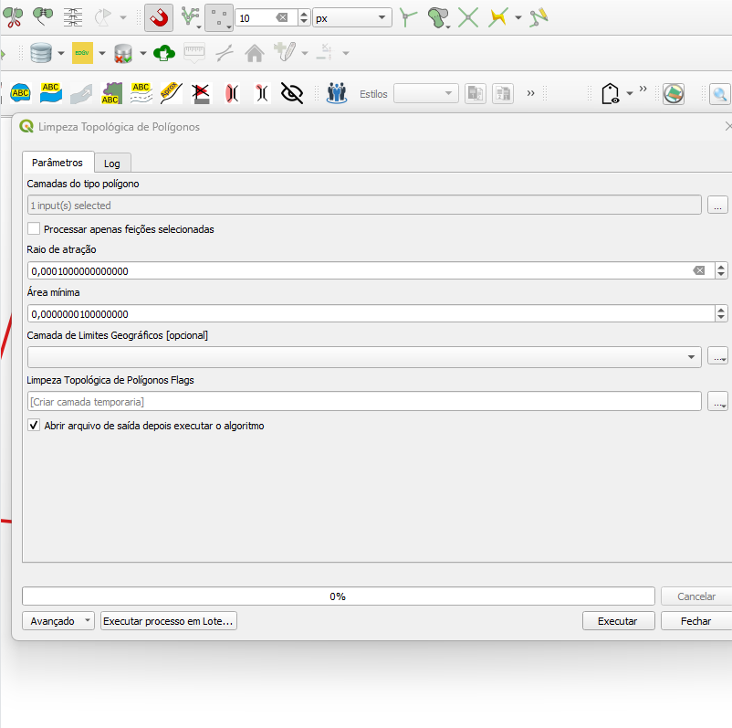
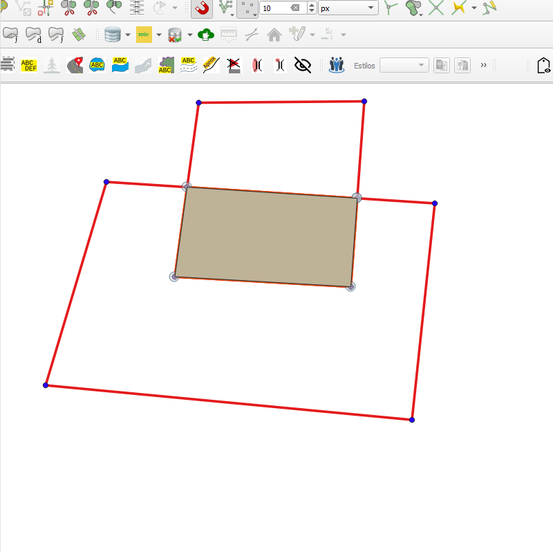

# Módulo 4: Provedor de Algoritmos - QA Tools: Topological Processes

## Algoritmo: Topological Clean Polygons (Limpeza Topológica de Polígonos)

## 1. Introdução

O algoritmo `Topological Clean Polygons` tem como objetivo realizar uma limpeza topológica em camadas vetoriais do tipo polígono, corrigindo imperfeições como sobreposições, feições duplicadas, dangles e pequenas áreas inválidas. Ele assegura que a cobertura topológica das feições seja válida e contínua, com base em uma tolerância espacial definida pelo usuário.

---

## 2. Parâmetros de Entrada

| Parâmetro                  | Descrição                                                                 |
|----------------------------|---------------------------------------------------------------------------|
| `Polygon Layers`           | Lista de camadas vetoriais do tipo polígono a serem limpas                |
| `Process only selected features` | Define se o processamento será feito apenas nas feições selecionadas     |
| `Snap radius`              | Raio de ajuste para união de vértices próximos (em unidades da camada)    |
| `Minimum area`             | Área mínima para remoção de pequenos polígonos (em unidades da camada)    |
| `Geographic Bounds Layer`  | Limite geográfico para restringir a análise (opcional)                    |

### Interface de Parâmetros

*Figura 4.X – Interface do algoritmo "Topological Clean Polygons".*

---

## 3. Funcionamento

O algoritmo segue os seguintes passos:

1. Une todas as feições em uma camada auxiliar unificada.
2. Aplica a limpeza topológica com as seguintes operações:
   - **RMSA** (Remove Small Areas)
   - **RmDangle** (Remove Dangles)
   - **RmDupl** (Remove Duplicates)
   - **Break** (Quebra interseções)
3. Corrige os atributos e atualiza as camadas originais com as feições limpas.
4. Identifica e sinaliza sobreposições ou lacunas (gaps) com "flags" de erro.
5. Caso um limite geográfico seja definido, o processo é feito apenas dentro dessa área.

---

## 4. Saída Esperada

* Uma camada de pontos (flags) com geometrias representando os locais onde foram encontrados problemas topológicos.
* Mensagens descritivas nos atributos de cada flag, como:
  - `"Features from [layer name] overlap."`
  - `"Gap in coverage."`
  - `"Clean error on unified layer."`

  
  *Figura 4.X – Interface do algoritmo "Topological Clean Polygons".*

---

## 5. Aplicações Práticas

* Correção de bases cartográficas com múltiplas fontes
* Garantia de cobertura topológica contínua em projetos de mapeamento
* Validação e ajuste de feições antes da exportação ou integração
* Prevenção de erros de sobreposição ou lacunas em análises espaciais

---

## 6. Resumo

* Algoritmo para limpeza topológica de camadas poligonais
* Suporta múltiplas camadas e limite geográfico opcional
* Gera uma camada de saída com os erros topológicos identificados

> **ℹ️ Dica:** Execute este algoritmo antes de processos de validação, generalização ou exportação de dados para garantir uma base limpa e coesa.