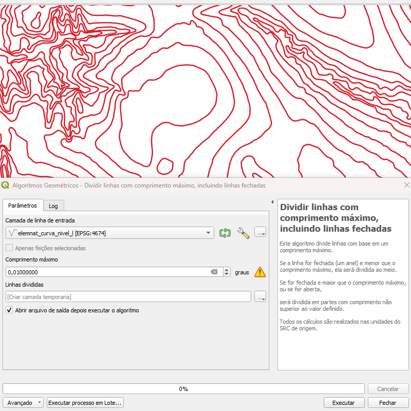
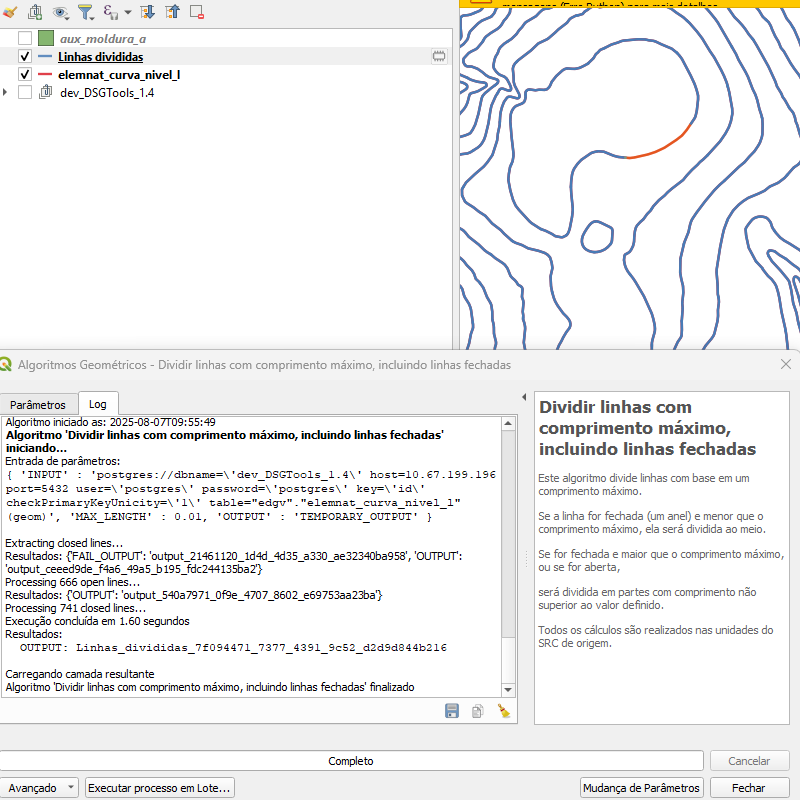

# Módulo 4: Provedor de Algoritmos - Geométricos

## Algoritmo: Dividir Linhas com Comprimento Máximo

---

## 1. Introdução

O algoritmo **Dividir Linhas com Comprimento Máximo** permite subdividir geometrias lineares (abertas ou fechadas) com base em um limite de comprimento definido pelo usuário. Essa subdivisão é útil para padronização de segmentos em análises ou processamento posterior.

> 💡 *Dica:* O algoritmo trata linhas fechadas com atenção especial: se forem menores que o comprimento definido, ainda assim serão subdivididas ao meio.

---

## 2. Parâmetros de Entrada

| Parâmetro           | Descrição                                                                 |
|---------------------|---------------------------------------------------------------------------|
| Camada de linha de entrada | Camada vetorial de geometria linear a ser processada                      |
| Comprimento máximo  | Tamanho máximo permitido para cada segmento gerado                        |
| Linhas divididas    | Saída vetorial com os segmentos resultantes                               |

### Interface de Parâmetros

Abaixo, a interface apresentada no QGIS ao executar o algoritmo:

*Figura 4.3 – Interface do algoritmo "Dividir Linhas com Comprimento Máximo"*

> ⚠️ *Atenção:*  
> - O comprimento é interpretado conforme a unidade do Sistema de Referência de Coordenadas (SRC) da camada.
> - O valor de entrada deve ser positivo e maior que zero.

---

## 3. Fluxo Operacional

1. Abrir o QGIS e carregar a camada de linhas desejada.
2. Acessar o algoritmo no provedor *DSGTools* pelo nome **Dividir Linhas com Comprimento Máximo** (atalho: `splitlinesatmaximumlengthalgorithm`).
3. Definir o valor de comprimento máximo a ser considerado.
4. Executar o algoritmo.
5. Visualizar os segmentos resultantes em nova camada.

---

## 4. Funcionamento

O algoritmo segue as etapas:

- Separa as linhas em dois grupos:
  - **Linhas abertas:** divididas em múltiplos segmentos com comprimento inferior ou igual ao limite.
  - **Linhas fechadas (anéis):**
    - Se forem **maiores** que o limite, são divididas em partes conforme necessário.
    - Se forem **menores**, são divididas ao meio por número de vértices.

> 💡 *Dica:* Em casos de anéis com poucos vértices, o algoritmo pode manter a geometria original sem alterações.

---

## 5. Saída Esperada

- Uma camada vetorial de linhas com segmentos respeitando o comprimento máximo definido.
- Todos os atributos das geometrias originais são preservados nas feições resultantes.

*Figura 4.4 – Segmentos resultantes após divisão por comprimento*

---

## 6. Aplicações Práticas

- Normalização de segmentos para simulação de rede (e.g. drenagem, infraestrutura)
- Divisão para preparação de rotas em navegação ou mobilidade
- Fragmentação para aplicação de algoritmos topológicos (snap, ajuste, análise)

---

## 7. Resumo

- Divide linhas em segmentos de comprimento controlado
- Trata automaticamente geometrias fechadas
- Mantém os atributos e a integridade geométrica
- Ideal para pré-processamento e análises espaciais em rede

> 🔹 *Recomendado:* Verifique se o SRC está em metros para facilitar o uso de valores inteiros.

> ⚠️ *Atenção:* Linhas fechadas com menos de quatro vértices podem não ser divididas.
