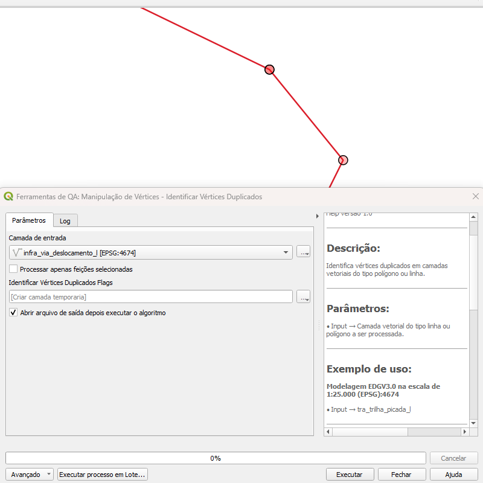
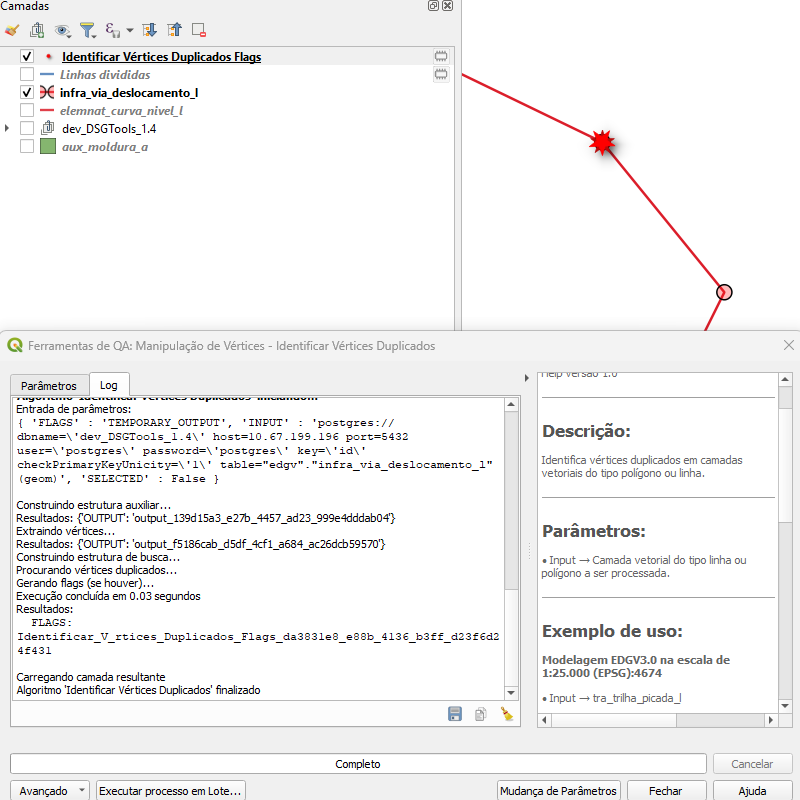

# Módulo 4: Provedor de Algoritmos – Manipulação de Vértices

## Algoritmo: Identificar Vértices Duplicados *(Identify Duplicated Vertexes)*

## 1. Introdução
O algoritmo **Identificar Vértices Duplicados** detecta pontos coincidentes em linhas ou polígonos que apresentam múltiplos vértices sobre a mesma posição geográfica. Sua principal utilidade é localizar inconsistências topológicas resultantes de sobre‑edições ou importações de dados com tolerâncias inadequadas.

> *💡 Dica:* Marcar vértices duplicados antes de realizar operações de *snap* ou de validação topológica evita resultados inesperados.

---

## 2. Parâmetros de Entrada

| Parâmetro | Descrição |
|-----------|-----------|
| Camada de entrada | Feições do tipo **linha** ou **polígono** onde será efetuada a verificação |
| Processar apenas feições selecionadas | Limita a análise aos elementos previamente selecionados |
| Saída de flags | Camada pontual gerada contendo marcadores nos vértices duplicados |

### Interface de Parâmetros

*Figura 4.X – Formulário do algoritmo “Identificar Vértices Duplicados”.*

> ⚠️ *Atenção:* Caso pretenda auditar apenas parte da camada, selecione as feições no *Canvas* do QGIS antes de executar o algoritmo.

---

## 3. Fluxo Operacional

1. Adicionar ao projeto a camada de linhas ou polígonos a ser verificada.  
2. Opcionalmente, selecionar as feições de interesse.  
3. No painel de **Processamento › DSGTools › Manipulação de Vértices**, localizar *“Identificar Vértices Duplicados”*.  
4. Definir os parâmetros conforme a necessidade e indicar um destino para a camada de flags.  
5. Executar o algoritmo e inspecionar os pontos de saída.  

---

## 4. Funcionamento

O processo realiza cinco etapas internas:

1. **Construção de estrutura auxiliar** – adiciona campo incremental para rastrear feições originais.  
2. **Extração de vértices** – converte todos os vértices em pontos individuais.  
3. **Construção de índice de busca** – organiza vértices por feição e geometria.  
4. **Detecção de duplicidade** – verifica coordenadas idênticas dentro de cada feição.  
5. **Geração de flags** – cria ponto na posição duplicada, registrando descrição *“Duplicated vertex.”* nos atributos.

> *💡 Dica:* Em polígonos, apenas vértices do anel externo são analisados; orifícios internos não são considerados nesta versão.

---

## 5. Saída Esperada

* Uma camada de pontos contendo todos os vértices duplicados encontrados.  
* Atributos incluem identificação da feição original, facilitando correção manual ou automática.  
* Possibilidade de integrar com rotinas de limpeza geométrica subsequentes.

*Figura 4.Y – Pontos (em vermelho) marcando vértices duplicados numa linha.*

---

## 6. Aplicações Práticas

* Auditoria de qualidade antes de exportar dados para clientes ou bases federativas.  
* Suporte a rotinas de consolidação de redes (hidrografia, malha viária) onde sobre‑edits são frequentes.  
* Pré‑validação em fluxos de modelagem colaborativa, evitando sobreposições indesejadas.

---

## 7. Resumo

* Localiza vértices coincidentes em linhas ou polígonos.  
* Gera camada de flags pontuais para inspeção e correção.  
* Essencial em fluxos de QA/QC de dados espaciais.

> **🔹 Recomendado:** Após corrigir os vértices duplicados, execute o algoritmo **Remover Vértices Duplicados** para simplificar a geometria e otimizar o desempenho.

> **⚠️ Atenção (Internacionalização):** As strings “Input layer”, “Process only selected features” e “Identify Duplicated Vertexes” permanecem em inglês no *source code*. Inclua traduções adequadas no arquivo `.ts` ou ajuste `self.tr` para garantir consistência da interface em **Português**.

