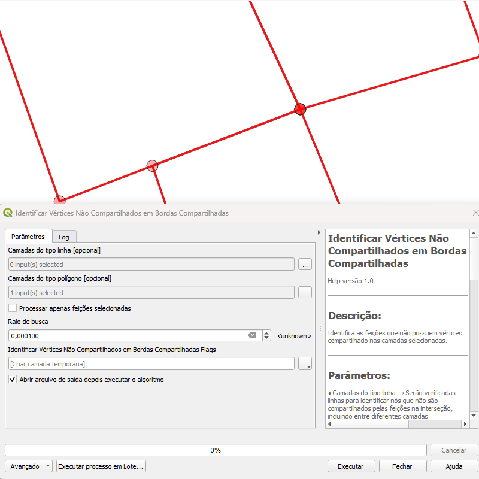
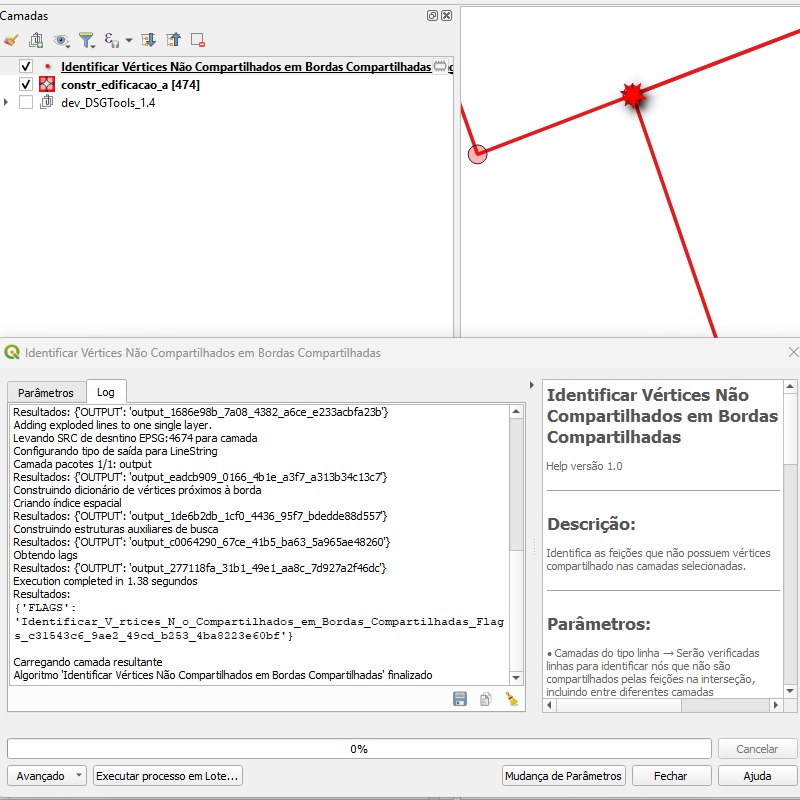

# Módulo 4: Provedor de Algoritmos – Manipulação de Vértices

## Algoritmo: Identificar Vértices Não Compartilhados em Arestas Compartilhadas

## 1. Introdução
Este algoritmo detecta vértices de linhas ou polígonos que, embora estejam muito próximos de uma aresta pertencente à mesma ou a outra camada, **não** são compartilhados por ela. Situações assim costumam indicar falhas de *snap* que podem comprometer a continuidade topológica.

> *💡 Dica:* Verifique esses vértices antes de executar validações topológicas ou análises de rede.

---

## 2. Parâmetros de Entrada

| Parâmetro | Descrição |
|-----------|-----------|
| **Camadas de linhas** | Lista de camadas de linha a serem verificadas (*opcional*) |
| **Camadas de polígonos** | Lista de camadas de polígono a serem verificadas (*opcional*) |
| **Processar apenas feições selecionadas** | Limita a verificação às feições selecionadas no mapa |
| **Raio de busca** | Distância máxima entre o vértice e a aresta para ser considerada “próxima” |
| **Saída de flags** | Camada pontual gerada indicando cada vértice não compartilhado |

### Interface de Parâmetros

*Figura 4.X – Tela de configuração do algoritmo.*

> ⚠️ **Atenção:** Ao menos uma camada deve ser fornecida para execução do algoritmo.

---

## 3. Fluxo Operacional

1. Carregue as camadas de linha e/ou polígono no QGIS.  
2. (Opcional) Selecione as feições que devem ser analisadas.  
3. Abra **Processamento › DSGTools › Manipulação de Vértices** e escolha *“Identificar Vértices Não Compartilhados em Arestas Compartilhadas”*.  
4. Defina o **Raio de busca** e o caminho da camada de flags.  
5. Execute e analise os pontos sinalizados.  

---

## 4. Funcionamento

1. **Coleta de feições** – incorpora apenas as feições escolhidas (ou todas, se nenhuma estiver selecionada).  
2. **Análise de proximidade** – verifica, para cada vértice, se existe aresta a uma distância menor que o raio definido.  
3. **Checagem de compartilhamento** – confirma se o vértice pertence (ou não) à aresta próxima.  
4. **Geração de flags** – cria ponto nos vértices não compartilhados, registrando geometria da(s) aresta(s) envolvida(s).  

---

## 5. Saída Esperada

* Camada de pontos destacando vértices sem compartilhamento apesar de próximos a arestas.  
* Cada flag possui atributos descrevendo a geometria das arestas relacionadas.

*Figura 4.Y – Pontos em vermelho indicando vértices não compartilhados.*

---

## 6. Aplicações Práticas

* Ajuste de redes (hidrografia, vias, energia) para garantir continuidade.  
* Validação de camadas consolidadas provenientes de múltiplas fontes.  
* Preparação de dados para operações de corte, união ou análises de fluxo.

---

## 7. Resumo

* Detecta vértices muito próximos a arestas, mas que não são compartilhados.  
* Parâmetro de **Raio de busca** permite adaptar a tolerância à escala de trabalho.  
* Camada de flags facilita correção pontual ou automatizada.

