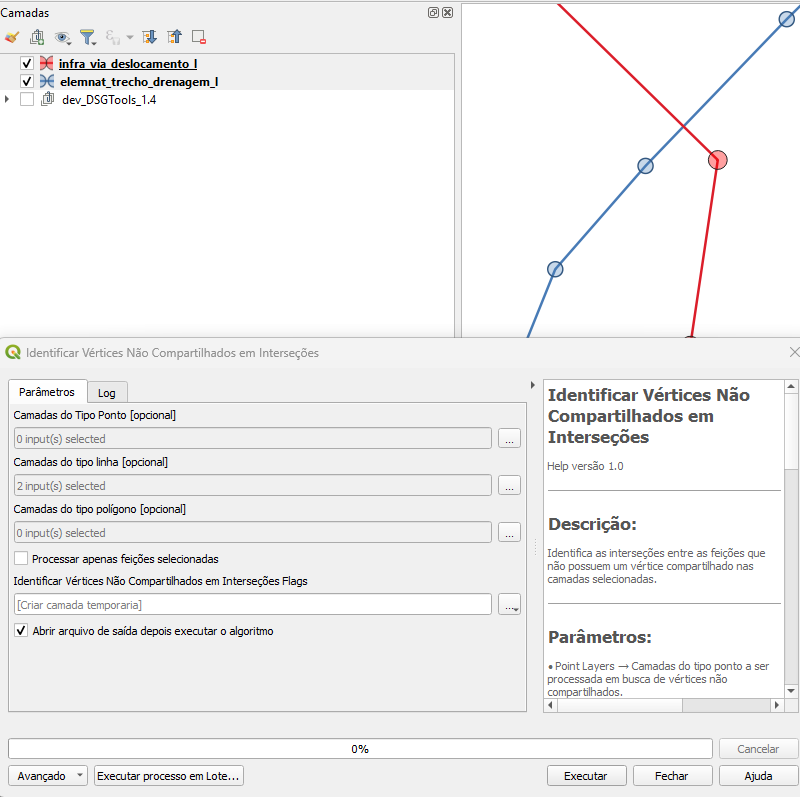
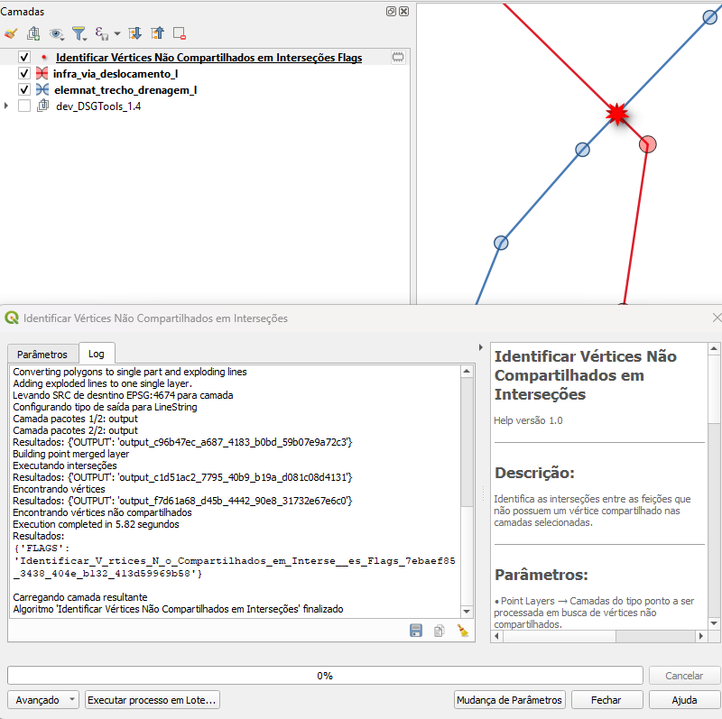

# Módulo 4: Provedor de Algoritmos – Manipulação de Vértices

## Algoritmo: Identificar Vértices Não Compartilhados em Interseções

## 1. Introdução
O algoritmo **Identificar Vértices Não Compartilhados em Interseções** analisa o ponto de cruzamento entre camadas vetoriais (pontos, linhas e/ou polígonos) para verificar se existe vértice comum entre elas. A ausência de um vértice compartilhado indica possíveis falhas de *snap* que podem comprometer a integridade topológica.

> *💡 Dica:* Use este algoritmo antes de operações de *network analysis* ou *overlay* para evitar resultados incorretos.

---

## 2. Parâmetros de Entrada

| Parâmetro | Descrição |
|-----------|-----------|
| **Camadas de pontos** | Lista de camadas de ponto que participarão da verificação (*opcional*) |
| **Camadas de linhas** | Lista de camadas de linha que participarão da verificação (*opcional*) |
| **Camadas de polígonos** | Lista de camadas de polígono que participarão da verificação (*opcional*) |
| **Processar apenas feições selecionadas** | Restringe a análise às feições selecionadas no mapa |
| **Saída de flags** | Camada de pontos gerada contendo marcadores nos locais de interseção sem vértice compartilhado |

### Interface de Parâmetros

*Figura 4.X – Configuração do algoritmo “Identificar Vértices Não Compartilhados em Interseções”.*

> ⚠️ **Atenção:** É necessário informar pelo menos uma camada de entrada.

---

## 3. Fluxo Operacional

1. Carregue no QGIS as camadas de interesse.  
2. (Opcional) Selecione as feições que devem ser analisadas.  
3. Acesse **Processamento › DSGTools › Manipulação de Vértices** e escolha *“Identificar Vértices Não Compartilhados em Interseções”*.  
4. Defina as camadas nos campos apropriados e o destino da saída de flags.  
5. Execute o algoritmo e inspecione os pontos sinalizados.  

---

## 4. Funcionamento

1. **Detecção de interseções** – identifica todos os pontos onde geometrias de camadas diferentes se cruzam.  
2. **Checagem de compartilhamento** – verifica se cada interseção possui vértice coincidente em todas as camadas envolvidas.  
3. **Geração de flags** – para cada interseção sem vértice compartilhado, cria‑se um ponto de alerta na camada de saída.  

---

## 5. Saída Esperada

* Camada de pontos indicando interseções problemáticas.  
* Cada ponto possui atributo apontando as camadas envolvidas.  

*Figura 4.Y – Pontos vermelhos mostram vértices ausentes em interseções.*

---

## 6. Aplicações Práticas

* Correção de redes (viária, hidrográfica, elétrica) para garantir conectividade.  
* Validação de dados provenientes de diferentes fontes cartográficas.  
* Preparação de camadas para análises de fluxo, roteamento e overlays complexos.

---

## 7. Resumo

* Localiza interseções onde falta vértice compartilhado.  
* Permite correção rápida via camada de flags.  
* Essencial para manter consistência topológica em bases multitemáticas.

---