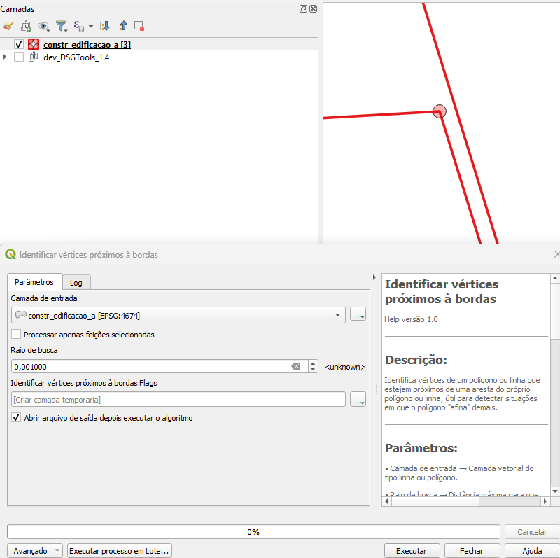
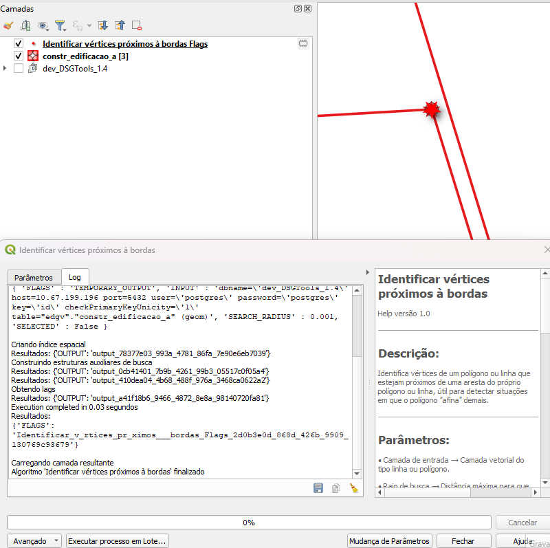

# Módulo 4: Provedor de Algoritmos – Manipulação de Vértices

## Algoritmo: Identificar Vértices Próximos a Arestas

## 1. Introdução
O algoritmo **Identificar Vértices Próximos a Arestas** sinaliza vértices que se encontram muito próximos de segmentos de linha (arestas) dentro da mesma camada, indicando possíveis erros de construção geométrica — como falta de *snap* ou sobre‑edições minuciosas.

> *💡 Dica:* Detectar esses vértices evita que análises topológicas retornem resultados inconsistentes.

---

## 2. Parâmetros de Entrada

| Parâmetro | Descrição |
|-----------|-----------|
| Camada de entrada | Feições de **linha** ou **polígono** a serem inspecionadas |
| Processar apenas feições selecionadas | Restringe a verificação às feições destacadas no mapa |
| Raio de busca | Distância máxima entre um vértice e uma aresta para que seja considerado “próximo” |
| Saída de flags | Camada pontual onde serão gravados os vértices detectados |

### Interface de Parâmetros

*Figura 4.X – Configuração do algoritmo “Identificar Vértices Próximos a Arestas”.*

> ⚠️ *Atenção:* Ajuste o **Raio de busca** de acordo com a tolerância de edição (em metros); valores exagerados podem gerar muitos falsos positivos.

---

## 3. Fluxo Operacional

1. Adicionar a camada alvo ao projeto QGIS.  
2. (Opcional) Selecionar feições específicas que necessitam de checagem.  
3. No painel de **Processamento › DSGTools › Manipulação de Vértices**, localizar o algoritmo *“Identificar Vértices Próximos a Arestas”*.  
4. Definir o raio de busca e o destino da camada de flags.  
5. Executar e revisar os pontos sinalizados.  

---

## 4. Funcionamento

1. **Construção de dicionário de busca** – para cada feição, coleta vértices e arestas.  
2. **Análise de proximidade** – verifica se a distância entre um vértice e qualquer aresta excede o raio definido.  
3. **Geração de flags** – cria pontos nos vértices infratores, registrando a descrição do problema.  

> *💡 Dica:* Ao final, utilize ferramentas de *snap* para corrigir vértices mal conectados.

---

## 5. Saída Esperada

* Camada de pontos destacando vértices dentro do raio de busca em relação a arestas vizinhas.  
* Atributos incluem o identificador da feição original e a geometria da(s) aresta(s) associada(s).  

*Figura 4.Y – Pontos em vermelho marcando vértices muito próximos de arestas.*

---

## 6. Aplicações Práticas

* Auditoria de redes viárias ou hidrográficas antes de análises de conectividade.  
* Verificação de polígonos segmentados onde vértices se aproximam do limite sem se tocar.  
* Revisão de dados provenientes de fontes múltiplas com diferentes precisões.

---

## 7. Resumo

* Detecta vértices demasiado próximos a arestas, prevenindo erros topológicos.  
* Parâmetro de raio configurável assegura flexibilidade em diferentes escalas.  
* Camada de flags facilita a correção manual ou automática subsequente.

