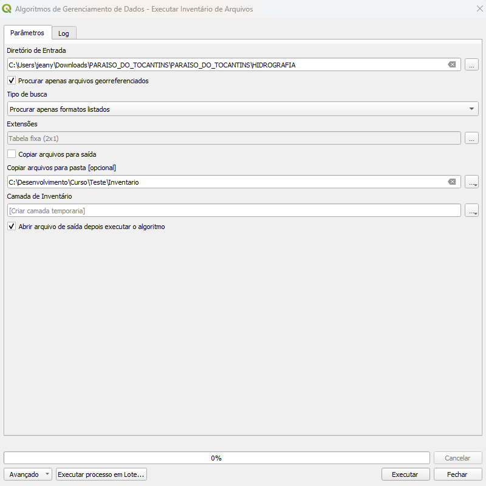
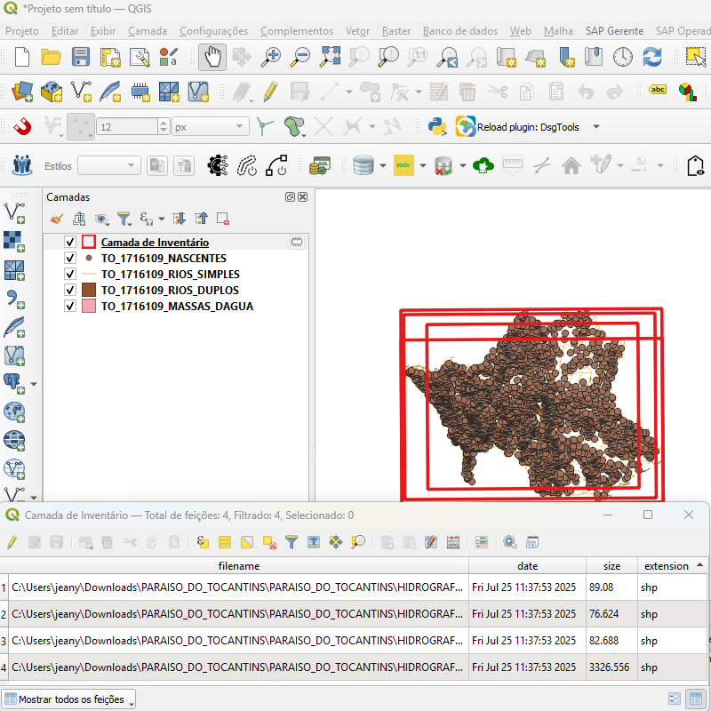
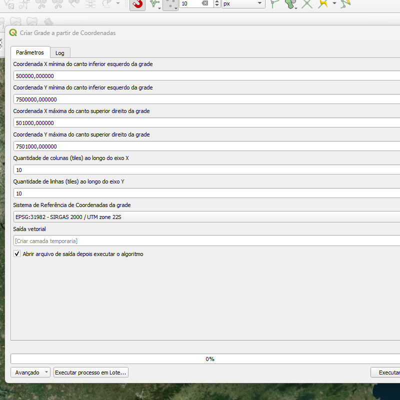
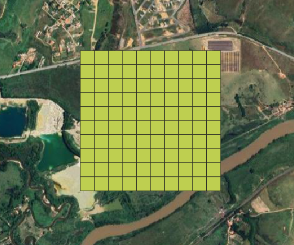
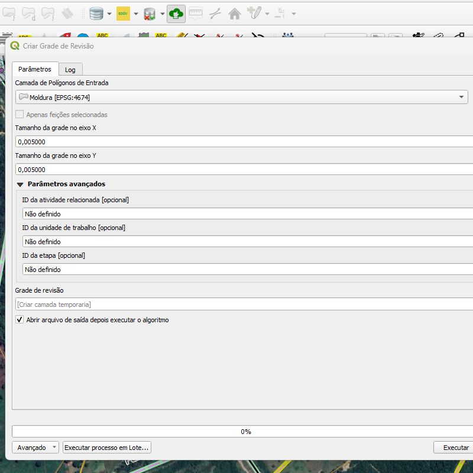
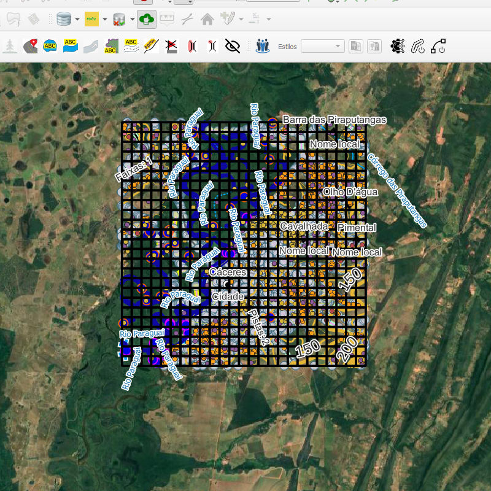
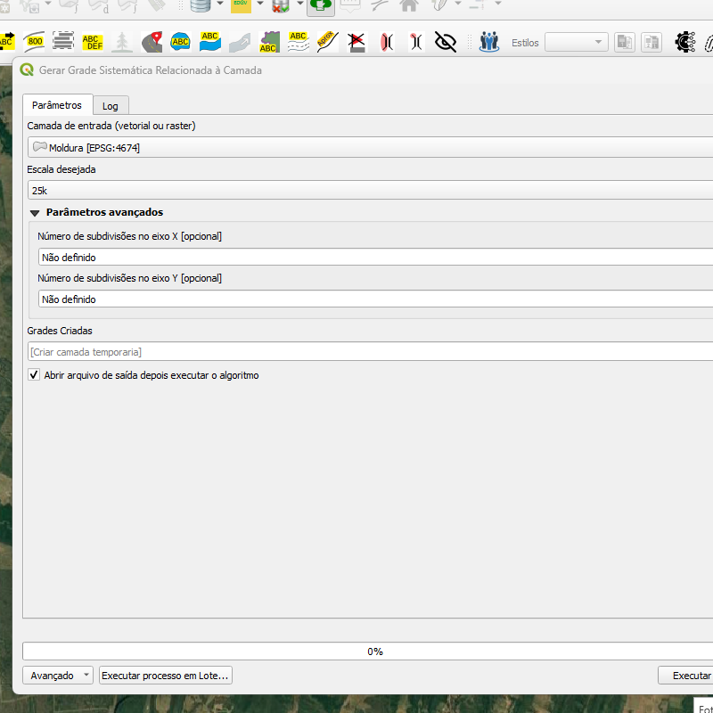
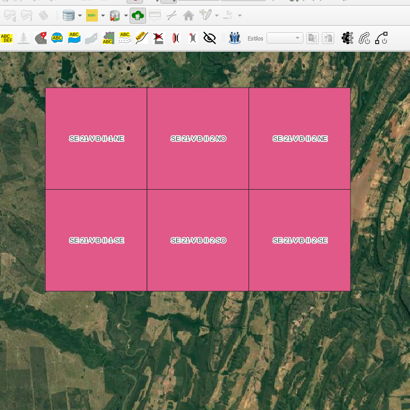
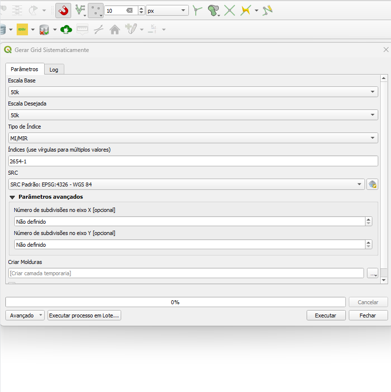
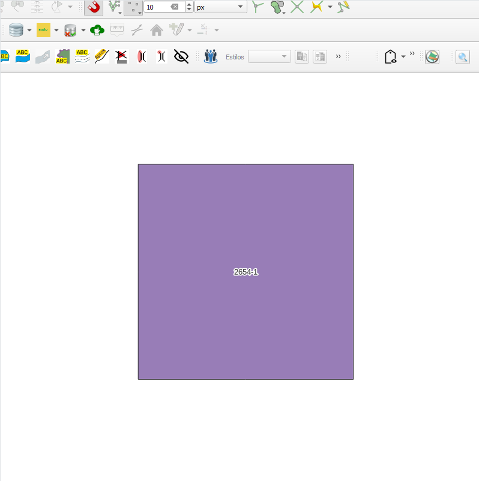

# Módulo 4: Provedor de Algoritmos

**Instrutores:** 2º Sgt Alvarez / 3º Sgt Godinho

## Objetivos de Aprendizagem
- [ ] Compreender e utilizar algoritmos de inventário
- [ ] Aplicar todos os algoritmos de grid
- [ ] Executar algoritmos geométricos específicos
- [ ] Implementar algoritmos de validação
- [ ] Realizar processamento de vértices e snap
- [ ] Aplicar algoritmos de terreno

## Pré-requisitos
> **📋 Pré-requisito:** Módulos 1, 2 e 3 concluídos, conhecimento intermediário de SIG

## 1. Inventário

### Algoritmo: Inventário de Arquivos (Run File Inventory)

---

#### 1. Introdução

O algoritmo **Inventário de Arquivos** realiza uma varredura em um diretório especificado, identifican os arquivos espaciais (como shapefiles e rasters) e produz uma camada vetorial com informações sobre esses arquivos.
É uma ferramenta essencial para organização, gestão e preparo dos dados geoespaciais.
Com a camada criada é possivel verificar rapidamente quais insumos estão disponiveis, qual local do terreno e qual o dataset, ou seja, onde se encontra o arquivo.

> 💡 *Dica:* Utilize esse algoritmo para mapear rapidamente os dados disponíveis em pastas externas antes de iniciar os processos do preparo.

---

#### 2. Parâmetros de Entrada

| Parâmetro                      | Descrição                                                                 |
| ----------------------------- | ------------------------------------------------------------------------- |
| Diretório de Entrada          | Caminho da pasta onde será feita a varredura                             |
| Procurar apenas georreferenciados | Filtra apenas arquivos com referência espacial                           |
| Tipo de Busca                 | Define se serão incluídas ou excluídas as extensões listadas             |
| Extensões                     | Lista de formatos (ex.: `shp`, `tif`) a incluir ou excluir                |
| Copiar arquivos para saída    | Se marcado, copia os arquivos encontrados para outra pasta               |
| Pasta de Cópia                | Caminho da pasta de destino para os arquivos copiados                    |
| Camada de Inventário (saída)  | Camada vetorial resultante com os arquivos identificados                 |

#### Interface de Parâmetros

A seguir, temos um exemplo da interface do algoritmo *"Inventário de Arquivos"* no provedor de algoritmos do DSGTools, onde o usuário define o diretório, os filtros e os formatos desejados:

*Figura 4.3 – Interface do algoritmo "Inventário de Arquivos" com os parâmetros configuráveis*

> ⚠️ *Atenção:* 
>
> - O diretório de entrada deve existir e conter arquivos válidos.
> - As extensões não devem incluir ponto (use `shp`, e não `.shp`).
> - A pasta de cópia deve estar vazia ou ser usada com cuidado para não sobrescrever dados.

---

#### 3. Fluxo Operacional

1. Abrir o QGIS e carregar o plugin DSGTools.
2. Acessar o algoritmo no provedor de algoritmos ou na busca dos processos "Executar inventário de Arquivos" (atalho: `runfileinventory`).
3. Informar o diretório de entrada com os arquivos.
4. Definir se deseja copiar os arquivos e para onde.
5. Escolher se a busca deve ser restritiva ou excludente quanto aos formatos.
6. Executar o algoritmo.
7. Visualizar e explorar a camada vetorial de inventário gerada.

---

#### 4. Funcionamento

O algoritmo utiliza uma estrutura em *threads* para varrer todos os arquivos do diretório informado, verifica suas características espaciais (quando aplicável), e os transforma em feições poligonais, representando sua área de cobertura espacial.

Cada feição criada representa um arquivo, e inclui informações como:

| Campo       | Descrição                                 |
| ----------- | ----------------------------------------- |
| `fileName`  | Nome do arquivo                           |
| `filePath`  | Caminho completo                          |
| `extension` | Extensão do arquivo (formato)             |
| `geometry`  | Polígono de cobertura espacial            |
| `size`      | Tamanho em bytes                          |
| `crs`       | Sistema de referência espacial            |

> 💡 *Dica:* Arquivos raster (como `.tif`) e vetoriais (`.shp`, `.gpkg`) são detectados e convertidos em polígonos automaticamente.

---

#### 5. Saída Esperada

* Camada vetorial com feições do tipo polígono.
* Cada feição representa um arquivo identificado no diretório.
* Atributos informativos disponíveis para análise e filtragem.

*Figura 4.4: Camada de inventário com arquivos geoespaciais encontrados*

---

#### 6. Aplicações Práticas

* Auditoria de dados em servidores ou pastas locais.
* Mapeamento de acervo cartográfico para controle de qualidade.
* Identificação rápida de lacunas ou sobreposições entre arquivos.
* Geração de relatórios de cobertura por tipo de arquivo ou pasta.
* Análise rápida da distribuição espacial dos insumos.

---

#### 7. Resumo

* Algoritmo para inventariar arquivos geoespaciais em diretórios.
* Identifica e registra arquivos shapefile, raster e outros.
* Permite ações automatizadas para recarregar camadas diretamente.
* Útil para organização, planejamento e validação de dados.

> 🔹 *Recomendado:* Utilize este algoritmo antes de carregar dados em banco, garantindo maior controle e padronização.

> ⚠️ *Atenção:* Sempre confira a consistência das extensões listadas e a validade dos arquivos no diretório.

## 2. Grid Algorithms

### Algoritmo: Create Grid Along Line (Criar grade ao longo da linha)

#### 1. Introdução

O algoritmo `Create Grid Along Line` permite a geração de uma **grade linear** segmentada ao longo de uma ou mais feições do tipo **linha**. Cada célula da grade corresponde a um quadro com dimensões calculadas a partir da escala e do tamanho do papel selecionado, ideal para apoiar a produção cartográfica orientada por feições lineares, como rios, estradas ou oleodutos.

> 💡 **Dica:** Muito útil na produção de mapas por quadros (map series), especialmente para impressão sequencial de seções ao longo de eixos lineares.

---

#### 2. Parâmetros de Entrada

| Parâmetro               | Descrição                                                                 |
|-------------------------|---------------------------------------------------------------------------|
| `Insert the line layer` | Camada vetorial do tipo linha a ser utilizada como base para o grid       |
| `Scale`                 | Escala de visualização/detecção da feição (ex: 1:2000, 1:5000 etc.)        |
| `Sheet Size`            | Tamanho da folha para cálculo da área de cada quadro (A4 ou A3)           |
| `Overlap (%)`           | Sobreposição entre quadros consecutivos, em percentual                   |
| `Start from begin (m)`  | Distância inicial antes do primeiro quadro, ao longo da linha             |
| `Top Margin (mm)`       | Margem superior da folha a ser descontada do quadro                      |
| `Bottom Margin (mm)`    | Margem inferior da folha a ser descontada do quadro                      |
| `Left Margin (mm)`      | Margem esquerda da folha a ser descontada do quadro                      |
| `Right Margin (mm)`     | Margem direita da folha a ser descontada do quadro                       |
| `Grid Layer`            | Camada de saída contendo os polígonos dos quadros gerados                |

##### Interface de Parâmetros

A interface do algoritmo no provedor DSGTools permite ao usuário configurar com precisão os valores para escala, margens, sobreposição e folha.

  
*Figura 4.4 – Interface do algoritmo "Create Grid Along Line" com os parâmetros preenchidos.*

> ⚠️ **Importante:** As dimensões do quadro são calculadas automaticamente a partir da escala e do tamanho do papel, considerando as margens informadas.

---

#### 3. Funcionamento

1. A geometria de entrada (linha) é estendida a partir de seu início (`Start from begin`) para permitir geração de quadros desde o início do traçado.
2. Com base no tamanho do papel (A4 ou A3) e na escala selecionada, o algoritmo calcula a **largura e altura reais de cada quadro** no terreno.
3. Os quadros são criados ao longo da linha usando o método de interpolação, com sobreposição controlada entre eles (`Overlap (%)`).
4. Cada quadro é um polígono orientado de acordo com o azimute entre os pontos inicial e final de cada segmento.
5. A camada resultante contém os quadros com atributos de ordenamento e identificação da linha base.

> 💡 **Dica:** Utilize geometrias bem construídas e topologicamente corretas para melhores resultados.

---

#### 4. Fluxo Operacional

1. Carregar a camada de linha no QGIS  
2. Abrir o plugin DSGTools e localizar o algoritmo `Create Grid Along Line`  
3. Definir a escala e tamanho da folha desejados  
4. Ajustar sobreposição e margens conforme necessário  
5. Executar o algoritmo e revisar a grade gerada na saída  

---

#### 5. Atributos da Camada de Saída

| Campo      | Descrição                                              |
|------------|--------------------------------------------------------|
| `ord`      | Número sequencial de cada quadro ao longo da linha     |
| `id`       | ID da feição da camada de linha usada como base        |

> 🔎 **Observação:** Não há campos para IDs de tarefa ou etapa, pois o foco aqui é a geração de quadros cartográficos, não necessariamente ligados ao fluxo de revisão.

---

#### 6. Saída Esperada

- Uma camada vetorial do tipo polígono representando os quadros dispostos sequencialmente ao longo da linha de entrada  
- Geometria dos quadros com rotação e posicionamento corretos em função do azimute do traçado  
- Atributos que indicam a ordem dos quadros (`ord`) e ID da feição base (`id`)  

  
*Figura 4.5 – Resultado visual da geração do grid ao longo da linha.*

---

#### 7. Aplicações Práticas

- Geração de mapas por quadros ao longo de rodovias, ferrovias ou rios  
- Impressão sequencial com sobreposição para navegação cartográfica  
- Planejamento de inspeções lineares (ex: oleodutos, linhas de transmissão)  
- Suporte à visualização de feições contínuas em escalas fixas

---

#### 8. Resumo

- Gera quadros cartográficos ao longo de feições lineares  
- Baseado em parâmetros de escala, papel, sobreposição e margens  
- Ideal para map series e inspeções técnicas orientadas por linha  

> 🔹 **Recomendado:** Use um CRS projetado (como UTM) para garantir medidas em metros.  
> ⚠️ **Atenção:** A camada de entrada deve conter feições do tipo **linha**, com extensão suficiente para suportar a geração dos quadros.

### Algoritmo: Create Grid From Coordinates (Criar Grade a partir de Coordenadas)

#### 1. Introdução

O algoritmo `Create Grid From Coordinates` permite a geração de uma grade regular com base em coordenadas geográficas fornecidas pelo usuário. É ideal para subdividir áreas retangulares em blocos menores de forma padronizada.

> **💡 Dica:** Esse processo é especialmente útil em contextos de planejamento cartográfico e organização espacial de dados.

---

#### 2. Parâmetros de Entrada

| Parâmetro                     | Descrição                                               |
| -----------------------------|---------------------------------------------------------|
| `Min x coordinates`           | Coordenada X mínima do canto inferior esquerdo da grade |
| `Min y coordinates`           | Coordenada Y mínima do canto inferior esquerdo da grade |
| `Max x coordinates`           | Coordenada X máxima do canto superior direito da grade  |
| `Max y coordinates`           | Coordenada Y máxima do canto superior direito da grade  |
| `Number of subdivisions on x` | Quantidade de colunas (tiles) ao longo do eixo X        |
| `Number of subdivisions on y` | Quantidade de linhas (tiles) ao longo do eixo Y         |
| `CRS`                         | Sistema de Referência de Coordenadas da grade           |
| `Grid`                        | Saída vetorial com feições poligonais                   |

##### Interface de Parâmetros

Abaixo, temos um exemplo da interface do algoritmo **"Create Grid From Coordinates"** no provedor do DSGTools. É nela que o usuário define os valores necessários para a geração da grade regular.

*Figura 4.2 – Interface do algoritmo "Create Grid From Coordinates" com os parâmetros a serem preenchidos.*

> ⚠️ **Atenção:** Certifique-se de que:
>
> - Os valores de `Min` e `Max` são coerentes (a diferença deve ser maior que zero).
> - O `CRS` está corretamente definido (não pode estar como `invalid projection`).
> - As subdivisões nos eixos `x` e `y` devem ser números inteiros positivos.

---

#### 3. Fluxo Operacional

1. Abrir o QGIS e carregar o plugin DSGTools  
2. Acessar o algoritmo no provedor de algoritmos e procurar pelo nome do algoritimo `(Atalho : creategridfromcoordinatesalgorithm)`  
3. Preencher as coordenadas mínimas e máximas  
4. Definir `Delta X` e `Delta Y` conforme a escala desejada  
5. Executar o algoritmo e visualizar a camada gerada  

---

#### 4. Funcionamento

O algoritmo utiliza as coordenadas mínimas e máximas fornecidas, juntamente com o número de subdivisões nos eixos X e Y, para calcular o tamanho de cada célula da grade. Em seguida, gera uma malha composta por polígonos regulares.

> **💡 Dica:** Utilizar um sistema de coordenadas projetado (como UTM) facilita a interpretação do espaçamento entre células.

---

#### 5. Saída Esperada

* Uma camada vetorial contendo polígonos regulares.
* Geometrias válidas e compatíveis com operações de análise espacial, como interseção, seleção e recorte.

  
*Figura 4.1: Exemplo de grade regular criada com base em coordenadas e subdivisões definidas*

---

#### 6. Aplicações Práticas

* Indexação de dados em grandes áreas  
* Planejamento de coleta de campo  
* Divisão espacial para processamento  
* Segmentação para aquisição de dados  
* Geração de folhas cartográficas no Compositor de Impressão do QGIS  

---

#### 7. Resumo

* Algoritmo para criação de grades regulares  
* Interface intuitiva com controle total da malha gerada  
* Adequado para diferentes contextos de análise espacial em SIG  

> **🔹 Recomendado:** Utilize coordenadas em metros para facilitar o cálculo de dimensões.  
> **⚠️ Atenção:** Verifique se o sistema de referência (CRS) está compatível com os dados e com os objetivos do projeto.

###  Algoritmo: Create Review Grid (Criar Grade de Revisão)

#### 1. Introdução

O algoritmo `Create Review Grid` permite a criação de uma grade regular com base na geometria de uma camada poligonal de entrada. Ele é ideal para subdividir áreas existentes em **blocos (tiles)** com dimensões definidas em unidades do CRS.

> **💡 Dica:** Esse algoritmo é útil em processos de revisão, validação e segmentação de grandes áreas, especialmente no contexto de produção cartográfica.

---

#### 2. Parâmetros de Entrada

| Parâmetro              | Descrição                                                                 |
|------------------------|---------------------------------------------------------------------------|
| `Input Polygon Layer`  | Camada vetorial poligonal que define a área de interesse                 |
| `Grid size on x-axis`  | Largura de cada célula (tile) da grade, em unidades do CRS               |
| `Grid size on y-axis`  | Altura de cada célula (tile) da grade, em unidades do CRS                |
| `Related task id`      | (Avançado) ID da atividade relacionada à grade criada                    |
| `Work unit id`         | (Avançado) ID da unidade de trabalho responsável                         |
| `Step id`              | (Avançado) ID da etapa do fluxo de trabalho (ex: validação, revisão)     |
| `Created Review Grid`  | Saída vetorial com os polígonos gerados da grade                         |

##### Interface de Parâmetros

Abaixo, temos um exemplo da interface do algoritmo **"Create Review Grid"** no provedor do DSGTools. É nela que o usuário define os valores necessários para a geração da grade.

*Figura 4.3 – Interface do algoritmo "Create Review Grid" com os parâmetros padrão e avançados.*

> ⚠️ **Importante:** Os parâmetros avançados são opcionais, mas úteis para rastreabilidade e controle de etapas do processo.

---

#### 3. Parâmetros Avançados

Esses campos são adicionados aos atributos da grade criada. Eles permitem associar cada célula da grade com elementos do processo de produção:

| Campo na grade            | Origem do parâmetro           | Finalidade                                      |
|---------------------------|-------------------------------|------------------------------------------------|
| `atividade_id`            | `Related task id`             | Relaciona a célula com uma tarefa específica   |
| `unidade_trabalho_id`     | `Work unit id`                | Identifica qual equipe ou setor produziu       |
| `etapa_id`                | `Step id`                     | Indica a fase do fluxo (validação, revisão...) |

> **💡 Exemplo prático:** Ao dividir uma área para revisão por diferentes equipes, o ID da equipe e da etapa podem ser registrados automaticamente na grade gerada.

---

#### 4. Fluxo Operacional

1. Carregar a camada poligonal no QGIS
2. Abrir o plugin DSGTools e buscar por `Create Review Grid` no provedor de algoritmos
3. Definir os tamanhos da grade em `x` e `y`
4. (Opcional) Preencher os parâmetros avançados: tarefa, unidade e etapa
5. Executar o algoritmo e revisar a grade gerada

---

#### 5. Funcionamento

A grade é gerada com base na **extensão da camada poligonal de entrada**, respeitando os espaçamentos definidos nos eixos X e Y.

Depois, a grade é filtrada para manter apenas as células que **intersectam** com a camada original, e cada feição é enriquecida com atributos conforme os parâmetros fornecidos.

> **💡 Dica:** Utilizar um CRS projetado (como UTM) facilita o controle das dimensões da grade.

---

#### 6. Saída Esperada

* Uma camada vetorial com feições poligonais regulares
* Atributos adicionais que indicam:
  * ordem (`rank`)
  * se foi visitada (`visited`)
  * IDs de controle (atividade, unidade, etapa)
  * data de atualização (opcionalmente preenchida)

  
*Figura 4.1: Exemplo de grade criada com o Grid Review*

---

#### 7. Aplicações Práticas

* Criação de grades para **validação cartográfica**
* Controle de progresso por equipe/setor
* Divisão de áreas para **trabalho colaborativo**
* Geração de relatórios e rastreabilidade em auditorias

---

#### 8. Resumo

* Gera grade com base em uma camada existente
* Suporte a atributos de controle (atividade, equipe, etapa)
* Ideal para revisão e segmentação de dados espaciais

> **🔹 Recomendado:** Use um CRS em metros (como UTM) para facilitar a definição das dimensões da grade.

> **⚠️ Atenção:** A camada de entrada deve ser poligonal e conter a área a ser dividida.

### Algoritmo: Create Frames With Constraint (Criar Molduras com Restrição)

#### 1. Introdução

O algoritmo `Create Frames With Constraint` permite a geração de grades cartográficas sistemáticas (INOM/MI) a partir de uma camada poligonal de entrada, limitada à extensão dessa camada. Ele utiliza escalas padrões cartográficas (de 1:1000.000 até 1:1.000) como base para subdivisões hierárquicas, permitindo a criação de molduras em níveis desejados.

> ✨ Ideal para gerar recortes sistemáticos e edição cartográfica distribuída.

---

#### 2. Parâmetros de Entrada

| Parâmetro                     | Descrição                                                            |
| ----------------------------- | -------------------------------------------------------------------- |
| `Input Polygon Layer`         | Camada vetorial poligonal que define a área onde a grade será criada |
| `Desired Scale`               | Escala de parada (ex: 250k, 100k, 50k, etc.)                         |
| `Number of subdivisions on x` | (Opcional) Número adicional de subdivisões no eixo X                 |
| `Number of subdivisions on y` | (Opcional) Número adicional de subdivisões no eixo Y                 |
| `Created Frames`              | Saída vetorial com as feições geradas (polígonos da grade)           |

> ⚠️ A escala define automaticamente subdivisões padrões. Subdivisões manuais são opcionais.

##### Interface de Parâmetros

Abaixo, temos um exemplo da interface do algoritmo **"Create Frames With Constraint"** no provedor do DSGTools. É nela que o usuário define a modura para a geração das grades.

*Figura 4.3 – Interface do algoritmo "Create Frames With Constraint" com os parâmetros.*

---

#### 3. Fluxo Operacional

1. Carregue a camada poligonal com a área de interesse.
2. Acesse o algoritmo `Create Frames With Constraint` no provedor DSGTools.
3. Defina a escala final desejada.
4. (Opcional) Defina número de subdivisões adicionais nos eixos X e Y.
5. Execute o algoritmo.
6. Visualize a camada de grades sistemáticas geradas.

---

#### 4. Funcionamento

O algoritmo utiliza uma camada vetorial como base para restringir a área de geração da grade. Ele parte de uma escala inicial e gera subdivisões até a escala definida. Cada escala possui padrões de subdivisão definidos:

* 1:250.000 → 12 colunas / 8 linhas
* 1:100.000 → 4 colunas / 4 linhas
* 1:50.000 → 2 colunas / 2 linhas

Subdivisões adicionais podem ser inseridas manualmente para criar grades ainda mais refinadas. O algoritmo também adiciona atributos como `INOM` e `MI` a cada feição gerada.

---

#### 5. Saída Esperada

* Uma camada vetorial de polígonos que representam folhas cartográficas sistemáticas.
* Cada feição terá atributos como `INOM` (Identificador de Nome) e `MI` (Mapa-Imagem).

*Figura 4.1: Exemplo de grade criada com o Create Frames With Constraint*

---

#### 6. Aplicações Práticas

* Divisão de área para controle de campo
* Planejamento de edição cartográfica paralela
* Criação de molduras cartográficas indexadas
* Organização espacial de grandes bases vetoriais

---

#### 7. Resumo

* Gera grades cartográficas sistemáticas dentro de uma área poligonal
* Permite seleção da escala e subdivisões por eixo
* Adequado para contextos de planejamento, edição e impressão cartográfica

> ✨ Recomendado: Utilizar sistemas projetados (como UTM) para manter a precisão dos recortes

> ⚠️ Garanta que o CRS da camada esteja corretamente definido e compatível com a projeção pretendida

### Algoritmo: Generate Systematic Grid (Gerar Grade Sistemática)

#### 1. Introdução

O algoritmo `Generate Systematic Grid` permite a criação de grades sistemáticas baseadas em índices cartográficos (MI/MIR ou INOM), com subdivisões automáticas conforme a escala desejada. É ideal para gerar quadros padronizados usados em mapeamento sistemático do território brasileiro.

> 💡 **Dica:** Muito útil na geração de grades por escala padronizada (ex: 1:250k → 1:50k), com suporte a subdivisões e múltiplos índices de entrada.

---

#### 2. Parâmetros de Entrada

| Parâmetro                                 | Descrição                                                                 |
|-------------------------------------------|---------------------------------------------------------------------------|
| `Base scale`                              | Escala de referência do índice de entrada                                |
| `Desired scale`                           | Escala final desejada para subdivisão dos quadros                        |
| `Index type`                              | Tipo de índice usado: `MI/MIR` ou `INOM`                                 |
| `Index`                                   | Código do índice (ex: SB-22-Z-A), permite múltiplos separados por vírgula|
| `CRS`                                     | Sistema de referência de coordenadas de saída                            |
| `Number of subdivisions on x-axis`        | (Avançado) Número de subdivisões no eixo X (horizontal)                  |
| `Number of subdivisions on y-axis`        | (Avançado) Número de subdivisões no eixo Y (vertical)                    |
| `Created Frames`                          | Camada de saída contendo os quadros gerados                              |

> ⚠️ **Importante:** A subdivisão é adaptativa com base na escala final. Parâmetros avançados podem sobrescrever o padrão.

  
*Figura 4.X – Exemplo de saída do algoritimo Generate Systematic Grid.*

---

#### 3. Funcionamento

1. O usuário define um ou mais índices cartográficos válidos (ex: `SB-22-Z-A`) e uma escala final desejada.
2. O algoritmo valida cada índice conforme o padrão do tipo selecionado (`MI/MIR` ou `INOM`).
3. A área de cada índice é convertida para a escala desejada, criando subdivisões automáticas.
4. Os quadros resultantes são reprojetados para o CRS escolhido.
5. É possível especificar manualmente o número de subdivisões em X e Y, sobrescrevendo o padrão da escala.

> 💡 **Padrões por escala:**  
> - 1:50k → 2x2  
> - 1:100k → 4x4  
> - 1:250k → 12x8

---

#### 4. Fluxo Operacional

1. Abrir o plugin DSGTools e selecionar o algoritmo `Generate Systematic Grid`  
2. Informar a escala base e a escala desejada  
3. Selecionar o tipo de índice e informar um ou mais códigos válidos  
4. Definir o CRS de saída  
5. (Opcional) Definir número de subdivisões manuais  
6. Executar o algoritmo e revisar os quadros gerados  

---

#### 5. Atributos da Camada de Saída

| Campo   | Descrição                                   |
|---------|---------------------------------------------|
| `inom`  | Código INOM da feição resultante            |
| `mi`    | Código MI ou MIR correspondente, se houver  |

---

#### 6. Saída Esperada

- Camada poligonal com quadros gerados a partir dos índices fornecidos  
- Atributos de rastreabilidade (`mi`, `inom`) preenchidos  
- Compatível com CRS definido e subdivisão por escala  

  
*Figura 4.X – Exemplo de saída do algoritimo Generate Systematic Grid.*

---

#### 7. Aplicações Práticas

- Geração de grades para mapeamento sistemático em diversas escalas  
- Planejamento de produção cartográfica orientada por INOM/MI  
- Estruturação de áreas para equipes por subdivisão homogênea  
- Visualização padronizada para mapas topográficos  

---

#### 8. Resumo

- Constrói grades padronizadas com base em índices cartográficos válidos  
- Suporte a múltiplos índices, validação automática e subdivisão inteligente  
- Ideal para padronização e planejamento da produção cartográfica brasileira  

> 🔹 **Recomendado:** Para escalas menores, utilize subdivisões maiores para maior controle.  
> ⚠️ **Atenção:** A entrada exige índices válidos e compatíveis com o tipo selecionado (`MI/MIR` ou `INOM`).

## 3. Geometric Algorithms

### 3.1 Deaggregate
### 3.2 Donut Hole Extractor
### 3.3 Extract by DE9IM
### 3.4 Line on Area Overlayer
### 3.5 Line on Line Overlayer
### 3.6 Polygon Tiler
### 3.7 Split Lines at Maximum Length

## 4. Processamento de Linhas

### 4.1 Identify Unmerged Lines
### 4.2 Merge Lines with Same Attribute Set
### 4.3 Extend Lines to Geographic Boundary
### 4.4 Generalização de Drenagem (Generalize Network Edges With Length Algorithm)

## 5. Algoritmos de Validação

### 5.1 Geometria Inválida
### 5.2 Identificar Elementos Pequenos
### 5.3 Identificar Ângulos Pequenos
### 5.4 Identificar Geometrias Duplicadas / Feições Duplicadas
### 5.5 Identificar Gaps
### 5.6 Identificar Overlaps
### 5.7 Dangles

## 6. Vertex Handling

### 6.1 Identificar Vértices Duplicados
### 6.2 Identify Vertex Near Edges
### 6.3 Identify Unshared Vertex on Intersections
### 6.4 Identify Unshared Vertex on Shared Edges

## 7. Snap Processes 

### 7.1 Clean  OK
### 7.2 Snap Hierárquico OK
### 7.3 Anchored Snapper OK

## 8. Douglas Peucker Topológico 

### 8.1 Algoritmo e Aplicação
### 8.2 Configuração de Tolerâncias
### 8.3 Preservação Topológica

## 9. Enforce Spatial Rules 

### 9.1 Definição de Regras
### 9.2 Implementação
### 9.3 Validação de Conformidade

## 10. Terrain Processes (Exceto Ponto Cotado)

### 10.1 Algoritmos Disponíveis
### 10.2 Configuração de Parâmetros
### 10.3 Integração com Outros Processos