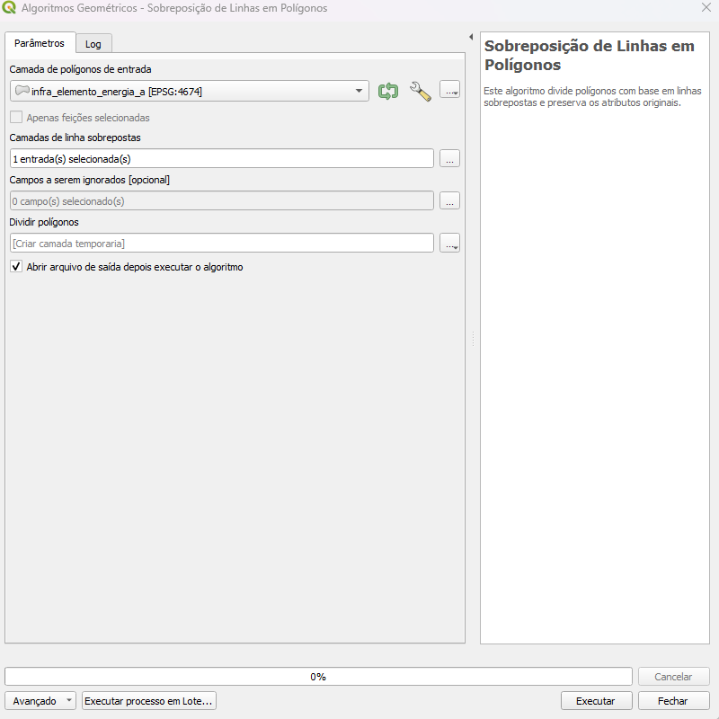

# Módulo 4: Provedor de Algoritmos - Geometria

## Algoritmo: Seccionar Polígonos sobrepostos por Linha

## 1. Introdução

O algoritmo **Seccionar Polígonos sobrepostos por Linha** tem como objetivo dividir feições poligonais com base em linhas de sobreposição. Esse procedimento é util para realizar subdivisões precisas de áreas conforme feições lineares. Podendo ser utilizado durante os processos de conversões de poligonos em delimitadores e vice-versa.

> *💡 Dica:* É de extrema importancia conferir a validade topológica antes de iniciar este processo.

---

## 2. Parâmetros de Entrada

| Parâmetro                     | Descrição                                                                   |
| ----------------------------- | --------------------------------------------------------------------------- |
| Camada de polígonos           | Camada vetorial de entrada com feições poligonais                           |
| Camadas de linhas sobrepostas | Lista de camadas de linhas que serão usadas para dividir os polígonos       |
| Campos a serem ignorados      | Lista de atributos que não devem ser mantidos no resultado final (opcional) |
| Polígonos divididos           | Camada vetorial de saída contendo os novos polígonos resultantes            |

### Interface de Parâmetros

Ao acessar o algoritmo no painel do DSGTools, o usuário deverá preencher os campos:

* **Camada de polígonos**: selecionar a camada base a ser cortada;
* **Camadas de linhas sobrepostas**: escolher uma ou mais camadas de linhas;
* **Campos a serem ignorados**: selecionar atributos que não devem ser copiados;
* **Polígonos divididos**: definir a camada de saída.

*Figura 4.X – Interface do algoritmo com os parâmetros a serem definidos no QGIS.*

> *⚠️ Atenção:* É necessário haver ao menos uma camada de linhas para execução. A camada de entrada deve ser válida e estar no mesmo sistema de referência que as linhas sobrepostas.

---

## 3. Fluxo Operacional

1. Carregar as camadas de polígonos e linhas no QGIS
2. Acessar o algoritmo no provedor do DSGTools (atalho: `lineonareaoverlayer`)
3. Selecionar os parâmetros conforme desejado
4. Executar o algoritmo
5. Verificar a camada de saída com os polígonos segmentados

---

## 4. Funcionamento

O algoritmo executa as seguintes etapas internas:

1. Converte os polígonos em linhas de contorno
2. Mescla essas linhas com as camadas de linhas fornecidas
3. Divide as linhas por interseção para garantir a segmentação correta
4. Realiza a poligonização das linhas resultantes
5. Gera um ponto interno (point-on-surface) para cada novo polígono
6. Usa esse ponto para identificar o polígono original correspondente por relação espacial
7. Atribui os atributos herdados (exceto os ignorados) ao novo polígono

> *💡 Dica:* A técnica de herança de atributos baseada em ponto interno garante precisão mesmo em subdivisões complexas.

---

## 5. Saída Esperada

* Camada vetorial de polígonos segmentados por linhas sobrepostas
* Atributos herdados corretamente da camada original
* Geometrias válidas e compatíveis com processos de validação topológica

*Figura 4.4: Exemplo de polígonos divididos conforme feições lineares sobrepostas.*

> *🧪 Sugestão:* Após a execução, recomenda-se utilizar as ferramentas de validação do DSGTools para garantir integridade topológica.

---

## 6. Aplicações Práticas

* Geração de folhas cartográficas conforme divisão viária
* Segmentação de glebas rurais por cercas ou rios
* Subdivisão de setores censitários por limites reais
* Atualização de bases temáticas com feições novas ou corrigidas

---

## 7. Resumo

* Algoritmo específico para segmentar polígonos por linhas sobrepostas
* Mantém atributos herdados, com opção de filtragem
* Etapas internas robustas que garantem resultado topologicamente válido
* Recomendado para operações de refinamento espacial em bases vetoriais

> *🔹 Recomendado:* Realizar inspeção visual após execução para confirmar se os segmentos estão corretamente atribuídos e topologicamente coerentes.
